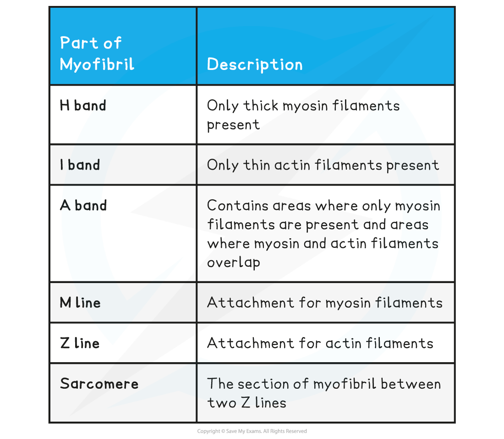
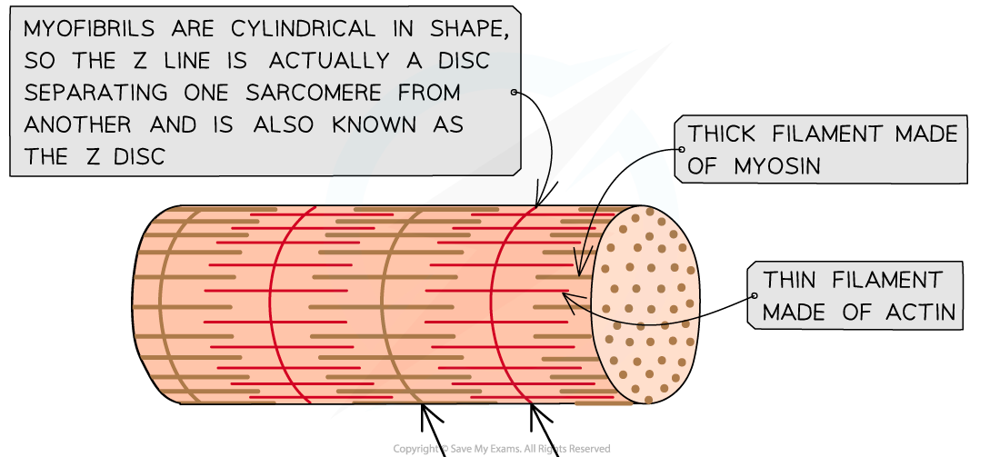
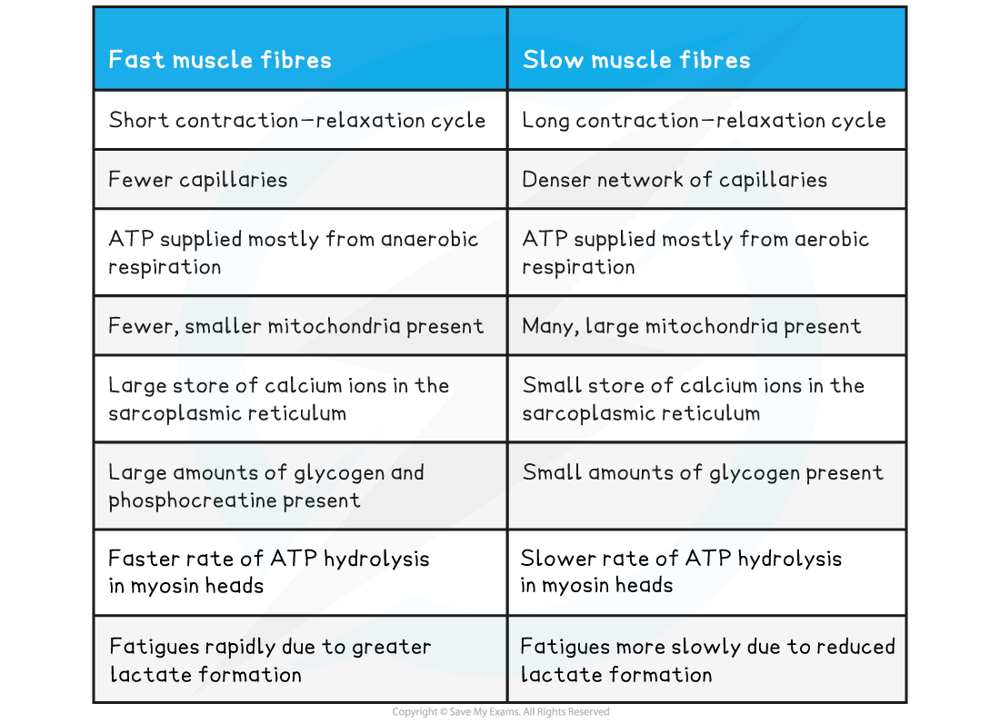

Muscle Fibres: Structure
------------------------

* <b>Skeletal muscle</b> makes up the muscles in the body that are attached to the skeleton
* Skeletal muscle is made up of <b>muscle fibres</b>
* A muscle fibre is a <b>highly specialised </b>cell-like <b>unit</b>:

  + Each muscle fibre contains an organised arrangement of <b>contractile proteins in the cytoplasm</b>
  + Each muscle fibre is surrounded by a <b>cell surface membrane</b>
  + Each muscle fibre contains <b>many nuclei</b> (<b>multi-nucleated</b>) – this is why muscle fibres are not usually referred to as cells
* The different parts of a muscle fibre have different names to the equivalent parts of a normal cell:

  + Cell surface membrane = <b>sarcolemma</b>
  + Cytoplasm = <b>sarcoplasm</b>
  + Endoplasmic reticulum = <b>sarcoplasmic reticulum (SR)</b>
* The sarcolemma has many deep tube-like projections that fold in from its outer surface:

  + These are known as transverse system tubules or <b>T-tubules</b>
  + These run <b>close to the SR</b> and help spread electrical impulses throughout muscle fibre
* The sarcoplasm contains <b>mitochondria</b> and <b>myofibrils</b>

  + The mitochondria carry out aerobic respiration to generate the ATP<b> required for muscle contraction</b>
  + Myofibrils are <b>bundles of actin and myosin filaments</b>, which slide past each other during muscle contraction
* The membranes of the SR contain <b>protein pumps </b>that transport <b>calcium ions </b>into the lumen of the SR

  + Calcium ions are needed for the contraction of muscle

<i><b>The ultrastructure of skeletal muscle and of a section of muscle fibre</b></i>

#### Myofibrils

* Myofibrils are located in the <b>sarcoplasm</b>
* Each myofibril is made up of <b>two types of protein filament:</b>

  + <b>Thick</b> filaments made of <b>myosin</b>
  + <b>Thin</b> filaments made of <b>actin</b>
* These two types of filaments are arranged in a particular order, creating different types of <b>bands</b> and <b>line</b>

<b>Myofibrils Parts & Descriptions Table</b>

<i><b>The structure of a myofibril</b></i>

Fast vs Slow Twitch Fibres
--------------------------

* There are two types of muscle fibres found in muscles

  + <b>Fast</b> <b>twitch</b> fibres
  + <b>Slow</b> <b>twitch</b> fibres
* Human muscles are made up of both types of muscle fibres
* Some muscles have higher proportions of a particular fibre type due to their different properties

#### Fast twitch muscle fibres

* Fast twitch muscle fibres <b>contract rapidly</b>

  + The myosin heads bind and unbind from the actin-binding sites five times faster than slow twitch muscle fibres
  + Their rapid contraction-relaxation cycle means they need <b>large amounts of calcium ions</b> present to stimulate contraction
* They rely on <b>anaerobic</b> <b>respiration</b> for ATP supply
* They are suited to <b>short bursts of high-intensity activity </b>as they <b>fatigue quickly</b> due to the <b>lactate</b> produced from anaerobic respiration
* These muscle fibres are often found in high proportions in the <b>limbs</b> of animals that flee a predator or hunt prey at high speeds

  + For example, the wings of a robin and legs of a cheetah
* There are high proportions of fast twitch muscle fibres in <b>human eyelids</b>

  + They contract in short bursts and do not need to sustain the rapid movement
* Fast twitch muscle fibres have <b>fewer capillaries</b>

  + Blood containing glucose and oxygen flow through the capillaries
  + This means they have quite a slow supply of oxygen and glucose for aerobic respiration
* <b>Low amounts of myoglobin are present</b> in fast twitch muscle fibres

  + Myoglobin is a red pigment molecule that is similar to haemoglobin
  + Myoglobin functions as a <b>store of oxygen</b> in muscles and increases the rate of oxygen absorption from the capillaries
* Due to this fast twitch muscle fibres appear <b>paler</b> in colour than slow muscle fibres

#### Slow twitch muscle fibres

* Slow twitch muscle fibres <b>contract more slowly</b> and are suited to <b>sustained activities </b>like walking and perching
* They rely on aerobic respiration for ATP
* They <b>fatigue less quickly</b> due to less lactate production, making them ideal for <b>endurance</b>
* These muscle fibres are often found in high proportions in the <b>limbs</b> of animals that migrate or stalk prey over long distances

  + For example, the wings of geese and legs of wolves
* <b>Human back muscles</b> have a high proportion of slow twitch muscle fibres

  + These muscles have to contract for long periods of time in order to keep the skeleton erect when standing or sitting
* Slow twitch muscle fibres have <b>a denser network of capillaries</b>

  + Blood containing glucose and oxygen flow through the capillaries
  + This means they have a short diffusion distance and a good supply of oxygen and glucose for aerobic respiration
* <b>High amounts of myoglobin, haemoglobin and mitochondria </b>are present in slow twitch muscle fibres

  + This increases the rate of oxygen supply, oxygen absorption and aerobic respiration
* Due to the high amounts of red pigment, slow twitch muscle fibres appear a <b>dark red</b>

<b>Fast Twitch & Slow Twitch Muscle Fibres Table</b>

