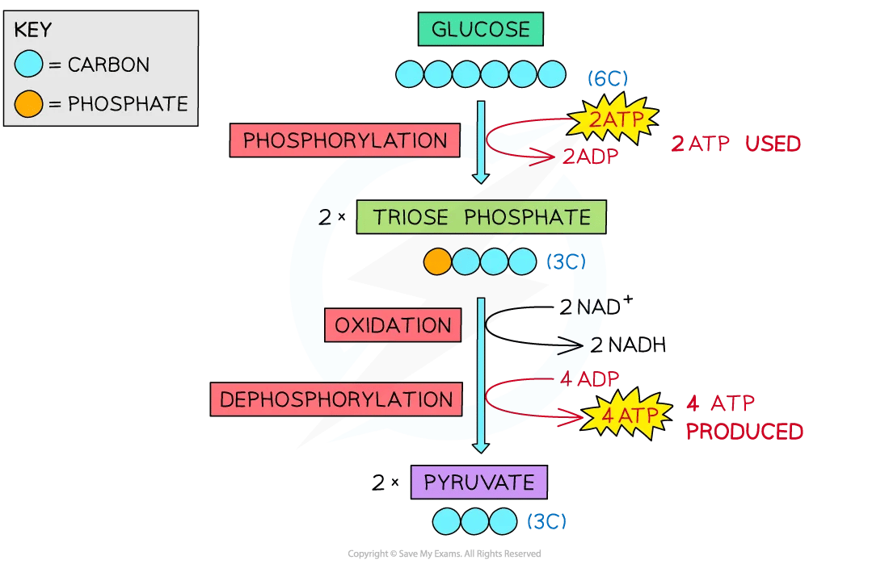

Glycolysis
----------

* Glycolysis is the first stage of respiration
* It does not require oxygen to take place and is therefore the first step for both aerobic and anaerobic respiration
* Glucose is only <b>partially </b><b>oxidised</b> during glycolysis
* It takes place in the cytoplasm of the cell and involves:

  + <b>Trapping glucose</b> in the cell by <b>phosphorylating</b> the molecule
  + <b>Oxidising </b>triose phosphate (by losing hydrogen)
* It results in the production of

  + <b>2 Pyruvate </b>(3C) molecules which moves into the matrix of mitochondria to be used during the link reaction
  + Net gain <b>2 ATP</b>
  + <b>2 reduced </b><b>NAD</b>, which will be used during a later stage called oxidative phosphorylation
* Under <b>anaerobic</b> conditions, glycolysis produces <b>lactic acid or lactate </b>instead of pyruvate

#### Steps of glycolysis

* <b>Phosphorylation</b> of glucose (a hexose sugar)

  + Two molecules of ATP are required to provide the <b>two phosphates</b> needed for the phosphorylation of glucose
  + This produces

    - <b>Two molecules of triose phosphate</b>
    - <b>Two molecules of ADP</b>
* <b>Oxidation</b> of triose phosphate

  + After triose phosphate <b>loses hydrogen</b>, it forms <b>two molecules of pyruvate</b>
  + The <b>hydrogen ions are collected by NAD</b> which reduces the coenzyme
  + This forms <b>two reduced NAD or NADH</b>
  + Even though a total of four ATP molecules were produced during glycolysis, two of them were used to phosphorylate glucose
  + There was therefore a <b>net gain of two ATP molecules</b>

<i><b>The process of glycolysis</b></i>

#### Examiner Tips and Tricks

It may seem strange that ATP is used and also produced during glycolysis. At the start ATP is used to <b>make glucose more reactive</b> (it is usually very stable) and to lower the activation energy of the reaction. Since 2 ATP are used and 4 are produced during the process, there is a <b>net gain of 2 ATP per glucose molecule.</b>