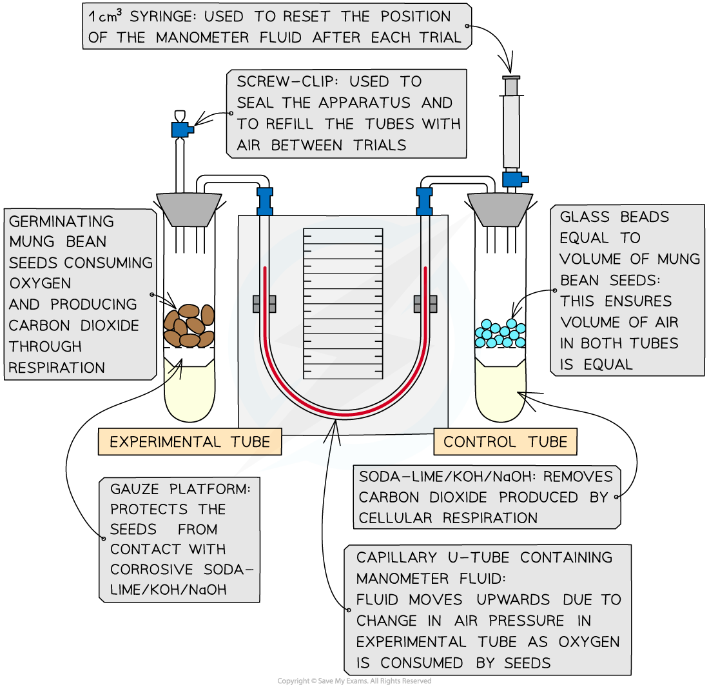

Practical: Investigating the Rate of Respiration
------------------------------------------------

* Respirometers are used to measure and investigate the <b>rate of oxygen consumption </b>during aerobic respiration in organisms
* The experiments usually involve organisms such as seeds or invertebrates

#### Apparatus

* Respirometer
* Glass beads
* Germinating seeds

  + These will be actively respiring and consuming oxygen
* Test tubes
* Soda-lime pellets (or potassium hydroxide)

  + To absorb the carbon dioxide produced
* Stopwatch

<i><b>A respirometer set up to measure the rate of respiration</b></i>

#### Method

* <b>Measure oxygen consumption</b>: set up the respirometer and run the experiment with both tubes for a set amount of time (e.g. 30 minutes)
* As the seeds consume oxygen, the <b>volume of air</b> in the test tube <b>will decrease</b> (CO2 produced during respiration is absorbed by soda lime or KOH)
* This <b>reduces the pressure</b> in the capillary tube and <b>manometer fluid will move towards</b> the test tube containing the seeds
* Measure the distance moved by the liquid in a given time
* Use this measurement to calculate the change in gas volume within a given time, <i>x</i> cm3 min-1
* <b>Reset the apparatus</b>: Allow air to re-enter the tubes via the screw cap and reset the manometer fluid using the syringe
* <b>Repeat</b> experiment several times and calculate the <b>average volume of oxygen consumed</b>

#### Calculations

* The volume of oxygen consumed (cm3 min-1) can be worked out using:

  + The diameter of the capillary tube<i> r</i> (cm)
  + The distance moved by the manometer fluid <i>h</i> (cm) in a minute using the formula:

<b>πr</b><b>2</b><b>h</b>

#### Examiner Tips and Tricks

It is important to note that when using living organisms such as woodlice or maggots you must treat them with respect and do not harm them.