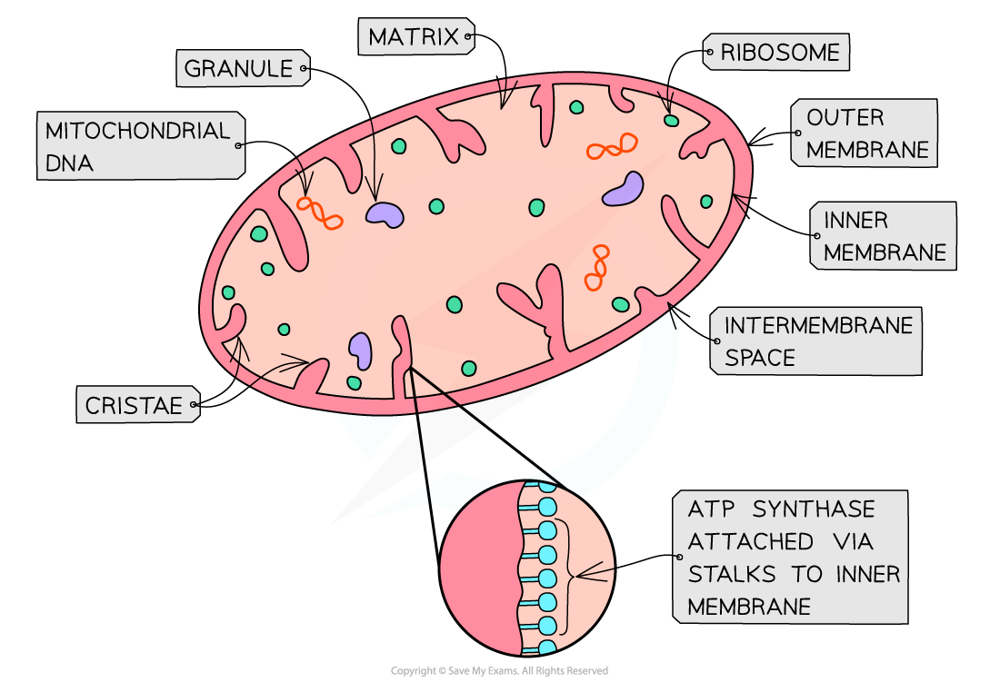

Respiration: An Overview
------------------------

* <b>Glucose</b> is the main respiratory substrate used by cells
* Aerobic respiration is the process of breaking down a respiratory substrate in order to <b>produce ATP using oxygen</b>
* The equation for aerobic respiration:

<b>glucose + oxygen →  carbon dioxide + water + energy</b>

<b>C</b><b>6</b><b>H</b><b>12</b><b>0</b><b>6</b><b> + 6 O</b><b>2</b><b> →  6 CO</b><b>2</b><b> + 6 H</b><b>2</b><b>0 + 2870kJ</b>

* The energy that is released during the process is used to phosphorylate (add a phosphate) ADP to form ATP
* The ATP provides energy for other biological processes in cells
* The process of aerobic respiration using glucose can be split into four stages:

  + <b>Glycolysis</b>
  + The <b>Link reaction</b>
  + The <b>Krebs cycle</b>
  + <b>Oxidative phosphorylation</b>
* Glycolysis occurs in the cytoplasm of the cell, while the other three stages all occur within different parts of the mitochondria
* The reactions in each stage of respiration are <b>controlled by enzymes</b> found inside the cell
* The enzyme that catalyses these reactions the <b>slowest</b> will determine the <b>overall rate of aerobic respiration</b>
* Several <b>coenzymes</b> are required during respiration to <b>transfer</b> various molecules involved in the process

  + <b>NAD</b> and <b>FAD</b> are the coenzymes responsible for <b>transferring hydrogen</b> between molecules
  + Depending on whether they give or take hydrogen, they are able to <b>reduce</b> or <b>oxidise</b> a molecule
  + <b>Coenzyme A</b> is responsible for the <b>transfer of acetate </b>(also known as acetic acid) from one molecule to another
* Although glucose is the main fuel for respiration, organisms can also break down other molecules (such as fatty acids or amino acids) to be respired

#### Structure of mitochondria

* Mitochondria have two phospholipid membranes
* The <b>outer membrane</b> is:

  + Smooth
  + Permeable to several small molecules
* The<b> inner membrane</b> is:

  + Folded (cristae)
  + <b>Less permeable</b>
  + The site of the <b>electron transport chain </b>(used in oxidative phosphorylation)
  + Location of<b> ATP synthase enzymes </b>(used in oxidative phosphorylation)
* The<b> intermembrane space</b>:

  + Has a low pH due to the <b>high concentration of protons</b>
  + The concentration gradient across the inner membrane is formed during oxidative phosphorylation and is <b>essential for ATP synthesis</b>
* The <b>matrix</b>:

  + Is an aqueous solution within the inner membranes of the mitochondrion
  + Contains ribosomes, enzymes and circular mitochondrial DNA necessary for mitochondria to function

<i><b>The structure of a mitochondrion</b></i>