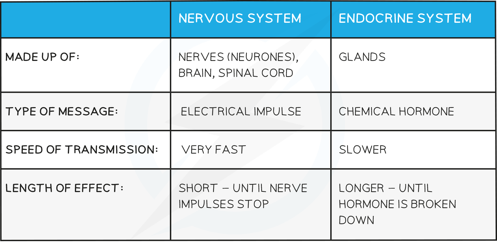

Co-ordination of Response
-------------------------

* Organisms must <b>respond to changes</b> in their <b>external</b> and <b>internal</b> environments in order to survive

  + Organisms need to

    - Find favourable external conditions e.g. avoiding locations that are too hot or cold
    - Find food
    - Avoid harm e.g. from predators or high blood glucose
* Changes in the environment, or <b>stimuli </b>(singular<b> stimulus</b>) are detected by specialised <b>receptor cells</b>

  + Receptor cells are located in the <b>sense organs</b> e.g. the nose and eyes
  + Receptor cells can also be found inside the body e.g. pressure receptors in the blood vessels
* Receptor cells send <b>signals</b> via either the<b> nervous system </b>or the <b>hormonal system</b> to the body's co-ordination centres in the<b> brain</b> or <b>spinal cord</b>
* Signals are then sent on to the parts of the body which respond, known as the <b>effectors</b>

  + Effectors can be either <b>muscles</b> or <b>glands</b> e.g.

    - An arm muscle would respond to a hot surface by contracting to move the hand away
    - The pancreas responds to high blood sugar by secreting insulin

<i><b>Receptors are cells that detect stimuli in the internal and external environment</b></i>

#### The nervous system

* The human nervous system consists of

  + <b>Central nervous system</b> (CNS) – the <b>brain</b> and <b>spinal cord</b>
  + <b>Peripheral nervous system</b> (PNS) – all of the <b>nerves</b> in the body
* The nervous system allows detection of stimuli in our surroundings and the <b>coordination </b>of the body's <b>responses</b> to the stimuli
* Information is sent through the nervous system in the form of <b>electrical impulses</b> that pass along <b>nerve cells</b> known as <b>neurones</b>

  + A <b>bundle of neurones</b> is known as a <b>nerve</b>
  + There are different types of neurones<b> </b>including <b>sensory neurones, relay neurones, </b>and <b>motor neurones</b>
* The nerves connect the receptors in the sense organs with the CNS, and connect the CNS with effectors

  + The <b>CNS </b>acts as a <b>central coordinating centre</b> for the impulses that come in from, and are sent out to, any part of the body
* Nerve impulses pass through the nervous system along the following pathway

<b>stimulus </b><math><semantics><mo>→</mo><annotation>{"language":"en","fontFamily":"Times New Roman","fontSize":"18"}</annotation></semantics></math><b> receptor </b><math><semantics><mo>→</mo><annotation>{"language":"en","fontFamily":"Times New Roman","fontSize":"18"}</annotation></semantics></math><b> sensory neurone </b><math><semantics><mo>→</mo><annotation>{"language":"en","fontFamily":"Times New Roman","fontSize":"18"}</annotation></semantics></math><b> CNS </b><math><semantics><mo>→</mo><annotation>{"language":"en","fontFamily":"Times New Roman","fontSize":"18"}</annotation></semantics></math><b>motor neurone </b><math><semantics><mo>→</mo><annotation>{"language":"en","fontFamily":"Times New Roman","fontSize":"18"}</annotation></semantics></math><b>effector</b>

* An example of this nerve pathway in action might be

<b>hot surface </b><math><semantics><mo>→</mo><annotation>{"language":"en","fontFamily":"Times New Roman","fontSize":"18"}</annotation></semantics></math><b> pain receptor in skin of hand </b><math><semantics><mo>→</mo><annotation>{"language":"en","fontFamily":"Times New Roman","fontSize":"18"}</annotation></semantics></math><b> sensory neurone </b><math><semantics><mo>→</mo><annotation>{"language":"en","fontFamily":"Times New Roman","fontSize":"18"}</annotation></semantics></math><b>CNS </b><math><semantics><mo>→</mo><annotation>{"language":"en","fontFamily":"Times New Roman","fontSize":"18"}</annotation></semantics></math><b> motor neurone </b><math><semantics><mo>→</mo><annotation>{"language":"en","fontFamily":"Times New Roman","fontSize":"18"}</annotation></semantics></math><b> arm muscle</b>

* The muscle in the arm responds by contracting to move the hand away from the hot surface

<i><b>The nervous system allows the detection of stimuli and the co-ordination of appropriate responses</b></i>

#### The hormonal system

* Hormones are <b>chemical substances</b> produced by <b>endocrine glands</b> and carried by the <b>blood</b>

  + Hormones are sometimes known as <b>chemical messengers</b>
* Hormones <b>transmit information from one part of an organism to another</b> and bring about <b>change </b>by altering the <b>activity</b> of one or more <b>specific target organs</b>

  + Hormones can leave the blood and bind to <b>specific receptors</b> on the cell surface membranes of target organs
* Hormones are slower in action than nerve impulses and are therefore used to control functions that <b>do not need instant responses</b>
* Endocrine glands that produces hormones in animals are known collectively as the <b>endocrine system</b>

  + Endocrine glands secrete hormones directly into the <b>blood</b>
  + Endocrine glands can be stimulated to secrete hormones by the action of <b>another hormone </b>or by the arrival of a <b>nerve impulse</b>
* The pathway of hormone action is as follows

<b>stimulus </b><math><semantics><mo>→</mo><annotation>{"language":"en","fontFamily":"Times New Roman","fontSize":"18"}</annotation></semantics></math><b> receptor </b><math><semantics><mo>→</mo><annotation>{"language":"en","fontFamily":"Times New Roman","fontSize":"18"}</annotation></semantics></math><b> hormone </b><math><semantics><mrow><mo>→</mo><mo> </mo></mrow><annotation>{"language":"en","fontFamily":"Times New Roman","fontSize":"18"}</annotation></semantics></math><b>effector</b>

* An example of this pathway in action might be

<b>high blood sugar </b><math><semantics><mo>→</mo><annotation>{"language":"en","fontFamily":"Times New Roman","fontSize":"18"}</annotation></semantics></math><b> cells in the pancreas </b><math><semantics><mo>→</mo><annotation>{"language":"en","fontFamily":"Times New Roman","fontSize":"18"}</annotation></semantics></math><b> insulin </b><math><semantics><mo>→</mo><annotation>{"language":"en","fontFamily":"Times New Roman","fontSize":"18"}</annotation></semantics></math><b> liver cells </b>

* The liver cells respond to insulin by converting glucose into glycogen

<i><b>Hormones are secreted into the blood by the endocrine glands </b></i>

<b>Comparison of Nervous and Hormonal control Table</b>

