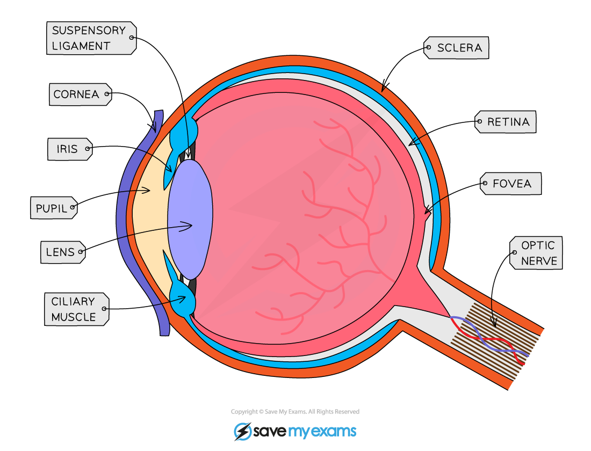
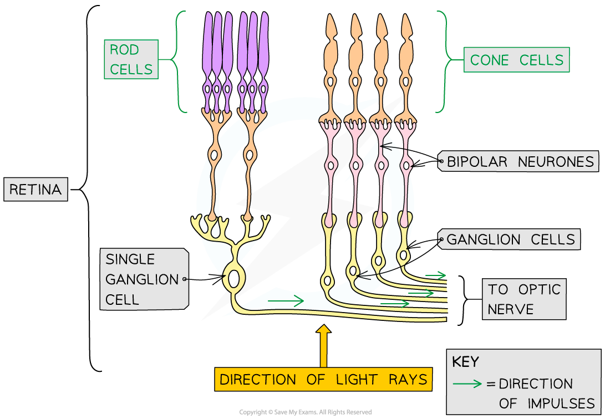
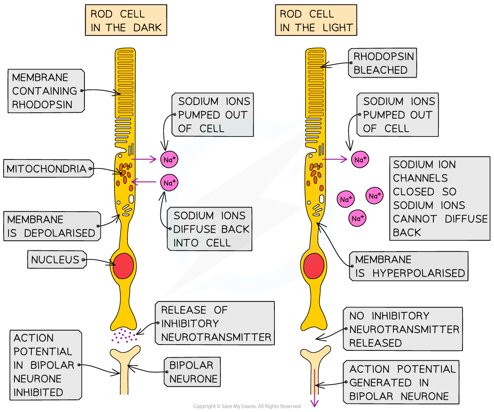

Detection of Light
------------------

* The eye is a <b>sense organ</b> containing receptors sensitive to light intensity and wavelength

  + <b>Receptors</b> are specialised cells that can generate an electrical impulse in a sensory neurone when stimulated by a particular stimulus e.g. light receptors are stimulated when light falls on them
* Light enters the eye through the <b>pupil</b> and is focused onto a region of the <b>retina</b> called the <b>fovea</b>

  + The amount of light that enters the eye is controlled by the muscles of the<b> iris</b>
  + Light is focused using the <b>lens</b>, the shape of which is controlled by <b>ciliary</b> <b>muscles</b> attached to the lens by <b>suspensory ligaments</b>

    - The muscles change the shape of the lens to allow it to focus light reflected from objects at different distances from the eye
  + The fovea contains many <b>light receptors, </b>or<b> photoreceptors</b>
* The retina contains two types of photoreceptors

  + <b>Rod cells</b>

    - Primarily located around the <b>outer retina</b>
    - Sensitive to <b>light intensity</b> so can detect the presence and brightness of light
    - Images generated using information from only rod cells is <b>black and white</b>
  + <b>Cone cells</b>

    - Mostly found grouped together in the<b> fovea</b>
    - Sensitive to <b>different wavelengths </b>of visible light and so detect colour

      * Cone cells can be <b>red-sensitive, green-sensitive</b>, or <b>blue-sensitive</b>
      * The number of red-, green-, and blue-sensitive cone cells stimulated will <b>determine the colours seen</b>
    - Images generated using information from cone cells will be in <b>colour</b>
* Action potentials generated in the photoreceptor are transmitted to the brain via the <b>optic nerve</b>

  + The optic nerve leaves the back of the eye from a region known as the <b>blind spot</b>

    - The blind spot contains no photoreceptors

<i><b>The eye focuses light on the retina, which contains many light receptors</b></i>

#### Photoreceptors generate nerve impulses

* Photoreceptors in the eye generate action potentials when <b>stimulated</b> by <b>bright enough light</b> (rods), or by <b>light of a particular wavelength</b> (cones)
* <b>Light-sensitive pigments</b> inside the photoreceptors are <b>bleached</b> when light falls on them e.g.

  + Rod cells contain a light-sensitive pigment called <b>rhodopsin</b>
  + When light hits rhodopsin it <b>breaks apart</b> into constituent parts <b>retinal</b> and <b>opsin</b>
  + The breaking apart of rhodopsin is known as <b>bleaching</b>
* The bleaching of light-sensitive pigments causes a <b>chemical change</b> in the photoreceptor that results in the generation of a <b>nerve impulse</b>
* Nerve impulses travel along a <b>bipolar neurone</b> to the optic nerve, which carries information to the brain

<i><b>Information passes from rod and cone cells to the optic nerve via bipolar neurones. Note that you do not need to know about ganglion cells here</b></i>

#### The action of rod cells

* The way in which rod cells pass information to the optic nerve is a bit back-to-front in comparison to the action of other nerve cells; rather than initiating an action potential when they are <b>depolarised</b>, rod cells initiate action potentials in neighbouring bipolar neurones when they are <b>hyperpolarised</b>
* In the <b>dark</b> the following occurs inside rod cells

  + <b>Sodium ions</b> are actively pumped out of rod cells, generating a <b>concentration gradient</b>

    - Sodium ions (Na+) are <b>positively charged</b> ions, also known as <b>cations</b>
  + Sodium ions <b>diffuse </b>back down this concentration gradient into the rod cell via <b>sodium channels</b>

    - Sodium channels are also known as <b>cation channels</b> because they allow the movement of positively charged ions
  + At this stage there is little difference in charge between the outside and inside of the rod cell, and the cell is said to be <b>depolarised</b>

    - In reality the inside of the rod cell is <b>slightly negative</b> in comparison to the outside
  + The depolarised rod cell <b>releases neurotransmitters</b> which diffuse across a synapse to a <b>bipolar neurone</b>
  + Rather than initiating an action potential in the bipolar neurone <b>this neurotransmitter inhibits the generation of an action potential</b>, preventing a nerve impulse from being sent to the optic nerve

    - This neurotransmitter is said to be an <b>inhibitory neurotransmitter</b>
* In the <b>light</b> the following occurs inside rod cells

  + Light <b>bleaches rhodopsin</b>, causing it to break apart into retinal and opsin
  + The bleaching of rhodopsin causes the sodium ion channels in the cell surface membrane of the rod cell to <b>close</b>, <b>preventing sodium ions from diffusing</b> back into the rod cell

    - The active transport of sodium ions out of the cell is still taking place, so sodium ions are removed from the cell but not able to return
  + The lack of positively charged ions entering the rod cell causes its interior to become <b>more negative</b> until it reaches a <b>hyperpolarised state</b>

    - A membrane that is hyperpolarised has a <b>more negative</b> potential difference across it than the resting -70 mV
  + The hyperpolarised rod cell <b>stops releasing an inhibitory neurotransmitter</b>, so the generation of an action potential in the neighbouring bipolar neurone is <b>no longer inhibited</b>
  + An <b>action potential</b> is generated in the bipolar neurone attached to the rod cell and <b>an impulse is sent to the optic nerve</b>

<i><b>Rod cell membranes are depolarised in the dark and hyperpolarised in the light</b></i>