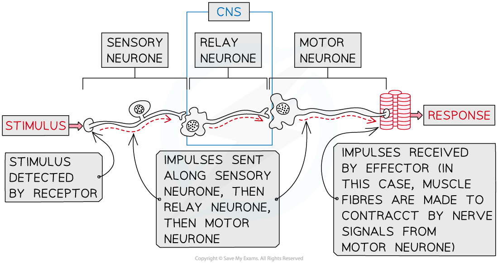

Nervous System: Response to a Stimulus
--------------------------------------

* The nervous system enables the body to <b>detect changes in the environment </b>and brings about <b>appropriate responses</b> to ensure its safety

  + <b>Receptor cells</b> detect changes in the environment, or <b>stimuli</b>
  + Nerve impulses travel from the receptor cells along <b>sensory neurones </b>to the <b>central nervous system,</b> or CNS
  + The <b>CNS </b>acts as a <b>coordinating centre</b> for the impulses that arrive from the receptors, determining which part of the body needs to respond and sending out a new set of impulses along <b>motor neurones</b>
  + <b>Motor neurones send impulses</b> to the<b> effectors </b>to bring about a <b>response</b>

    - Effectors may be muscles or glands
* Nerve impulses pass through the nervous system along the following pathway

<b>stimulus </b><math><semantics><mo>→</mo><annotation>{"language":"en","fontFamily":"Times New Roman","fontSize":"18"}</annotation></semantics></math><b> receptor </b><math><semantics><mo>→</mo><annotation>{"language":"en","fontFamily":"Times New Roman","fontSize":"18"}</annotation></semantics></math><b> sensory neurone </b><math><semantics><mo>→</mo><annotation>{"language":"en","fontFamily":"Times New Roman","fontSize":"18"}</annotation></semantics></math><b> CNS </b><math><semantics><mo>→</mo><annotation>{"language":"en","fontFamily":"Times New Roman","fontSize":"18"}</annotation></semantics></math><b>motor neurone </b><math><semantics><mo>→</mo><annotation>{"language":"en","fontFamily":"Times New Roman","fontSize":"18"}</annotation></semantics></math><b>effector</b>

<i><b>Receptors detect stimuli and impulses are sent through to nervous system to bring about a response in the effector</b></i>

Pupil Response
--------------

* An example of a nerve pathway in action is the sequence of events that leads to a change in the diameter of the pupil in the eye

  + Changing pupil diameter enables the eye to control the amount of light hitting the retina
  + The diameter of the pupil in the eye is determined by two sets of muscles

    - The <b>circular muscles</b> contract to <b>constrict</b> the pupil
    - The <b>radial muscles</b> contract to <b>dilate</b> the pupil
  + The two sets of muscles work <b>antagonistically</b>, meaning that when one set of muscles contracts the other relaxes, and vice versa
* In <b>bright light</b> the following events occur

  <b>bright light </b><math><semantics><mo>→</mo><annotation>{"language":"en","fontFamily":"Times New Roman","fontSize":"18"}</annotation></semantics></math><b> light receptors in eyes </b><math><semantics><mo>→</mo><annotation>{"language":"en","fontFamily":"Times New Roman","fontSize":"18"}</annotation></semantics></math><b> sensory neurone </b><math><semantics><mo>→</mo><annotation>{"language":"en","fontFamily":"Times New Roman","fontSize":"18"}</annotation></semantics></math><b> CNS </b><math><semantics><mo>→</mo><annotation>{"language":"en","fontFamily":"Times New Roman","fontSize":"18"}</annotation></semantics></math><b> motor neurone </b><math><semantics><mo>→</mo><annotation>{"language":"en","fontFamily":"Times New Roman","fontSize":"18"}</annotation></semantics></math><b> circular muscles in iris</b>

  + Contraction of the circular muscles in the iris of the eye causes the pupil to <b>constrict</b>
  + This limits the amount of light entering the eye and <b>prevents damage to the retina</b>
* In <b>low light</b> the following events occur

  <b>low light </b><math><semantics><mo>→</mo><annotation>{"language":"en","fontFamily":"Times New Roman","fontSize":"18"}</annotation></semantics></math><b> light receptors in eyes </b><math><semantics><mo>→</mo><annotation>{"language":"en","fontFamily":"Times New Roman","fontSize":"18"}</annotation></semantics></math><b> sensory neurone </b><math><semantics><mo>→</mo><annotation>{"language":"en","fontFamily":"Times New Roman","fontSize":"18"}</annotation></semantics></math><b> CNS </b><math><semantics><mo>→</mo><annotation>{"language":"en","fontFamily":"Times New Roman","fontSize":"18"}</annotation></semantics></math><b> motor neurone </b><math><semantics><mo>→</mo><annotation>{"language":"en","fontFamily":"Times New Roman","fontSize":"18"}</annotation></semantics></math><b> radial muscles in iris</b>

  + Contraction of the radial muscles in the iris of the eye causes the pupil to <b>dilate</b>
  + This <b>maximises the amount of light entering the eye</b>, improving vision

<i><b>The muscles in the eye respond to light levels due to nerve impulses generated by light receptors in the eye</b></i>