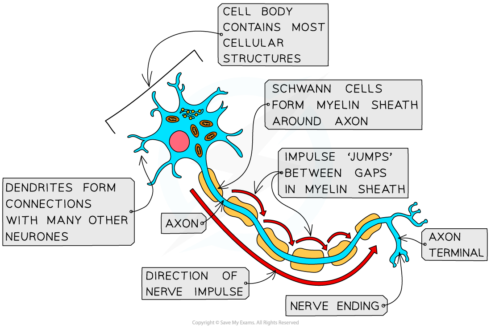

Neurones: Structure & Function
------------------------------

* <b>Neurones</b> are specialised cells of the nervous system which carry <b>electrical impulses</b> around the body
* A bundle of neurones is known as a <b>nerve</b>
* There are different types of neurones, but the following features are found in all types

  + A <b>long fibre</b> known as an <b>axon</b>
  + A <b>cell body</b> that contains the <b>nucleus</b> and other cellular structures
  + The end of the axon, known as the <b>axon terminal,</b> has many nerve endings

    - The nerve endings at the axon terminals allow neurones to <b>connect</b> to and<b> receive impulses from</b> other <b>neurones</b>, forming a <b>network</b> for easy <b>communication</b>
* Some neurones are<b> myelinated</b>, meaning that their axon is <b>insulated</b> by a fatty layer known as the <b>myelin sheath</b>

  + The myelin sheath is made up of specialised cells known as <b>Schwann cells </b>which wrap themselves around the axon
  + There are <b>uninsulated gaps</b> between the Schwann cells known as the <b>nodes of Ranvier</b>
  + Electrical impulses in myelinated cells do not travel down the whole axon, but jump from one <b>node</b> to the next, speeding up impulse transmission
* In<b> non-myelinated neurones</b> the axon is not insulated by Schwann cells

  + The impulse travels more slowly as it moves through the entire length of the axon

<i><b>Neurones have a long axon, a cell body, and an axon terminal, and some neurones are myelinated</b></i>

* There are <b>three main types </b>of neurones

  + <b>Sensory neurones</b> carry impulses from <b>receptors</b> to the brain and spinal cord in the <b>CNS</b>
  + <b>Relay neurones</b> are found entirely within the CNS and <b>connect</b> <b>sensory</b> and <b>motor</b> neurones
  + <b>Motor</b> <b>neurones</b> carry impulses from the <b>CNS</b> to <b>effector </b>muscles or glands
* Each type of neurone has a <b>slightly different structure</b>

  + <b>Motor neurones </b>

    - A large <b>cell body at one end</b> that lies within the spinal cord or brain
    - Many highly-branched<b> dendrites</b> extending from the cell body, providing many connections with the axon terminals of other neurones
  + <b>Relay neurones</b>

    - Short neurones with axons and highly branched dendrites
  + <b>Sensory neurones</b>

    - A<b> cell body</b> that branches off in the <b>middle</b> of the axon
    - The dendrites are attached to a <b>receptor cell</b>
    - The section of neurone that links the axon terminal (at the receptors) with the cell body is known as a <b>dendron</b>; it delivers the electrical impulse to the cell body
    - The section of neurone that connects the cell body with the CNS is the <b>axon</b>

<i><b>Different types of neurone differ in both structure and function</b></i>