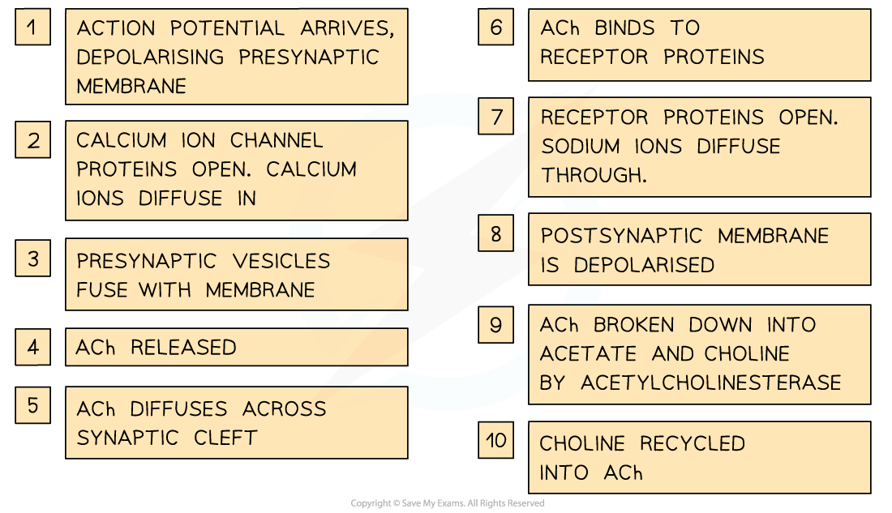

Synapses: Structure & Function
------------------------------

* Structures known as<b> synapses </b>are found at the<b> junctions between cells in the nervous system</b> e.g.

  + In the sense organs there are synapses between <b>sensory receptor cells</b> and <b>sensory neurones</b>
  + In muscles there are synapses between <b>motor neurones</b> and <b>muscle fibres </b>
* The structure of a synapse includes the following features

  + A gap between the neurones known as the <b>synaptic cleft</b>
  + The neurone before the synapse is known as the <b>presynaptic neurone </b>and has a rounded end known as the <b>synaptic knob</b>
  + The neurone after the synapse is known as the <b>postsynaptic neurone</b>
  + Nerve impulses are passed across the synaptic cleft by the<b> diffusion of chemicals</b> known as <b>neurotransmitters</b> e.g. acetylcholine

    - Neurotransmitters are contained within vesicles in the synaptic knob

<i><b>Synapses are the junctions between neurones e.g. between a sensory neurone and a relay neurone</b></i>

#### Synaptic transmission

* Electrical impulses cannot ‘jump’ across the synaptic cleft
* When an action potential arrives at the end of the axon of the <b>presynaptic neurone </b>the <b>membrane</b> becomes depolarised, causing <b>voltage gated calcium ion channels</b> to open
* <b>Calcium ions </b>diffuse into the synaptic knob via <b>calcium ion channels</b> in the membrane
* The calcium ions cause vesicles in the synaptic knob to move towards the presynaptic membrane where they fuse with it and <b>release chemical messengers</b> called <b>neurotransmitters</b> into the synaptic cleft by exocytosis

  + A common neurotransmitter is<b> acetylcholine</b>, or <b>ACh</b>
* The neurotransmitters <b>diffuse</b> across the <b>synaptic cleft</b> and<b> bind with receptor molecules</b> on the <b>postsynaptic membrane</b>; this causes associated <b>sodium ion channels</b> on the postsynaptic membrane to open, allowing <b>sodium ions</b> to diffuse into the postsynaptic cell
* If enough neurotransmitter molecules bind with receptors on the postsynaptic membrane then an <b>action potential</b> is generated, which then travels down the <b>axon</b> of the <b>postsynaptic neurone</b>

  + Whether or not an action potential is generated depends on whether or not <b>threshold potential </b>is reached, which in turn depends on the <b>number of action potentials arriving at the presynaptic knob</b>

    - Many action potentials will cause more neurotransmitter to be released by exocytosis
    - A large amount of neurotransmitter will cause many sodium ion channels to open
    - Many sodium ion channels opening will allow a large influx of sodium ions, increasing the likelihood of threshold being reached
* The neurotransmitters are then <b>broken down</b> to prevent continued stimulation of the postsynaptic neurone

  + The enzyme that breaks down acetylcholine is <b>acetylcholinesterase</b>

<i><b>Impulses are transmitted across the synaptic cleft by the diffusion of neurotransmitters such as acetylcholine</b></i>

#### Additional roles of synapses

* Synapses enable

  + <b>Unidirectionality</b> of impulse transmission

    - Synapses ensure the <b>one-way transmission</b> of impulses
    - Impulses can only pass in <b>one direction</b> at synapses because <b>neurotransmitter is released on one side</b> and its <b>receptors are on the other; </b>chemical transmission cannot occur in the opposite direction
  + <b>Divergence</b> of nerve impulses

    - One neurone can connect to <b>several other neurones</b> at a synapse, allowing nerve signals to be sent in several directions from a single presynaptic neurone
  + <b>Amplification</b> of nerve signals by <b>summation</b>

    - When an impulse arrives at a synapse it <b>does not always</b> cause an impulse to be generated in the next neurone; a <b>single impulse</b> that arrives at a synaptic knob may be <b>insufficient</b> to generate an action potential in the post-synaptic neurone

      * Only a small amount of acetylcholine may release into the synaptic cleft
      * A small number of sodium ion channels are opened in the postsynaptic axon membrane
      * An insufficient number of sodium ions pass through the membrane
      * The threshold potential is not reached
    - The effect of multiple impulses can be added together to overcome this in a process known as <b>summation</b>
    - Summation can be achieved by

      * <b>Several presynaptic neurones</b> converging to meet a single postsynaptic neurone

        + This is known as <b>synaptic convergence</b>
      * <b>Many action potentials</b> arriving at a postsynaptic knob in quick succession