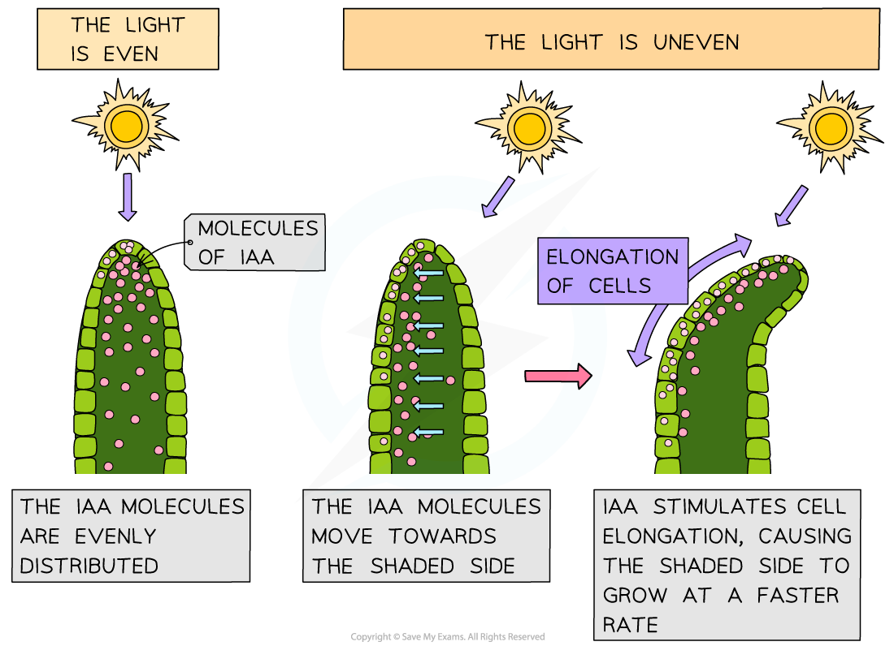

The Effects of IAA
------------------

* Just like animals, the survival of plants is dependent on their ability to <b>respond to changes</b> in their environment; this <b>maximises their survival chances</b> e.g.

  + Growing towards light <b>maximises the rate of photosynthesis</b> and therefore glucose production
  + Producing harmful or foul-tasting chemicals in response to being eaten by a herbivore <b>reduces the likelihood of being eaten</b>
  + Roots growing towards water <b>maximises the plant's ability to gain water</b>
* Plants can respond to<b> several types of stimuli</b> e.g.

  + Light
  + Gravity
  + Physical objects
  + Herbivory
  + Water
  + Physical touch
* Plants can respond to stimuli in various ways, including by <b>altering their growth</b>

  + E.g. a seedling will bend and grow towards the light because there is more growth on the shaded side than on the illuminated side
* This type of <b>directional</b> <b>growth response</b> is referred to as a <b>tropism</b>

  + Phototropism is a growth response to<b> light</b>
  + Geotropism is a growth response to <b>gravity</b>

    - The response to gravity is also known as gravitropism
* Tropisms can be <b>positive </b>or<b> negative</b>

  + Positive tropisms involve growth <b>towards</b> a stimulus

    - E.g. positive phototropism is a growth response towards light
  + Negative tropisms involve growth <b>away from</b> a stimulus

    - E.g. negative geotropism is a growth response<b> </b>away from gravity i.e. upwards

#### Plant growth factors

* The growth responses of plants rely on chemical substances that are released in response to a stimulus
* These chemical <b>growth factors</b> act in a similar way to the hormones that are found in animals

  + Plant growth factors are sometimes referred to as <b>plant hormones</b> as they are <b>chemical messengers</b>
* Growth factors are produced in the growing parts of a plant before moving <b>from the growing regions to other tissues</b> where they <b>regulate cell growth</b> in response to a directional stimulus

  + E.g. <b>auxin</b> is a growth factor that <b>stimulates cell elongation in plant shoots</b> and <b>inhibits growth in cells in plant roots</b>
* Other examples of plant hormones along with some of their regulatory roles include

  + <b>Giberellins</b>

    - Stem elongation
    - Flowering
    - Seed germination
  + <b>Cytokinins</b>

    - Cell growth and division
  + <b>Abscisic</b> <b>acid</b> (ABA)

    - Leaf loss
    - Seed dormancy
  + <b>Ethene</b>

    - Fruit ripening
    - Flowering

#### Indoleacetic acid

* <b>Indoleacetic acid</b>, or <b>IAA,</b> is a type of <b>auxin</b>

  + <b>Auxins</b> are a group of plant growth factors that influence many aspects of plant growth
* It is thought that <b>IAA brings about plant responses</b> such as phototropism by <b>altering the</b> transcription <b>of genes inside plant cells</b>

  + Altering the expression of genes that code for proteins involved with cell growth can affect the growth of a plant
* IAA is produced by cells in the growing parts of a plant before it is <b>redistributed</b> to other plant tissues

  + IAA can be transported from cell to cell by<b> diffusion and active transport </b>
  + Transport of IAA over longer distances occurs in the <b>phloem</b>
* The redistribution of IAA is affected by <b>environmental stimuli </b>such as light and gravity, leading to an uneven distribution of IAA in different parts of the plant

  + This brings about <b>uneven plant growth</b>

#### IAA in plant shoots

* Light affects the growth of plant shoots in a response known as <b>phototropism</b>
* The <b>concentration of IAA</b> determines the <b>rate of cell elongation</b> within the stem

  + A <b>higher concentration of IAA </b>causes an <b>increase </b>in the rate of cell elongation
  + If the concentration of IAA is <b>not uniform</b> across the stem then <b>uneven cell growth </b>can occur
* When light shines on a stem from one side, IAA is transported<b> from the illuminated side of a shoot to the shaded side</b>
* An <b>IAA gradient</b> is established, with <b>more on the shaded side </b>and<b> less on the illuminated side</b>
* The higher concentration of auxin on the shaded side of the shoot causes a <b>faster rate of cell elongation</b>, and the shoot bends towards the source of light

<i><b>IAA stimulates cell elongation in shoots</b></i>

#### IAA in roots

* Roots respond to gravity in a response known as <b>geotropism</b>
* In roots, <b>IAA concentration also affects cell elongation</b>, but higher concentrations result in a<b> lower </b>rate of cell elongation

  + Note that this is the <b>opposite effect </b>to that of IAA on <b>shoot cells</b>
* IAA is transported<b> towards the lower side</b> of plant roots
* The resulting high concentration of auxin at the lower side of the root<b> inhibits cell elongation</b>
* As a result, the <b>lower side grows at a slower rate than the upper side of the root</b>, causing the <b>root to bend downwards</b>

<i><b>IAA inhibits cell elongation in roots. Note that you do not need to know about the role played by amyloplasts in detecting the direction of gravity</b></i>