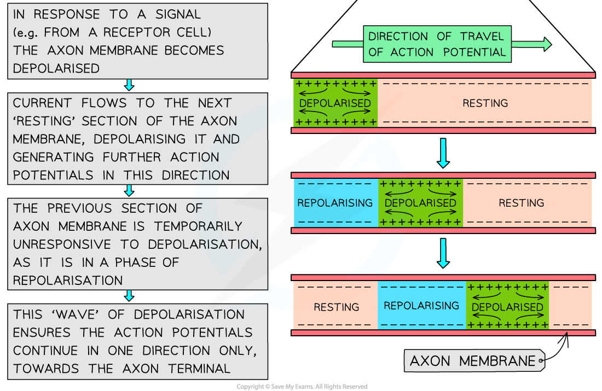

Transmission of Nerve Impulses
------------------------------

* <b>Neurones</b> transmit <b>electrical impulses</b> which travel along the neurone <b>cell surface membrane</b> from one end of a neurone to the other

  + Note that an impulse is <b>not</b> an electrical current that flows along neurones as if they were wires
  + Instead, an impulse is a <b>momentary reversal in the electrical potential difference</b> across the <b>neurone cell surface membrane</b>

    - The electrical potential difference across a membrane can also be described as the <b>voltage</b> across a membrane, the <b>difference in charge</b> across a membrane, or the <b>membrane potential</b>
* The different states of membrane potential across a neurone cell surface membrane during transmission of a nerve impulse include

  + <b>Resting potential</b>
  + <b>Action potential</b>

#### Resting potential

* In a <b>resting axon,</b> i.e.<b> </b>one that is <b>not transmitting impulses</b>, the <b>inside</b> of the axon always has a <b>negative electrical potential</b> compared to outside the axon

  + The <b>difference in charge</b> between the inside and outside of the neurone is due to <b>different numbers of ions</b> on each side of the neurone cell surface membrane
  + When there is a difference in charge across a membrane, we say that the membrane is <b>polarised</b>
* This <b>potential difference, </b>or <b>difference in charge,</b> across the membrane when there are no impulses is usually about<b> -70 mV</b> (millivolts) i.e. the inside of the axon has an electrical potential about 70 mV <b>lower</b> than the outside

  + -70 mV is the <b>resting potential</b> of the neurone
* Two factors contribute to establishing and maintaining resting potential

  + The active transport of sodium ions and potassium ions
  + A difference in membrane permeability to sodium and potassium ions

#### The active transport of sodium ions and potassium ions

* Carrier proteins called <b>sodium-potassium pumps</b> are present in the cell surface membranes of neurones
* These pumps use<b> ATP</b> to actively transport<b> sodium ions</b> (Na⁺) <b>out</b> of the axon and<b> potassium ions </b>(K⁺)<b> into</b> the axon
* The two types of ions are pumped at an unequal rate; for every <b>3 sodium ions that are pumped out</b> of the axon, only <b>2 potassium ions are pumped in</b>
* This creates a concentration gradient across the membrane for both sodium ions and potassium ions

#### Difference in membrane permeability to sodium ions and potassium ions

* Because of the concentration gradient generated by the sodium-potassium pumps, both sodium and potassium ions will <b>diffuse back across the membrane</b>

  + The neurone cell surface membrane has <b>sodium ion channels</b> and <b>potassium ion channels</b> that allow sodium and potassium ions to move across the membrane by facilitated diffusion
* The neurone membrane is <b>less permeable</b> to sodium ions than potassium ions, so potassium ions inside the neurone can diffuse <b>out </b>at a <b>faster rate</b> than <b>sodium ions</b> can diffuse <b>back in</b>
* This results in<b> more positive ions</b> on the <b>outside</b> of the neurone than on the inside, generating a <b>negative charge</b> <b>inside</b> the neurone in relation to the outside
* The result of this is that the neurone has a <b>resting membrane potential</b> of around <b>-70 millivolts (mV)</b>

<i><b>Sodium-potassium pumps in the membrane of a resting neurone generate a concentration gradient for both sodium ions and potassium ions. This process, together with the facilitated diffusion of potassium ions back out of the cell, generates a negative resting potential across the membrane</b></i>

#### Action potential

* Once resting potential is reached the neurone membrane is said to be <b>polarised</b>
* To initiate a nerve impulse in a neurone the membrane needs to be <b>depolarised</b>

  + Depolarisation is the <b>reversal of the electrical potential difference</b> across the membrane
* The depolarisation of the membrane occurs when an <b>action potential</b> is generated

  + Action potentials lead to the reversal of resting potential from around <b>-70 mV</b> to around <b>+30 mV </b>
* Action potentials involve the <b>rapid movement </b>of<b> sodium ions </b>and<b> potassium ions</b> across the <b>membrane</b> of the <b>axon</b>
* An action potential is the<b> potential electrical difference</b> produced across the axon membrane when a neurone is <b>stimulated</b> e.g. when an environmental stimulus is detected by a receptor cell

#### Generating an action potential

* Some of the ion channels in the membrane of a neurone are <b>voltage gated</b>, meaning that they open and close in response to changes in the <b>electrical potential</b> across the membrane

  + Voltage gated ion channels are <b>closed</b> when the membrane is at rest, but they are involved in the generation and transmission of action potentials
  + Note that not all of the channels in a neurone membrane are voltage gated e.g. some types of potassium ion channels are open when a neurone is at rest to enable potassium ions to diffuse out of the axon and generate a resting potential
* When a neurone is stimulated the following steps occur

  + A small number of <b>sodium ion channels</b> in the axon membrane <b>open</b>
  + <b>Sodium ions</b> begin to move <b>into the axon</b> down their <b>concentration gradient</b>

    - During resting potential there is a greater concentration of sodium ions outside the axon than inside due to the action of sodium-potassium pumps
  + This <b>reduces </b>the<b> potential difference</b> across the axon membrane as the <b>inside</b> of the axon becomes <b>less negative</b>
  + If the potential difference reaches around <b>-55 mV, </b>known as the <b>threshold potential</b>,<b> more sodium ion channels</b> open, leading to a further influx of sodium ions

    - This second set of sodium ion channels are voltage gated channels
    - Note that an <b>action potential </b>is only <b>initiated</b> if the <b>threshold potential </b>is reached
  + Once the charge has been reversed from -70 mV to around +30 mV the membrane is said to be <b>depolarised</b> and <b>an action potential</b> has been<b> generated</b>

#### Repolarisation

* About 1 millisecond after an action potential is generated all the<b> voltage gated sodium channels </b>in this section of membrane<b> close</b>
* <b>Voltage gated potassium channels</b> in this section of axon membrane now <b>open</b>, allowing the diffusion of potassium ions <b>out of the axon</b> down their concentration gradient

  + Remember that the sodium-potassium pumps have not stopped working during the action potential; hence the potassium ion gradient is still present
* This movement of potassium ions causes the inside of the axon to become negatively charged again, a process known as <b>repolarisation</b>

  + There is a short period during which the membrane potential is more negative than resting potential; this is known as <b>hyperpolarisation</b>
  + The period during which the membrane is hyperpolarised is known as the <b>refractory period</b>

    - The membrane is unresponsive to stimulation during the refractory period, so a new action potential cannot be generated at this time
    - This makes the action potentials <b>discrete</b> events and means the impulse can <b>only</b> <b>travel in one direction</b>
    - This is essential for the successful and efficient transmission of nerve impulses along neurones
* The voltage gated potassium channels then <b>close,</b> and the <b>sodium-potassium pumps</b> work to restore<b> resting potential</b>

  + Only once resting potential is restored can the membrane be stimulated again

<i><b>The depolarisation and repolarisation of an action potential can be clearly seen in a graph of membrane potential against time</b></i>

#### Transmission of an action potential

* Once an action potential has been generated it can be <b>propagated</b>, or transmitted, along the length of the axon

  + The depolarisation of the membrane at the site of the first action potential causes <b>sodium ions </b>to <b>diffuse along the cytoplasm</b> into the next section of the axon, <b>depolarising</b> the membrane in this new section, and causing voltage gated sodium channels to open
  + This triggers <b>another action potential</b> in this section of the axon membrane
  + This process then repeats along the length of the axon

    - Note that any sodium ions that diffuse backwards along the membrane are unable to initiate a new action potential due to the<b> hyperpolarised</b> nature of the membrane in the moments following an action potential
* The action potential is said to move along the axon in a <b>wave of depolarisation</b>
* In the body, this allows action potentials to begin at one end of an axon and then pass along the entire length of the axon membrane

<i><b>Nerve impulses can be transmitted along axons by the diffusion of sodium ions</b></i>

#### The all-or-nothing principle

* Action potentials are either generated or not generated depending on whether the <b>threshold potential</b> is reached; there is <b>no such thing as a small or large action potential</b>

  + If a stimulus is <b>weak </b>only a few sodium ion channels will open and the membrane won’t be sufficiently depolarised to reach the <b>threshold potential; </b>an action potential will not be generated
  + If a stimulus is <b>strong enough</b> to raise the membrane potential above the<b> threshold</b> <b>potential</b> then an action potential will be generated
* This is the <b>all-or-nothing principle</b>

  + An impulse is <b>only transmitted</b> if the <b>initial stimulus is sufficient</b> to increase the membrane potential above a <b>threshold potential</b>
* Stimulus size can be detected by the brain because as the <b>intensity of a stimulus</b> <b>increases</b>, the <b>frequency </b>of action potentials transmitted along the neurone<b> increases</b>

  + This means that a small stimulus may only lead to one action potential, while a large stimulus may lead to several action potentials in a row

<i><b>As the strength of a stimulus increases, the frequency at which action potentials are generated also increases</b></i>

#### Myelination

* In <b>unmyelinated</b> neurones the speed of conduction is relatively <b>slow</b> because depolarisation must occur along the whole membrane of the axon
* By insulating the axon membrane myelin <b>increases the speed at which action potentials can travel</b> along the neurone

  + In sections of the axon that are surrounded by a myelin sheath membrane <b>depolarisation</b> <b>cannot occur</b>, as the myelin sheath <b>stops</b> the diffusion of sodium and potassium ions
  + Action potentials can only occur at the <b>nodes of Ranvier</b>

    - Nodes of Ranvier are the gaps between the Schwann cells that make up the myelin sheath
  + Sodium ions diffuse along the axon within the Schwann cells and the membrane at the nodes of Ranvier depolarises when the sodium ions arrive

    - The diffusion of sodium ions in this way is known as <b>local currents</b>, or <b>local circuits</b>
  + The action potential therefore appears to<b> ‘jump’ from one node to the next; </b>this is known as <b>saltatory conduction</b>
* Saltatory conduction allows the impulse to travel <b>much faster</b> than in an unmyelinated axon of the same diameter

<i><b>Action potentials are transmitted along myelinated axons by saltatory conduction</b></i>

#### Preventing impulse transmission

* The transmission of nerve impulses is essential to survival as it allows the body to <b>detect and respond to stimuli</b>
* On occasion, however, it is useful to be able to prevent the transmission of impulses e.g. in painkillers and anaesthetics
* Our understanding of the way that action potentials are transmitted means that it is possible to design medications that <b>prevent impulse transmission</b>

  + Such drugs may <b>bind to sodium ion channels</b>, preventing them from opening and therefore <b>preventing an influx of sodium ions</b> when an axon is stimulated
  + Preventing sodium ion influx <b>prevents membrane depolarisation</b> and an <b>action potential cannot be generated</b>