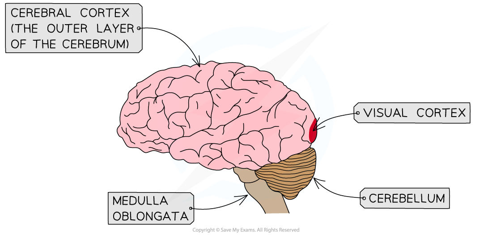

Development of the Visual Cortex
--------------------------------

* The visual cortex is the <b>region of the cerebral cortex</b> in which <b>visual information</b> is processed

  + The cerebral cortex is the outer layer of the <b>cerebrum</b>
* Soon after birth the neurones in the visual cortex of baby mammals begin to form connections, or <b>synapses</b>, allowing visual information to be transferred through and processed by the visual cortex
* Both eyes need to be visually stimulated in order for the neurones in the visual cortex to be <b>organised correctly</b> during this period of early development, known as the <b>critical period</b>
* Synapses that pass on nerve impulses during this critical period are <b>strengthened</b> and become <b>permanent parts of the structure of the visual cortex</b>
* Synapses that do not receive nerve impulses during this critical period <b>are lost</b> and <b>cannot be re-formed</b>

  + This can result in blindness in one or both eyes if visual stimulation is not provided during the critical period
* Evidence for this critical period of development comes from a <b>study using animal models</b> carried out by Hubel and Wiesel

<i><b>The visual cortex is located at the back of the brain within the cerebral cortex</b></i>