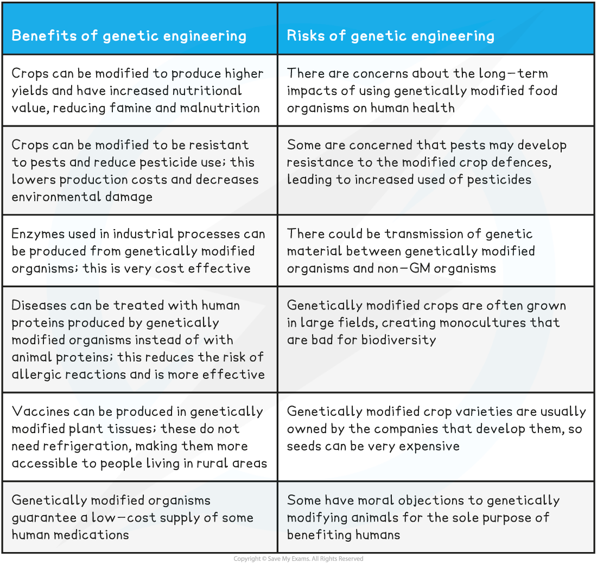

Producing Drugs Using GMOs
--------------------------

* Genetic engineering is a technique used to deliberately modify a specific characteristic of an organism

  + The technique involves <b>removing a gene</b> that codes for a desired characteristic from <b>one organism</b> and <b>transferring</b> the gene <b>into another</b> organism where the <b>desired gene is then </b>expressed
* The genetically engineered organism is said to contain <b>recombinant DNA</b> and will be a <b>genetically modified organism</b> (GMO)
* Micro-organisms, plants and animals have been genetically engineered to produce proteins used in medicine

#### Genetically modified micro-organisms

* Restriction enzymes are used to <b>remove</b> the gene coding for a desired protein from an organism's genome

  + The protein coded for here will be responsible for the <b>characteristic desired</b> in the GMO e.g. the ability to produce insulin
* Many <b>copies</b> of the gene are made using the <b>polymerase chain reaction</b>, or <b>PCR</b>

  + The enzyme DNA polymerase is used to join free nucleotides into new strands of DNA that are complementary to the original strand
* These copies are <b>inserted into</b> small loops of DNA called <b>plasmids, </b>which then<b> transfer the copies</b> into micro-organisms

  + The plasmids are said to be DNA <b>vectors</b>
  + The enzyme DNA ligase catalyses the joining of the desired gene to the plasmid vector
* The genetically modified micro-organisms are <b>grown in large fermenters</b> containing nutrients, enabling them to <b>multiply </b>and produce <b>large quantities</b> of the new protein
* The protein can be <b>isolated</b> and <b>purified</b> before being packaged and distributed

  + <b>Human insulin</b> and <b>human blood clotting factors</b> are examples of medicinal proteins produced by genetically modified bacteria

<i><b>The human insulin gene can be inserted into bacterial plasmid vectors which are then transferred into bacterial cells</b></i>

#### Genetically modified plants

* A similar process can be used to insert desired genes from other organisms into plant cells
* After the gene is inserted into a plasmid and then transferred to a bacterial cell, the bacteria can be used to <b>infect plant cells; </b>the bacterium acts as a <b>vector</b> for <b>introducing the gene into the plant DNA</b>

  + Note that this isn't the only method of introducing new genes into plant cells

    - Another method involves a 'gene gun'; tiny pellets are coated with the desired DNA and then fired into the plant cells
* The gene is transferred from the bacterial cell <b>into the plant cell nucleus</b>, after which the plant cell is stimulated to multiply and grow into an <b>adult plant</b>

  + <b>Each cell</b> of the plant <b>contains a copy</b> of the gene coding for the desired protein
* The protein can now be <b>purified</b> from the plant tissues, or the plant can be<b> eaten</b> to deliver the drug

  + <b>Human insulin</b> and a <b>cholera vaccine</b> are examples of drugs produced by modified plants

#### Genetically modified animals

* The gene that codes for the desired protein is injected into the <b>nucleus of a </b>zygote
* The zygote is <b>implanted</b> into the uterus of a surrogate animal where it develops into an <b>adult animal</b>

  + <b>Every cell</b> of this genetically modified animal will <b>contain a copy</b> of the gene coding for the desired protein
* The protein can be <b>purified </b>from<b> e.g. the milk</b> of the animal

  + <b>Human blood clotting proteins </b>can be produced from the milk of genetically modified animals

Using GMOs: Risks & Benefits
----------------------------

* While GMOs can be used for medical benefit, there is still <b>much concern about the potential impacts</b> of changing the genes of organisms, as well as the <b>ethics of genetically modifying animals</b>

  + These concerns are often amplified when the GMOs are <b>crop plants destined for human consumption</b>

<b>Risks and Benefits of Genetic Engineering Table</b>

