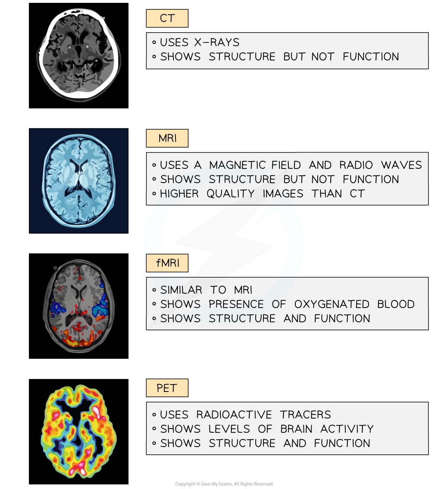

Studying the Brain
------------------

* Our understanding of brain structure and function is limited

  + The brain is incredibly<b> complex</b> and <b>very delicate</b>
  + Different regions work together to bring about brain function so can’t be studied in <b>isolation</b>
* It is therefore extremely difficult for neuroscientists to study the brain and find out how it works
* Specialised <b>scanners</b> and techniques can be used to study the brain without having to resort to <b>surgical intervention</b>

#### Computerised Tomography

* <b>Computerised tomography</b>, or <b>CT</b>, scans produce cross-section images of the brain using <b>x-ray radiation</b>

  + A beam of x-rays are aimed at a patient from all angles around the body
  + Digital x-ray detectors are used to pick up the x-rays as they exit the patient's body
  + Denser tissue absorbs more of the x-ray radiation so shows up as a lighter region on a scan
* A scan produced in this way shows <b>physical structures</b> of the brain and allows visualisation of any tissue damage

  + E.g. blood is less dense than brain tissue so a CT scan can be used to locate damaged blood vessels and areas of bleeding after a patient has had a stroke
* The scans <b>don't directly show the functions</b> of the regions of the brain but it is possible to link visible symptoms with the location of any tissue damage

  + This can allow neurologists to work out which regions of the brain are responsible for which functions
* CT scans are not recommended for <b>pregnant patients or children</b> due to the risks of exposure to the X-ray radiation, which is given at a <b>higher level</b> than in a normal X-ray

  + The risk of damage from such scans is still very low

#### Magnetic Resonance Imaging

* <b>Magnetic Resonance Imaging</b>, or <b>MRI</b>, uses a combination of a <b>magnetic field and radio waves</b> to generate images through the body

  + The patient being scanned must remain very still while inside a large magnet
* <b>Soft tissues</b> can be seen clearly using MRI, and images produced are at a <b>higher resolution</b> than those produced from CT scanning
* As with CT scanning, MRI is useful for <b>identifying areas of abnormal or damaged tissue</b>, but only enables brain function to be analysed by<b> linking damage on a scan with visible symptoms</b> in a patient
* MRI is especially useful for <b>tumour diagnosis</b> as tumours show up clearly in images generated in this way

  + MRI scans can therefore be used to <b>identify and locate tumours</b> in the brain
* MRI scans are <b>considerably more expensive</b> to carry out than CT scans but <b>do not carry the risk associated with the use of potentially harmful x-rays</b>

  + MRI scans are often the imaging method of choice during long-term therapies
* The magnetic field of an MRI scanner can <b>interfere with medical devices</b> such as pacemakers and insulin pumps, so patients with such devices cannot have MRI scans

#### Functional MRI

* <b>Functional MRI</b>, or <b>fMRI</b>, functions in a similar way to MRI, making use of a magnetic field and radio waves to generate images of brain structure
* The difference between MRI and fMRI is that fMRI scans allow <b>brain function to be studied in real time</b>

  + fMRI scans show the <b>location of oxygenated blood</b> in the brain, therefore indicating <b>which brain regions are active</b> at any one time

    - The scanner measures the <b>ratio of oxygenated to deoxygenated</b> haemoglobin
  + Patients can be asked to carry out particular actions, answer questions, or think about a specific topic while inside a scanner and the <b>change in blood flow to regions of the brain can be assessed</b>

    - The region of the brain associated with the activity or thought will 'light up' in the scanner
    - This can be used in medical diagnosis e.g. searching for the cause of seizures, or in psychology research

#### Positron Emission Tomography

* PET scans use <b>radioactive tracers</b> which collect in areas where there is <b>increased</b> <b>blood flow,</b> metabolism, or neurotransmitter activity

  + The tracer is introduced to the blood in advance of the scan so that it can be detected by the scanner
  + E.g. a radioactive tracer might be <b>radioactively labelled glucose</b>; glucose will be transported in the blood and will be present in high concentrations in metabolically active areas of the brain
* The scanner can detect areas of <b>high radioactivity</b>, and so the movement of the tracer through the body and any accumulation of tracer in the brain can be seen
* The amount of radioactive tracer present in a brain region can<b> indicate whether that region is active or inactive</b>

  + This has been useful in building an understanding of specific diseases such as Alzheimer's where brain activity in certain regions decreases
* Neurologists can use the images to study the <b>structure</b> and <b>function</b> of the brain in <b>real time</b>

<i><b>Some types of scan show only structure, while other allow the study of structure and function in real time</b></i>