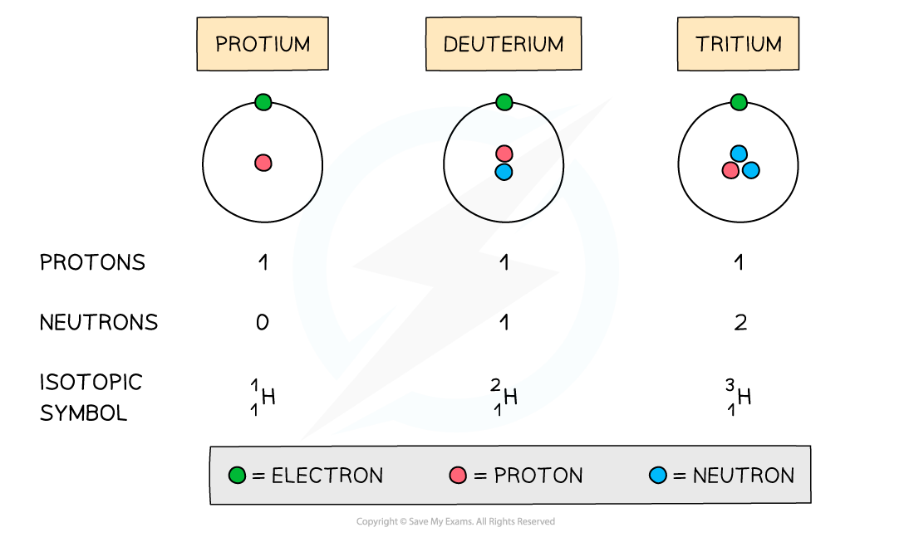

Atomic Structure Calculations
-----------------------------

* An atom is <b>neutral </b>and has no overall charge
* Ions on the other hand are formed when atoms either <b>gain </b>or <b>lose </b>electrons, causing them to become <b>charged</b>
* The number of <b>subatomic particles </b>in atoms and ions can be determined given their atomic (proton) number, mass (nucleon) number and charge

#### Properties

* Isotopes have <b>similar chemical properties </b>but <b>different physical properties</b>

#### Chemical properties

* Isotopes of the same element display the<b> same chemical characteristics</b>
* This is because they have the same number of electrons in their <b>outer</b> <b>shells</b>
* Electrons take part in <b>chemical reactions </b>and therefore determine the <b>chemistry </b>of an atom

#### Physical properties

* The only difference between isotopes is the number of <b>neutrons</b>
* Since these are neutral subatomic particles, they only add <b>mass</b> to the atom
* As a result of this, isotopes have different <b>physical properties </b>such as small differences in their <b>mass</b>, <b>density</b>, <b>melting point</b> and<b> boiling point </b>

  + For example samples of uranium hexafluoride gas, UF6, can undergo uranium enrichment by using a gas centrifuge cylinder
  + This is because nuclear reactors require higher amounts of the lighter U235 isotope
  + UF6 gas is placed in a gas centrifuge cylinder and rotated at a high speed
  + This rotation creates a strong centrifugal force so that the heavier gas molecules (UF6 containing the heavier U238 isotope) move towards the outside of the cylinder
  + The lighter gas molecules (containing the U235 isotope) collect closer to the centre

#### Protons

* The atomic number of an atom and ion determines which element it is
* Therefore, all atoms and ions of the <b>same element</b> have the same number of protons (atomic number) in the nucleus

  + E.g. lithium has an atomic number of 3 (three protons) whereas beryllium has atomic number of 4 (4 protons)
* The number of protons equals the <b>atomic (proton) number</b>
* The number of protons of an <b>unknown </b>element can be calculated by using its mass number and number of neutrons:

<i><b>Mass number = number of protons + number of neutrons</b></i>

<i><b>Number of protons = mass number - number of neutrons</b></i>

#### Worked Example

Determine the number of protons of the following ions and atoms:

1. Mg2+ ion
2. Carbon atom
3. An unknown atom of element X with mass number 63 and 34 neutrons

<b>Answers</b>

<b>Answer 1: </b>The atomic number of a magnesium atom is 12 indicating that the number of protons in the magnesium    element is 12

* Therefore the number of protons in a <b>Mg</b><b>2+</b><b> ion</b> is also 12

<b>Answer 2: </b>The atomic number of a carbon atom is 6 indicating that a <b>carbon atom</b> has 6 protons in its nucleus

<b>Answer 3: </b>Use the formula to calculate the number of protons

<i><b>Number of protons = mass number - number of neutrons</b></i>

<i><b>Number of protons = 63 - 34</b></i>

<i><b>Number of protons = 29</b></i>

* <b>Element X</b> is therefore copper

#### Electrons

* An atom is <b>neutral </b>and therefore has the <b>same </b>number of <b>protons </b>and <b>electrons</b>
* Ions have a different number of electrons to their atomic number depending on their charge

  + A positively charged ion has <b>lost </b>electrons and therefore has<b> fewer</b> electrons than protons
  + A negatively charged ion has <b>gained </b>electrons and therefore has <b>more</b> electrons than protons

#### Worked Example

Determine the number of electrons of the following ions and atoms:

1. Mg2+ ion
2. Carbon atom
3. An unknown atom of element X with mass number 63 and 34 neutrons

<b>Answers</b>

<b>Answer 1: </b>The atomic number of a magnesium atom is 12 suggesting that the number of protons in the <b>neutral </b>magnesium <b>atom</b> is 12

* However, the 2+ charge in Mg2+ ion suggests it has <b>lost</b> two electrons

  + It only has 10 electrons left now

<b>Answer 2:</b> The atomic number of a carbon atom is 6 suggesting that the <b>neutral</b> carbon <b>atom</b> has 6 electrons orbiting    around the nucleus

<b>Answer 3: </b>The number of protons of element <b>X</b> can be calculated by:

<i><b>Number of protons = mass number - number of neutrons</b></i>

<i><b>Number of protons = 63 - 34</b></i>

<i><b>Number of protons = 29</b></i>

* The <b>neutral atom </b>of element <b>X</b>  therefore also has 29 electrons

#### Neutrons

* The <b>mass </b>and <b>atomic</b> <b>numbers </b>can be used to find the number of <b>neutrons</b> in <b>ions </b>and <b>atoms:</b>

<i><b>Number of neutrons = mass number (A) - number of protons (Z)</b></i>

#### Worked Example

Determine the number of neutrons of the following ions and atoms:

1. Mg2+ ion
2. Carbon atom
3. An unknown atom of element X with mass number 63 and 29 protons

<b>Answers</b>

<b>Answer 1: </b>The atomic number of a magnesium atom is 12 and its mass number is 24

<i><b>Number of neutrons = mass number (A) - number of protons (Z)</b></i>

<i><b>Number of neutrons = 24 - 12</b></i>

<i><b>Number of neutrons = 12</b></i>

* The <b>Mg</b><b>2+</b><b> ion </b>has 12 neutrons in its nucleus

<b>Answer 2: </b>The atomic number of a carbon atom is 6 and its mass number is 12

<i><b>Number of neutrons = mass number (A) - number of protons (Z)</b></i>

<i><b>Number of neutrons = 12 - 6</b></i>

<i><b>Number of neutrons = 6</b></i>

* The <b>carbon atom </b>has 6 neutrons in its nucleus

<b>Answer 3: </b>The atomic number of an element <b>X </b>atom is 29 and its mass number is 63

<i><b>Number of neutrons = mass number (A) - number of protons (Z)</b></i>

<i><b>Number of neutrons = 63 - 29</b></i>

<i><b>Number of neutrons = 34</b></i>

* The <b>neutral atom </b>of element <b>X</b> has 34 neutrons in its nucleus

Defining & Calculating Isotopes
-------------------------------

* The symbol for an isotope is the <b>chemical</b> <b>symbol</b> (or <b>word</b>) followed by a <b>dash</b> and then the <b>mass</b> <b>number</b>

  + E.g. carbon-12 and carbon-14 are isotopes of carbon containing 6 and 8 neutrons respectively
* Isotopes are atoms of the <b>same</b> <b>element</b> that contain the same number of <b>protons</b> and electrons but a different number of <b>neutrons</b>

  + For example, three isotopes of hydrogen are protium, deuterium and tritium

<i><b>The atomic structure and symbols of the three isotopes of hydrogen</b></i>