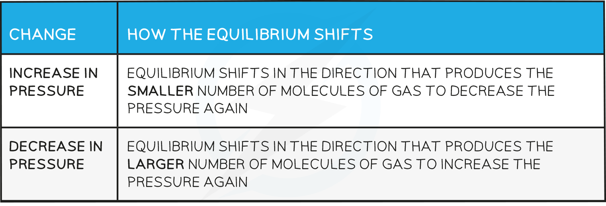

Le Chatelier's Principle
------------------------

#### Position of the equilibrium

* The <b>position of the equilibrium</b> refers to the relative amounts of products and reactants in an equilibrium mixture
* When the position of equilibrium shifts to the <b>left</b>, it means the concentration of <b>reactants </b>increases
* When the position of equilibrium shifts to the <b>right</b>, it means the concentration of <b>products </b>increases

#### Le Chatelier’s principle

* <b>Le Chatelier’s principle</b> says that if a change is made to a system in dynamic equilibrium, the position of the equilibrium moves to counteract this change
* The principle is used to predict changes to the position of equilibrium when there are changes in temperature, pressure or concentration

#### Effects of concentration

<b>How the equilibrium shifts with concentration changes</b>

#### Worked Example

<b>Changes in equilibrium position</b>

Using the reaction below:

CH3COOH (I) + C2H5OH (I)  ⇌  CH3COOC2H5 (I) + H2O (I)

Explain what happens to the position of equilibrium when:

<b>   1. More CH</b><b>3</b><b>COOC</b><b>2</b><b>H</b><b>5</b><b> is added</b>

<b>   2. Some C</b><b>2</b><b>H</b><b>5</b><b>OH is removed</b>

Using the reaction below:

Ce4+ (aq) + Fe2+ (aq) ⇌ Ce3+ (aq) + Fe3+ (aq)

Explain what happens to the position of equilibrium when

<b>   3. Water is added to the equilibrium mixture</b>

<b>Answer 1:</b>

* The position of the equilibrium moves to the left and more ethanoic acid and ethanol are formed

  + The reaction moves in this direction to oppose the effect of added ethyl ethanoate, so the ethyl ethanoate decreases in concentration

<b>Answer 2:</b>

* The position of the equilibrium moves to the left and more ethanoic acid and ethanol are formed

  + The reaction moves in this direction to oppose the removal of ethanol so more ethanol (and ethanoic acid) are formed from ethyl ethanoate and water

<b>Answer 3:</b>

* There is no effect as the water dilutes all the ions equally so there is no change in the ratio of reactants to products

#### Effects of pressure

* Changes in pressure only affect reactions where the reactants or products are gases

<b>How the equilibrium shifts with pressure changes</b>

#### Worked Example

<b>Changes in pressure</b>

Predict the effect of increasing the pressure on the following reactions:

<b>   1. N</b><b>2</b><b>O</b><b>4 </b><b>(g) ⇌ 2NO</b><b>2 </b><b>(g)</b>

<b>   2. CaCO</b><b>3 </b><b>(s) ⇌ CaO (s) + CO</b><b>2 </b><b>(g)</b>

Predict the effect of decreasing the pressure on the following reaction:

<b>   3. 2NO</b><b>2 </b><b>(g) ⇌ 2NO (g) + O</b><b>2 </b><b>(g)</b>

<b>Answer 1:</b>

* The equilibrium shifts to the left as there are fewer gas molecules on the left

  + This causes a decrease in pressure

<b>Answer 2:</b>

* The equilibrium shifts to the left as there are no gas molecules on the left but there is CO2 on the right

  + This causes a decrease in pressure

<b>Answer 3:</b>

* The equilibrium shifts to the right as there is a greater number of gas molecules on the right

  + This causes an increase in pressure

#### Effects of temperature

<b>How the equilibrium shifts with temperature changes</b>

#### Worked Example

<b>Changes in temperature</b>

Using the reaction below:

H2 (g) + CO2 (g) ⇌  H2O (g) + CO (g)    ΔH = +41.2 kJ mol-1

<b>   1. Predict the effect of increasing the temperature on this reaction</b>

Using the reaction below:

Ag2CO3 (s)  ⇌  Ag2O (s) + CO2 (g)

<b>   2. Increasing the temperature increases the amount of CO</b><b>2</b><b>(g) at constant pressure. Is this reaction exothermic or    endothermic?</b>

Explain your answer

<b>Answer 1:</b>

* The reaction will absorb the excess energy and since the forward reaction is endothermic, the equilibrium will shift to the right

<b>Answer 2:</b>

* The reaction will absorb the excess energy and since this causes a shift of the equilibrium towards the right (as more CO2(g) is formed) this means that the reaction is endothermic