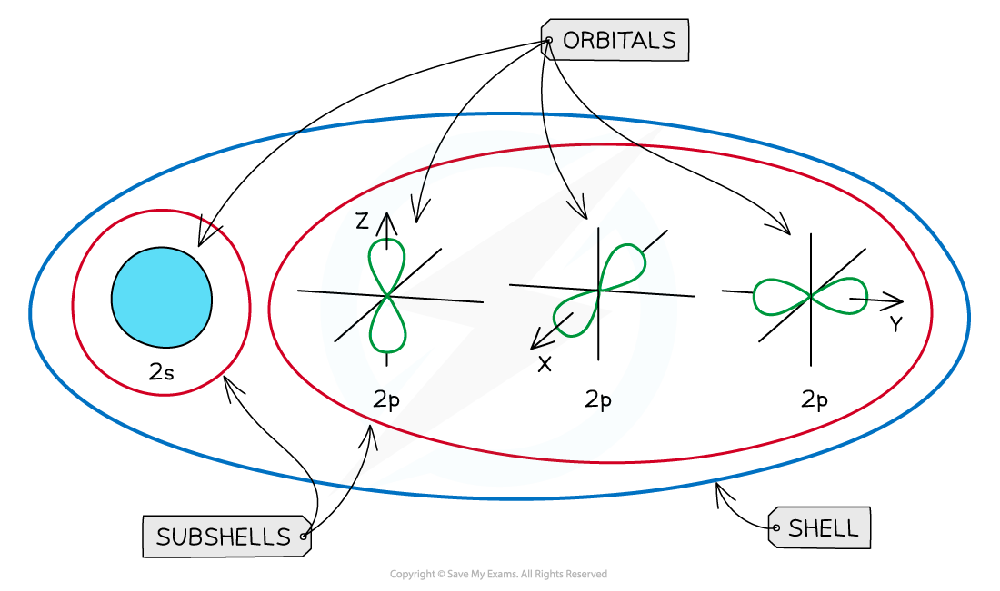

Orbital Shapes
--------------

#### Orbitals

* Subshells contain one or more <b>atomic orbitals</b>
* Orbitals exist at <b>specific</b> energy levels and electrons can only be found at these specific levels, <b>not</b> in between them

  + Each atomic orbital can be occupied by a maximum of two electrons
* This means that the number of orbitals in each subshell is as follows:

  + <b>s</b> : one orbital (1 x 2 = total of 2 electrons)
  + <b>p</b> : three orbitals ( 3 x 2 = total of 6 electrons)
  + <b>d</b> : five orbitals (5 x 2 = total of 10 electrons)
  + <b>f</b> : seven orbitals (7 x 2 = total of 14 electrons)
* The orbitals have specific 3-D shapes

#### s orbital shape

* The s orbitals are <b>spherical</b> in shape
* The <b>size</b> of the s orbitals increases with increasing shell number

  + E.g. the s orbital of the <b>third </b>quantum shell (<i>n</i> = 3) is bigger than the s orbital of the <b>first</b> quantum shell (<i>n</i> = 1)

#### p orbital shape

* The p orbitals have a <b>dumbbell shape</b>
* Every shell has three p orbitals except for the first one (<i>n</i> = 1)
* The p orbitals occupy the x, y and z axes and point at right angles to each other, so are oriented <b>perpendicular</b> to one another
* The lobes of the p orbitals become <b>larger</b> and <b>longer</b> with increasing shell number

<i><b>Representation of orbitals (the dot represents the nucleus of the atom) showing spherical s orbitals (a), p orbitals containing ‘lobes’ along the x, y and z axis</b></i>

* Note that the shape of the d orbitals is <b>not</b> required

<i><b>An overview of the shells, subshells and orbitals in an atom</b></i>

Filling Orbitals
----------------

* Electrons can be imagined as small <b>spinning charges </b>which rotate around their own axis in either a <b>clockwise</b> or <b>anticlockwise direction</b>

  + The spin of the electron is represented by its direction
  + The spin creates a tiny magnetic field with N-S pole pointing up or down

<i><b>Electrons can spin either in a clockwise or anticlockwise direction around their own axis</b></i>

* Electrons with the same <b>spin </b>repel each other which is also called <b>spin-pair repulsion</b>

  + Therefore, electrons will occupy separate orbitals in the same subshell first to minimise this repulsion and have their <b>spin </b>in the same direction
  + They will then pair up, with a second electron being added to the first p orbital, with its spin in the <b>opposite</b> direction
* This is known as <b>Hund's Rule</b>

  + E.g. if there are three electrons in a <b>p subshell</b>, one electron will go into each px, py and pz orbital

<i><b>Electron configuration: three electrons in a p subshell</b></i>

* The principal quantum number indicates the energy level of a particular shell but also indicates the energy of the electrons in that shell

  + A 2p electron is in the second shell and therefore has an energy corresponding to <i>n </i>= 2
* Even though there is repulsion between negatively charged electrons, they occupy the same region of space in orbitals
* An orbital can only hold two electrons and they must have opposite spin - the is known as the <b>Pauli Exclusion Principle</b>
* This is because the energy required to jump to a higher<b> </b>empty orbital is <b>greater </b>than the inter-electron repulsion
* For this reason, they pair up and occupy the lower energy levels first