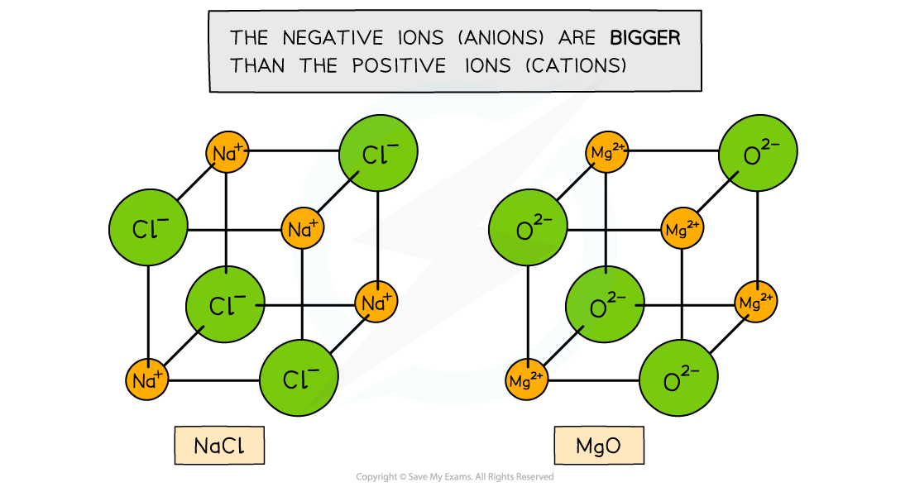

Physical Properties of Ionic Compounds
--------------------------------------

* Most ionic, metallic and covalent solids are <b>crystalline lattices</b>
* The ions, atoms or molecules are arranged in a <b>regular and repeating arrangement</b>

#### Giant ionic lattices

* An <b>ionic bond</b> is an electrostatic force of attraction between a positively charged metal (<b>cation</b>) ion and a negatively charged non-metal (<b>anion</b>) ion

  + The metal becomes positively charged as it transfers electrons to the non-metal which then becomes negatively charged
  + When an ionic compound is formed, the attraction between the ions happens in all directions
* Ionic compounds are arranged in giant <b>ionic lattices </b>(also called <b>giant ionic structures</b>)
* The type of lattice formed depends on the sizes of the <b>positive </b>and <b>negative </b>ions which are arranged in an <b>alternating </b>fashion

  + The ionic lattice of MgO and NaCl are <b>cubic</b>

<i><b>Ionic lattices of the ionic compounds NaCl and MgO</b></i>

<i><b>General ionic lattice which shows the actual packing of the ions</b></i>

<b>Melting and boiling point</b>

* Most ionic compounds are solids at room temperature
* This is because there isn't enough energy to overcome the strong electrostatic forces of attraction between the oppositely charged ions that make up the lattice
* Therefore, high temperatures are required to make an ionic compound melt or boil
* Melting (and boiling) points are also higher for lattices that contain ions with a greater ionic charge

  + For example, the melting point of sodium oxide, Na2O, is 1405 K while the melting point of calcium oxide, CaO, is 2845 K
  + This is due to a stronger attraction between the ions - the size of the ions is not a factor here as the Na+ and Ca2+ ions are a similar size

<b>Electrical Conductivity</b>

* For electrical current to flow there must be present freely moving charged particles such as electrons or ions
* Ionic compounds can conduct electricity in the <b>molten</b> state or in<b> solution</b> as they have ions that can move and carry charge
* They cannot conduct electricity in the solid state as the ions are in fixed positions within the lattice and are unable to move

<i><b>Molten or aqueous particles move and conduct electricity but cannot in the solid state</b></i>

<b>Solubility </b>

* Many ionic compounds will dissolve in <b>polar</b> solvents, e.g. water
* Solubility is dependent on two main factors:

  1. Breaking down the ionic lattice
  2. The polar molecules attracting and surrounding the ions
* Polar molecules, such as water, can break down or disrupt the ionic lattice and surround each ion in solution
* The δ+ end of the polar molecule can surround the negative anion
* The δ- end of the polar molecule can surround the positive cation
* The solubility of an ionic compound depends on the relative strength of the electrostatic forces of attraction within the ionic lattice and the attractions between the ions and the polar molecule
* In general, the greater the ionic charge the less soluble an ionic compound is

  + For example, 356.9 g of sodium chloride, NaCl, will dissolve in one dm3 of water while only 74.4 g of calcium chloride will dissolve in one dm3 of water
  + This is a general rule though and there are many exceptions

<i><b>The polar water molecules will form ion-dipole bonds with the ions in solution causing the ions to become hydrated</b></i>

#### Evidence for the Existence of Ions

* The behaviour of ionic substances during electrolysis is a clear piece of evidence for the existence of ions

  + Positive ions in solution are attracted to the negative electrode
  + Negative ions in solution are attracted to the positive electrode

<i><b>Set up of electrolysis </b></i>

* An example which is simple to see the separation is using copper(II) chromate(VI), CuCrO4
* The solution contains

  + <b>Cu</b><b>2+ </b><b>ions (blue)</b>
  + <b>CrO</b><b>4</b><b>2- </b><b>ions (yellow)</b>

    
* Overall the solution is an olive green colour, but when the solution undergoes electrolysis a blue colour appears around the negative electrode, and a yellow colour appears around the positive electrode
* This is because the Cu2+ ions are attracted to the negative electrode and their blue colour is observed and the CrO42- ions are attracted to the positive electrode and their yellow colour is observed