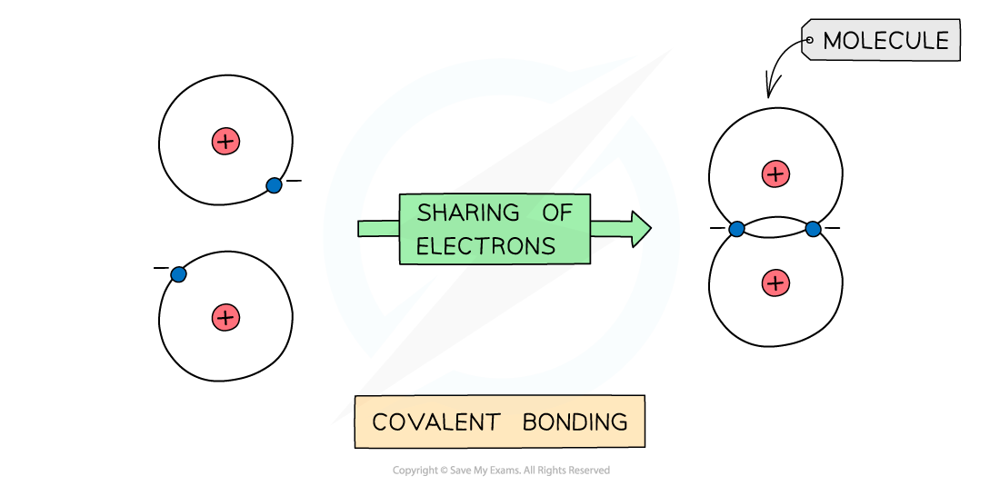
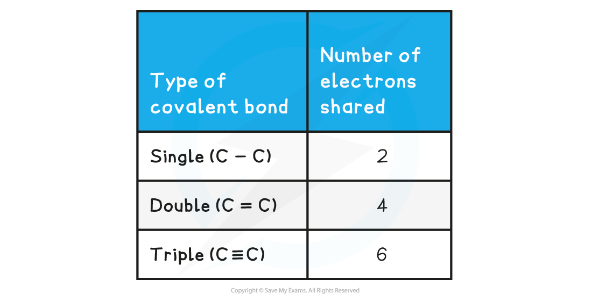

Covalent Bonding
----------------

* <b>Covalent</b> bonding occurs between two <b>non-metals</b>
* A covalent bond involves the <b>electrostatic</b> <b>attraction</b> between nuclei of two atoms and the bonding electrons of their outer shells
* <b>No</b> <b>electrons</b> are <b>transferred</b> but only <b>shared </b>in this type of bonding

<i><b>The positive nucleus of each atom has an attraction for the bonding electrons shared in the covalent bond</b></i>

* <b>Non-metals</b> are able to <b>share</b> pairs of electrons to form different types of covalent bonds
* Sharing electrons in the covalent bond allows each of the 2 atoms to achieve an electron configuration similar to a noble gas

  + This makes each atom more stable

<b>Covalent Bonds & Shared Electrons Table</b>

