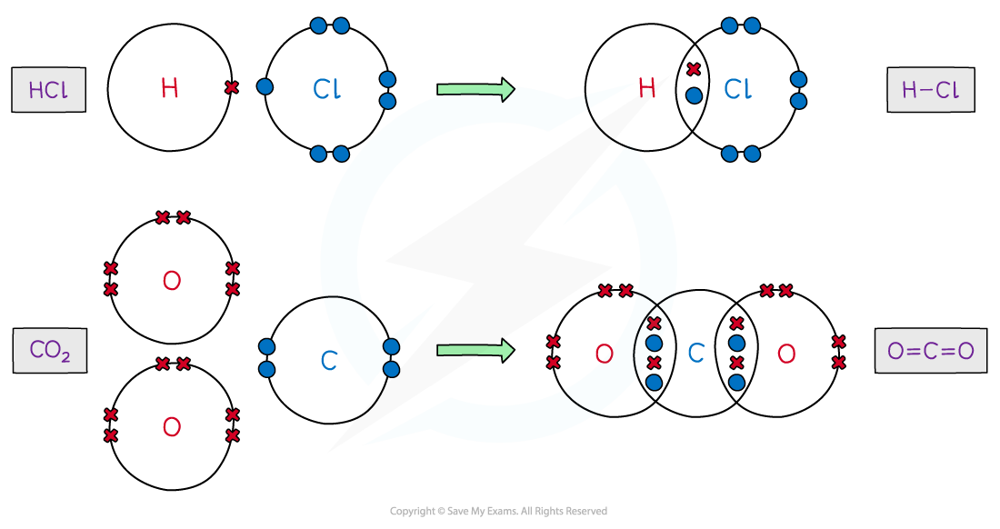
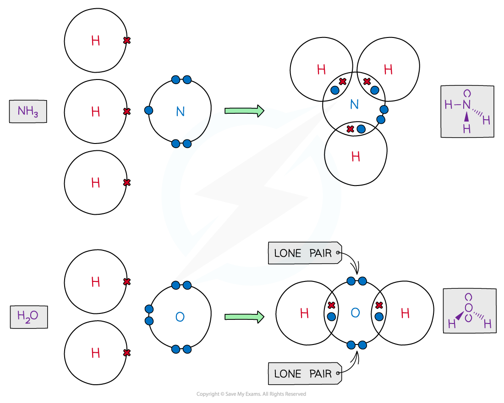
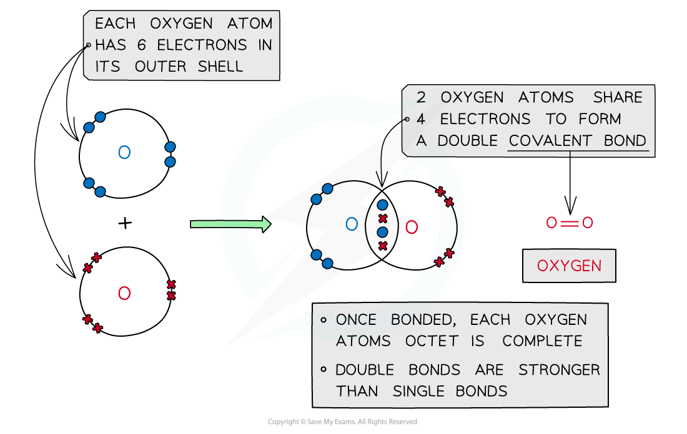
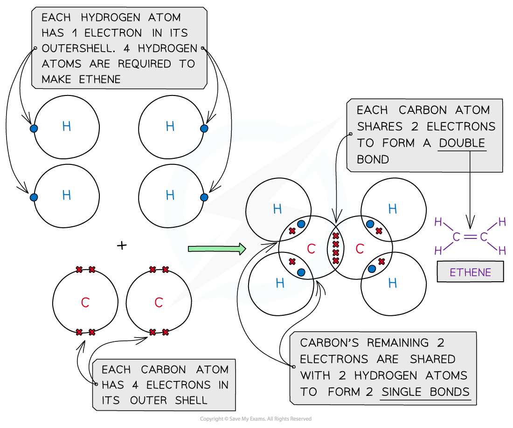
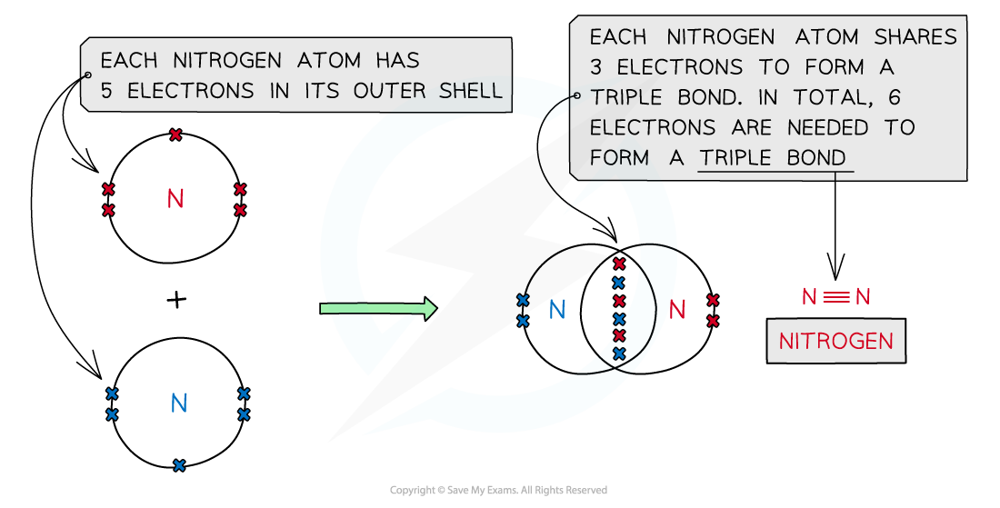
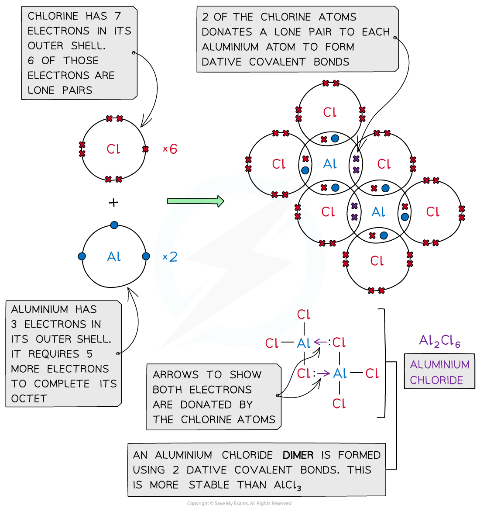

Covalent Dot-and-Cross Diagrams
-------------------------------

#### Covalent compounds

* The atoms in covalent compounds will<b> share </b>their outer valence electrons to achieve a <b>noble gas </b>configuration

<i><b>Dot-and-cross diagrams of covalent compounds in which the atoms share their valence electrons</b></i>

#### Double covalent bonding

<b>Oxygen, O</b><b>2</b>

<i><b>Covalent bonding in oxygen</b></i>

<b>Carbon dioxide, CO</b><b>2</b>

<i><b>Covalent bonding in carbon dioxide</b></i>

<b>Ethene, C</b><b>2</b><b>H</b><b>4</b>

<i><b>Covalent bonding in ethene</b></i>

#### Triple covalent bonding

<b>Nitrogen, N</b><b>2</b>

<i><b>Covalent bonding in nitrogen</b></i>

#### Dative covalent bonding

* In <b>simple</b> <b>covalent</b> <b>bonds</b>, the two atoms involved share electrons
* Some molecules have a <b>lone</b> pair of electrons that can be donated to form a bond with an <b>electron-deficient</b> atom

  + An electron-deficient atom is an atom that has an <b>unfilled outer orbital</b>
* So <b>both electrons</b> are from the <b>same atom</b>
* This type of bonding is called <b>dative covalent bonding</b> or <b>coordinate bonding</b>
* An example with a dative bond is in an <b>ammonium ion</b>

  + The hydrogen ion, H+ is <b>electron-deficient </b>and has space for two electrons in its shell
  + The nitrogen atom in ammonia has a lone pair of electrons which it can donate to the hydrogen ion to form a dative covalent bond

<i><b>Ammonia (NH</b></i><i><b>3</b></i><i><b>) can donate a lone pair to an electron-deficient proton (H</b></i><i><b>+</b></i><i><b>) to form a charged ammonium ion (NH</b></i><i><b>4</b></i><i><b>+</b></i><i><b>)</b></i>

#### Aluminium chloride

* <b>Aluminium</b> <b>chloride</b> is also formed using dative covalent bonding
* At <b>high temperatures </b>aluminium chloride can exist as a <b>monomer</b> (AlCl3)

  + The molecule is electron-deficient and needs two electrons to complete the aluminium atom’s outer shell
* At <b>lower temperatures </b>the two molecules of AlCl3 join together to form a dimer (Al2Cl6)

  + The molecules combine because lone pairs of electrons on two of the chlorine atoms form <b>two coordinate bonds </b>with the aluminium atoms

<i><b>Aluminium chloride is also formed with a dative covalent bond in which two of the chlorine atoms donate their lone pairs to each of the aluminium atoms to form a dimer</b></i>

#### Examiner Tips and Tricks

Covalent bonding takes place between nonmetal atoms. Remember to use the Periodic Table to decide how many electrons are in the outer shell of a nonmetal atom.