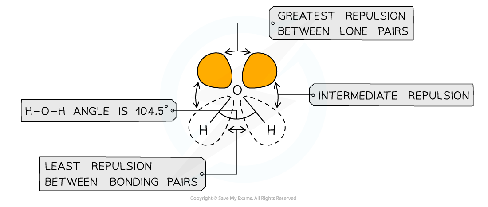
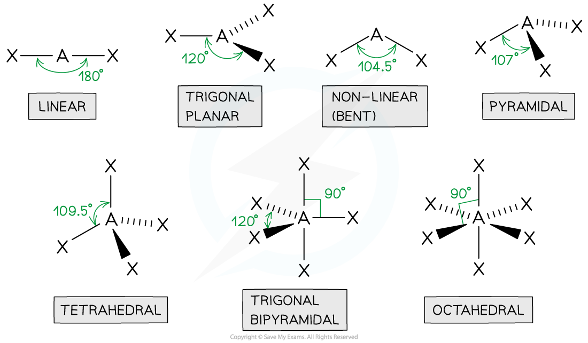
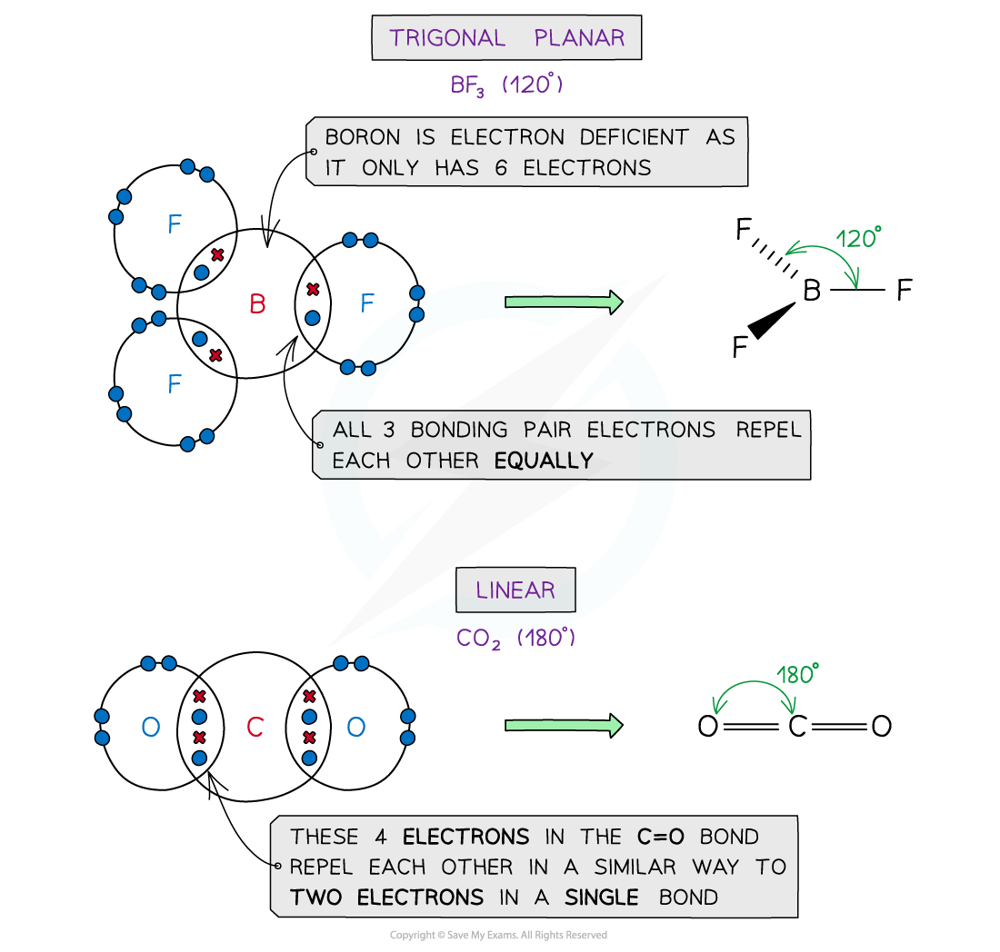
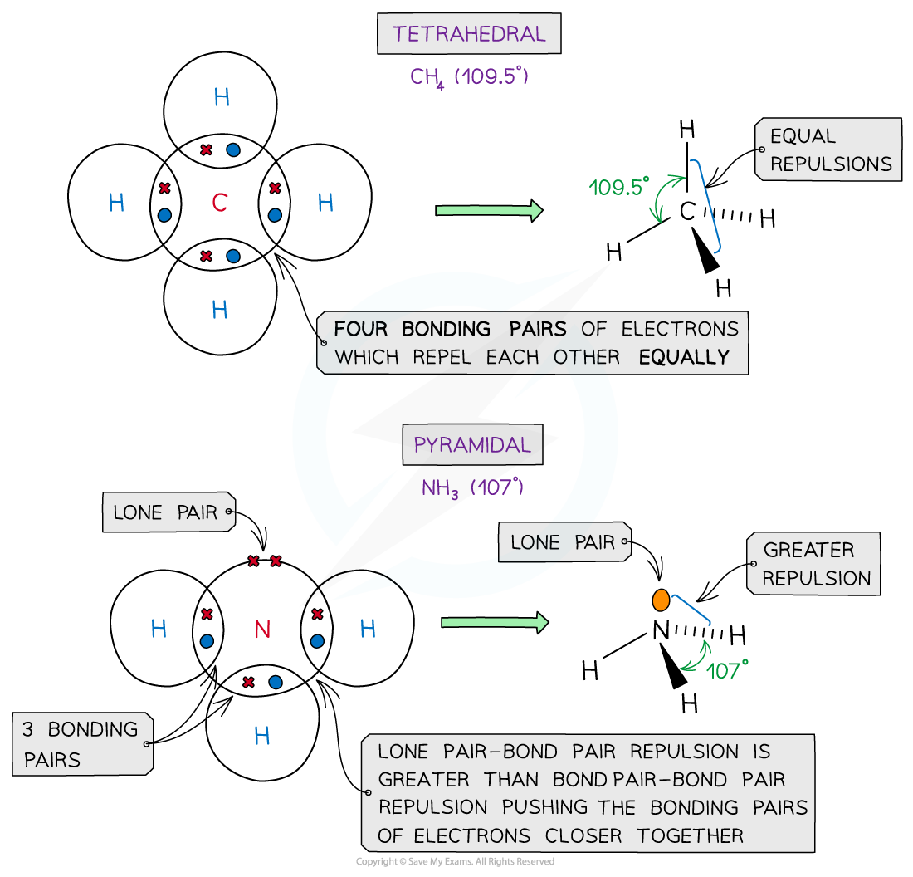
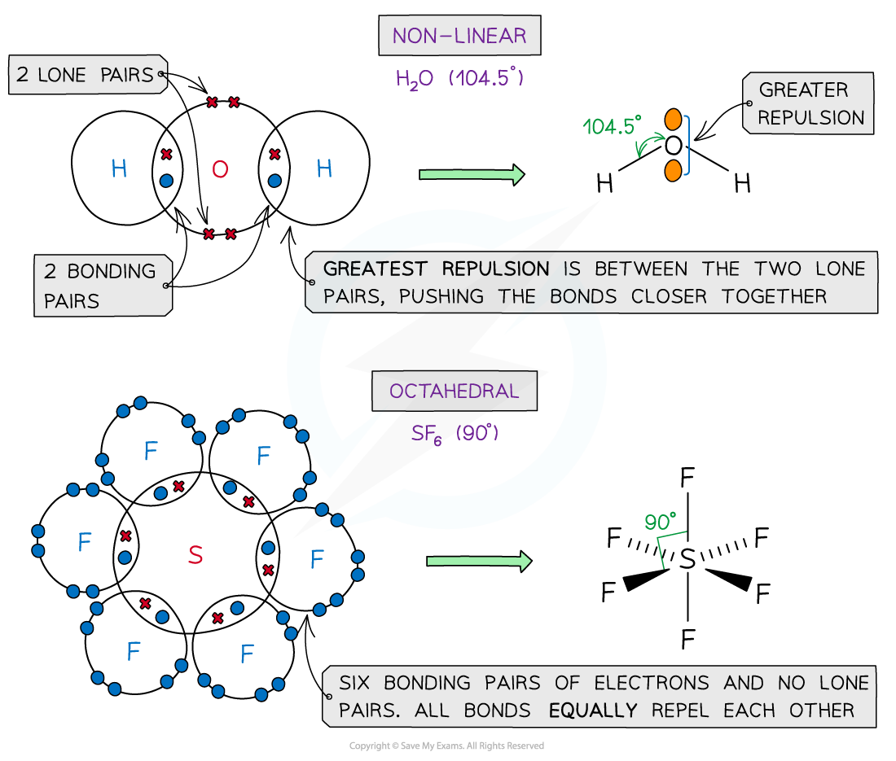
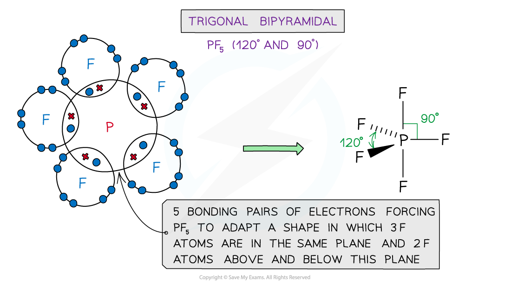
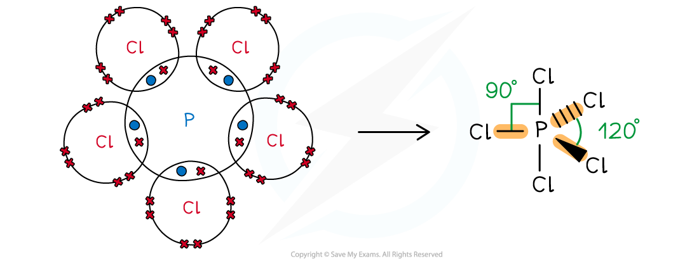
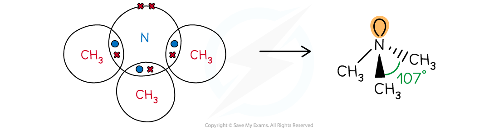
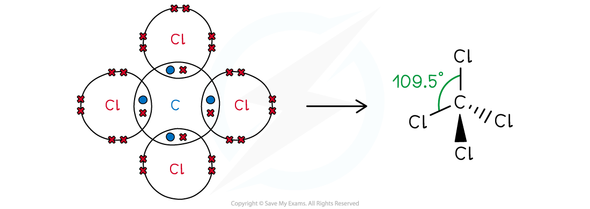

Electron Pair Repulsion & Shape
-------------------------------

* The <b>valence shell electron pair repulsion theory </b>(VSEPR) predicts the shape and bond angles of molecules
* Electrons are <b>negatively charged </b>and will repel other electrons when close to each other
* In a molecule, the <b>bonding pairs of electrons </b>will repel other electrons around the <b>central atom </b>forcing the molecule to adopt a shape in which these <b>repulsive forces </b>are minimised
* When determining the <b>shape</b> and <b>bond</b> angles of a molecule, the following VSEPR rules should be considered:

  + Valence shell electrons are those electrons that are found in the outer shell
  + Electron pairs repel each other as they have the same charge
  + Lone pair electrons repel each other more than bonded pairs
  + Repulsion between multiple and single bonds is treated the same as for repulsion between single bonds
  + Repulsion between pairs of double bonds are greater
  + The most stable shape is adopted to minimize the repulsion forces
* Different types of electron pairs have different repulsive forces

  + Lone pairs of electrons have a more concentrated electron charge cloud than bonding pairs of electrons
  + The cloud charges are wider and closer to the central atom’s nucleus
  + The order of repulsion is therefore: lone pair – lone pair > lone pair – bond pair > bond pair – bond pair

<i><b>Different types of electron pairs have different repulsive forces</b></i>

Shapes & Angles
---------------

* Molecules can adapt the following shapes and bond angles:

<i><b>Molecules of different shapes can adapt with their corresponding bond angles</b></i>

<b>Examples</b>

<i><b>Examples of molecules with different shapes and bond angles</b></i>

#### Worked Example

<b>VSEPR & shapes of molecules</b>

Draw the shape of the following molecules:

1. Phosphorus(V) chloride
2. N(CH3)3
3. CCl4

<b>Answers:</b>

<b>Answer 1:</b>

* Phosphorus is in group 15, so has 5 valence electrons; Cl is in group 17, so has 17 valence electrons

  + All 5 electrons are used to form covalent bonds with Cl and there are no lone pairs
  + This gives a <b>trigonal</b> (or <b>triangular</b>)<b> bipyramidal</b> shape:

<i><b>Phosphorus pentachloride or phosphorus (V) chloride</b></i>

<b>Answer 2: </b>

* Nitrogen is in group 15, so has 5 valence electrons; carbon is in group 14, so has 4 valence electrons, 3 of which are already used in the covalent bonds with hydrogen

  + Three of the valence electrons in N are used to form bonding pairs, so there is one lone pair left
  + N(CH3)3 has a <b>triangular pyramid</b> shape:

<i><b>Trimethylamine</b></i>

<b>Answer 3: </b>

* Carbon is in group 14, so has 4 valence electrons; chlorine is in group 17, so has 7 valence electrons

  + All four valence electrons are used to bond with chlorine and there are no lone pairs
  + The shape of CCl4 is <b>tetrahedral</b>

<i><b>Tetrachloromethane</b></i>