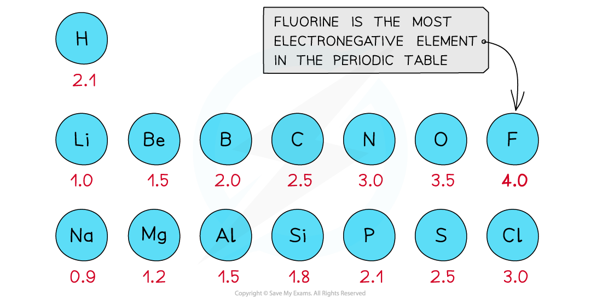
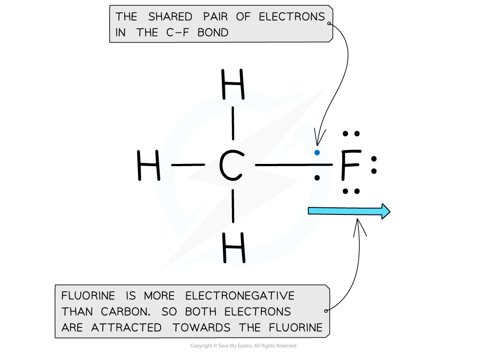
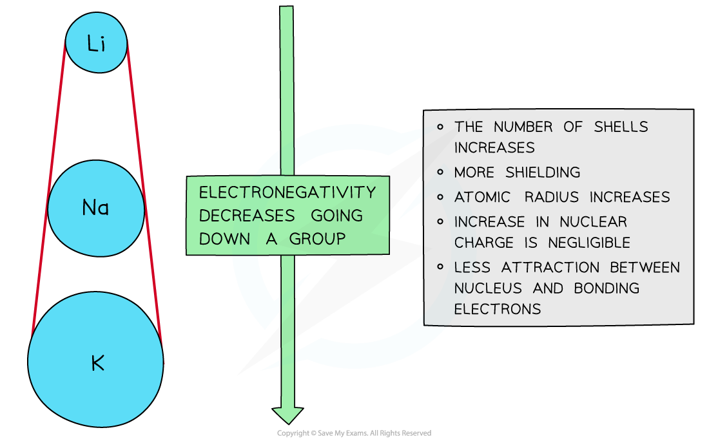
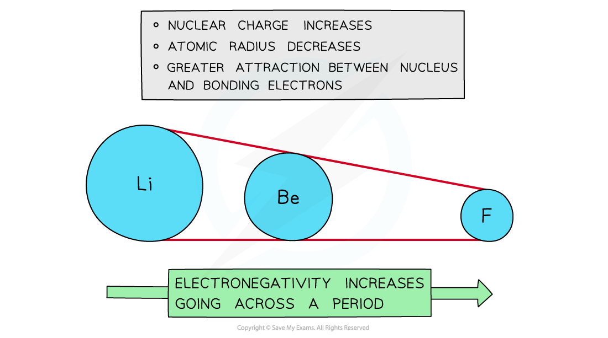
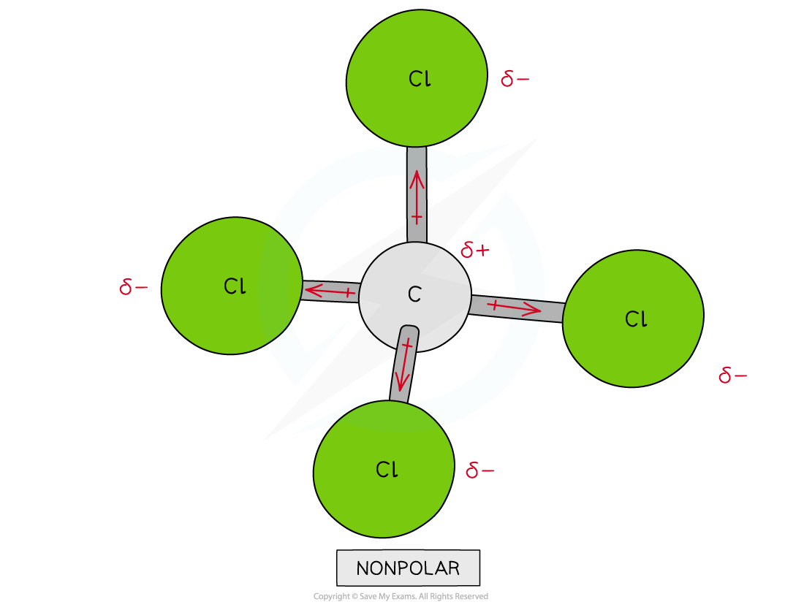
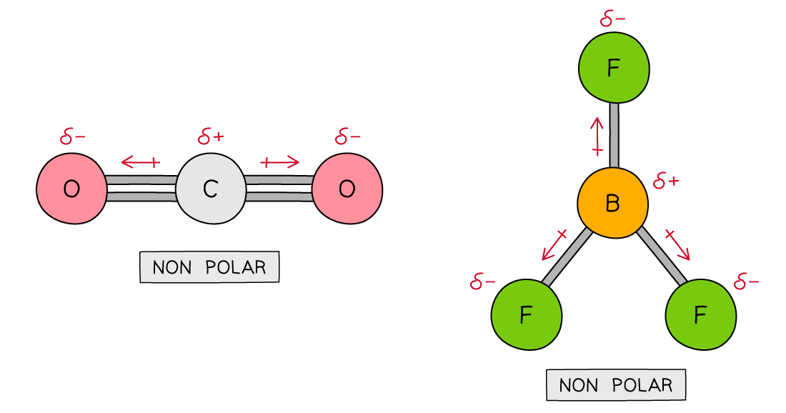

Defining Electronegativity
--------------------------

* <b>Electronegativity</b> is the power of an atom to attract the pair of electrons in a covalent bond towards itself
* The electron distribution in a covalent bond between elements with different electronegativities will be unsymmetrical
* This phenomenon arises from the <b>positive</b> nucleus’s ability to attract the <b>negatively</b> charged electrons, in the outer shells, towards itself
* The <b>Pauling</b> <b>scale</b> is used to assign a value of electronegativity for each atom

<i><b>First three rows of the periodic table showing electronegativity values</b></i>

* Fluorine is the most electronegative atom on the Periodic Table, with a value of 4.0 on the <b>Pauling Scale</b>
* It is best at attracting electron density towards itself when covalently bonded to another atom

<i><b>Electron distribution in the C-F bond of fluoromethane</b></i>

#### Nuclear charge

* <b>Attraction</b> exists between the positively charged <b>protons</b> in the nucleus and negatively charged <b>electrons</b> found in the energy levels of an atom
* An <b>increase</b> in the number of <b>protons</b> leads to an <b>increase</b> in <b>nuclear</b> <b>attraction</b> for the electrons in the outer shells
* Therefore, an <b>increased nuclear charge </b>results in an <b>increased electronegativity</b>

#### Atomic radius

* The <b>atomic</b> <b>radius</b> is the distance between the nucleus and electrons in the <b>outermost shell</b>
* Electrons <b>closer</b> to the nucleus are more <b>strongly</b> attracted towards its positive <b>nucleus</b>
* Those electrons <b>further</b> <b>away</b> from the nucleus are <b>less strongly </b>attracted towards the <b>nucleus</b>
* Therefore, an <b>increased atomic radius </b>results in a <b>decreased electronegativity</b>

#### Shielding

* <b>Filled</b> energy levels can <b>shield </b>(mask) the effect of the nuclear charge causing the outer electrons to be <b>less attracted </b>to the nucleus
* Therefore, the addition of extra <b>shells and subshells </b>in an atom will cause the outer electrons to experience <b>less </b>of the attractive force of the nucleus

  + Sodium (period 3, group 1) has higher <b>electronegativity </b>than caesium (period 6, group 1) as it has fewer shells and therefore the outer electrons experience less shielding than in caesium
* Thus, an increased number of <b>inner shells and subshells </b>will result in a <b>decreased electronegativity</b>

#### Trends in electronegativity

* <b>Electronegativity</b> varies across <b>periods</b> and down the groups of the periodic table

#### Down a group

* There is a <b>decrease</b> in <b>electronegativity</b> going down the group
* The <b>nuclear charge increases</b> as more protons are being added to the nucleus
* However, each element has an extra filled electron shell, which increases <b>shielding</b>
* The addition of the extra shells increases the distance between the nucleus and the outer electrons resulting in <b>larger</b> <b>atomic radii</b>
* Overall, there is decrease in attraction between the nucleus and outer bonding electrons

<i><b>Electronegativity decreases going down the groups of the periodic table</b></i>

#### Across a period

* Electronegativity <b>increases</b> across a period
* The <b>nuclear charge increases</b> with the addition of protons to the nucleus
* <b>Shielding</b> remains relatively <b>constant</b> across the period as no new shells are being added to the atoms
* The nucleus has an increasingly strong attraction for the bonding pair of electrons of atoms across the period of the periodic table
* This results in <b>smaller atomic radii</b>

<i><b>Electronegativity increases going across the periods of the Periodic Table</b></i>

Bond Polarity
-------------

* When two atoms in a covalent bond have the <b>same electronegativity </b>the covalent bond is <b>nonpolar</b>

<i><b>The two chlorine atoms have the same electronegativities so the bonding electrons are shared equally between the two atoms</b></i>

* The difference in electronegativities will dictate the type of bond that is formed
* When the electronegativities are very different (difference of more than 1.7) then ions will be formed and the bond will be ionic
* When two atoms in a covalent bond have a difference in electronegativities of 0.3 to 1.7 a covalent bond is formed and the bond will be polar

  + The electrons will be drawn towards the more electronegative atom
* As a result of this:

  + The negative charge centre and positive charge centre do not <b>coincide </b>with each other
  + This means that the <b>electron distribution </b>is <b>asymmetric</b>
  + The <b>less</b> <b>electronegative</b> atom gets a partial charge of δ+ (<b>delta</b> <b>positive</b>)
  + The <b>more</b> <b>electronegative</b> atom gets a partial charge of δ- (<b>delta</b> <b>negative</b>)
* The greater the difference in <b>electronegativity</b> the more polar the bond becomes

<i><b>Cl has a greater electronegativity than H causing the electrons to be more attracted towards the Cl atom which becomes delta negative and the H delta positive</b></i>

#### Assigning polarity to molecules

* To determine whether a molecule with <b>more than two atoms </b>is polar, the following things have to be taken into consideration:

  + The polarity of each bond
  + How the bonds are arranged in the molecule
* Some molecules have <b>polar bonds </b>but are overall not <b>polar</b> because the polar bonds in the molecule are arranged in such way that the individual dipole moments <b>cancel each other out</b>

<i><b>There are four polar covalent bonds in CH</b></i><i><b>3</b></i><i><b>Cl which do not cancel each other out causing CH</b></i><i><b>3</b></i><i><b>Cl to be a polar molecule; the overall dipole is towards the electronegative chlorine atom</b></i>

<i><b>Though CCl</b></i><i><b>4</b></i><i><b> has four polar covalent bonds, the individual dipole moments cancel each other out causing CCl</b></i><i><b>4</b></i><i><b> to be a nonpolar molecule</b></i>

* Further examples of molecules with no net dipole:

<i><b>Carbon dioxide and boron trifluoride have polar bonds but no net dipole</b></i>

#### Worked Example

Which molecule is non-polar?

<b>A</b>. NH3

<b>B</b>. CO

<b>C</b>. SO2

<b>D</b>. AlBr3

<b>Answer:</b>

The correct option is <b>D</b>.

The shapes and polarity of the molecules are as follows:

Although the Al-Br bonds are polar, the trigonal planar molecule is symmetrical so the dipoles cancel out leaving a non-polar molecule

#### Examiner Tips and Tricks

One of the clues about molecular polarity is to look at the symmetry of the molecule

Molecules which are symmetrical are unlikely to be polar