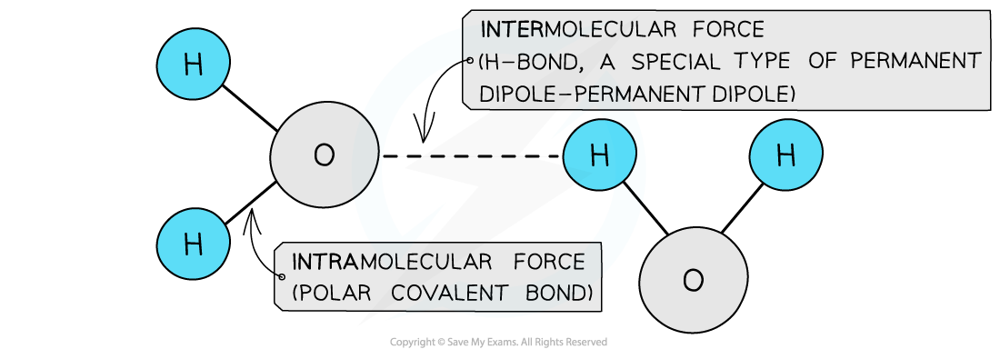
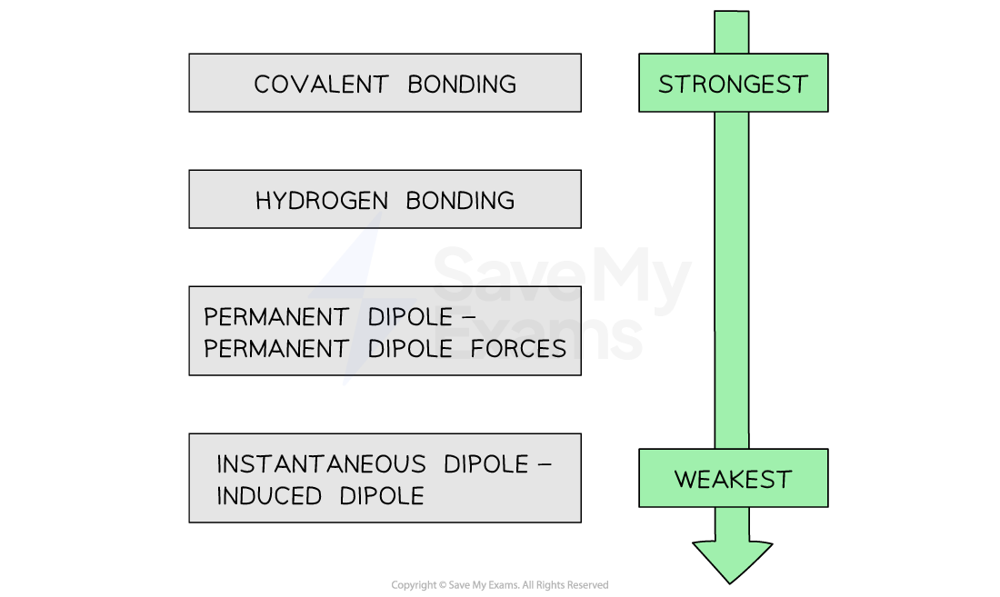
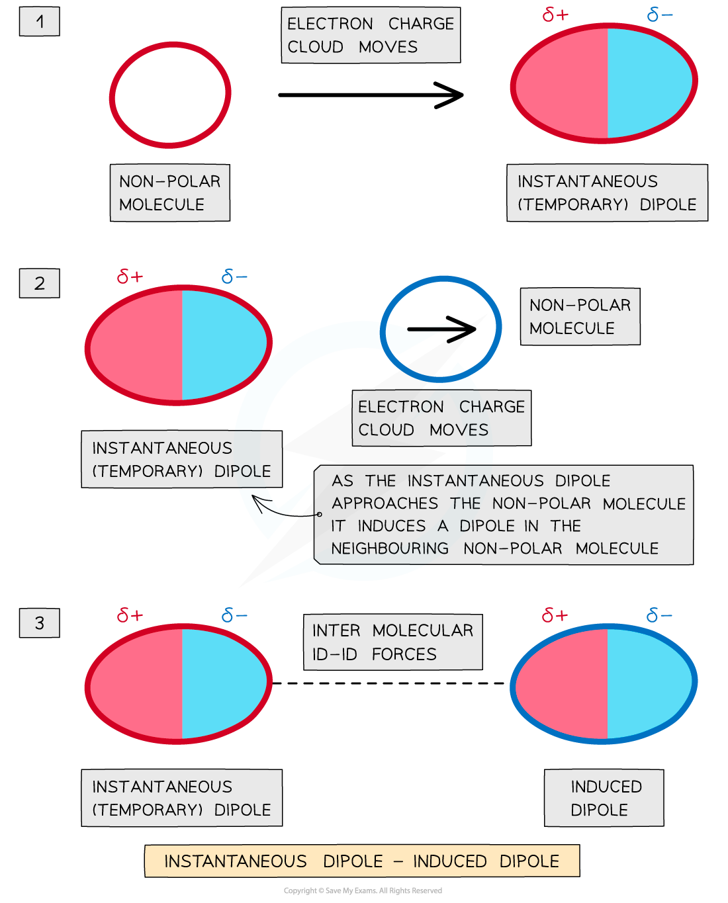
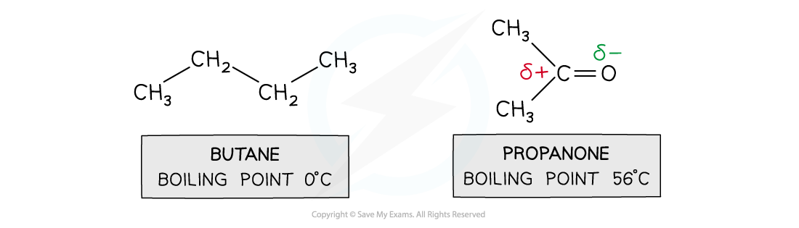
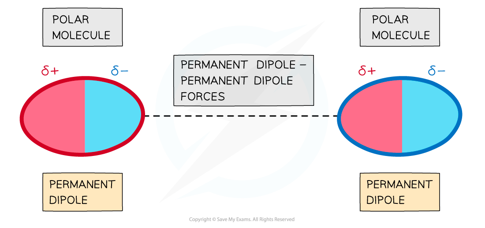
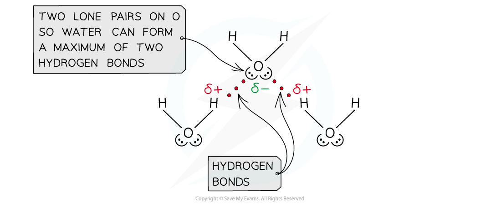

Intermolecular Forces
---------------------

#### Intramolecular forces

* <b>Intramolecular forces </b>are forces <b>within </b>a molecule and are usually covalent bonds
* <b>Covalent bonds </b>are formed when the outer electrons of two atoms are <b>shared</b>
* Single, double, triple and co-ordinate bonds are all types of intramolecular forces

#### Intermolecular forces

* Molecules also contain weaker <b>intermolecular forces </b>which are forces <b>between </b>the molecules
* There are three types of intermolecular forces:

  + <b>Induced</b> <b>dipole – dipole forces</b> also called <b>van der Waals</b> or <b>London dispersion forces</b>
  + <b>Permanent dipole – dipole forces </b>are the attractive forces between two neighbouring molecules with a permanent dipole
  + <b>Hydrogen Bonding </b>are a special type of <b>permanent dipole - permanent dipole </b>forces
  + <b>Intramolecular forces </b>are <b>stronger</b> than intermolecular forces

    - For example, a hydrogen bond is about one tenth the strength of a covalent bond
  + The strengths of the types of bond or force are as follows:

<i><b>The varying strengths of different types of bonds</b></i>

#### Induced dipole-dipole forces:

* <b>Induced dipole - dipole forces </b>exist between all atoms or molecules

  + They are also known as<b> London dispersion forces</b>

    

* The <b>electron charge cloud</b> in non-polar molecules or atoms are constantly moving
* During this movement, the electron charge cloud can be more on one side of the atom or molecule than the other
* This causes a <b>temporary dipole </b>to arise
* This <b>temporary dipole </b>can <b>induce </b>a dipole on neighbouring molecules
* When this happens, the <b>δ+ end of the dipole</b> in one molecule and the <b>δ- end of the dipole</b> in a neighbouring molecule are <b>attracted </b>towards each other
* Because the electron clouds are moving constantly, the dipoles are only <b>temporary</b>

#### Relative strength

* For small molecules with <b>the same number of electrons, </b>permanent dipoles are <b>stronger </b>than induced dipoles

  + Butane and propanone have the same number of electrons
  + Butane is a nonpolar molecule and will have induced dipole forces
  + Propanone is a polar molecule and will have permanent dipole forces
  + Therefore, more energy is required to break the intermolecular forces between propanone molecules than between butane molecules
  + So, propanone has a higher boiling point than butane

<i><b>Pd-pd forces are stronger than id-id forces in smaller molecules with an equal number of electrons</b></i>

#### Permanent dipole - dipole forces:

* <b>Polar molecules </b>have <b>permanent dipoles</b>
* The molecule will always have a <b>negatively </b>and <b>positively charged end</b>

* Forces between two molecules that have permanent dipoles are called <b>permanent dipole - dipole forces </b>
* The <b>δ+ end of the dipole</b> in one molecule and the <b>δ- end of the dipole</b> in a neighbouring molecule are <b>attracted </b>towards each other

#### Hydrogen bonding

* <b>Hydrogen bonding </b>is the <b>strongest </b>form of <b>intermolecular bonding</b>

  + Intermolecular bonds are bonds <b>between </b>molecules
  + Hydrogen bonding is a type of <b>permanent dipole – permanent dipole </b>bonding
* For hydrogen bonding to take place the following is needed:

  + A species which has an <b>O,</b> <b>N or F </b>(very <b>electronegative</b>) atom bonded to a hydrogen

* When hydrogen is covalently bonded to an <b>O</b>, <b>N </b>or <b>F</b>, the bond becomes highly <b>polarised</b>
* The H becomes so <b>δ</b><b>+</b> charged that it can form a bond with the <b>lone pair </b>of an <b>O</b>, <b>N or F </b>atom in another molecule
* For example, in water

  + Water can form two hydrogen bonds, because the O has two lone pairs

<i><b>Hydrogen bonding in water </b></i>

#### Examiner Tips and Tricks

Make sure to use a <b>dashed, straight line</b> when drawing your intermolecular forces! Hydrogen bonds should <b>start at the lone pair</b> and go <b>right up to the delta positive atom</b> - it must be really clear where your H bond starts and ends.