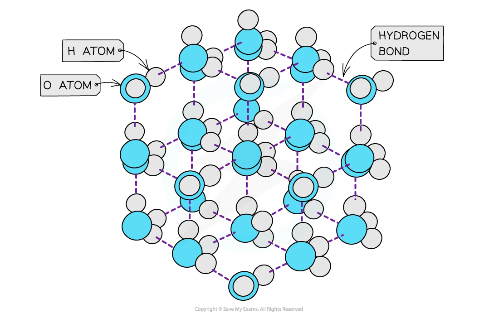

Hydrogen Bonding Interactions
-----------------------------

Examples of compounds that can form hydrogen bonds are:

* Alcohols (contains an O-H bond)
* Ammonia (contains an N-H bond)
* Amines (contains an N-H bond)
* Carboxylic acids (contains an O-H bond)
* Hydrogen fluoride (contains an H-F bond)
* Proteins (contains an N-H bond)

<i><b>Ammonia can form a maximum of one hydrogen bond per molecule</b></i>

Anomalous Properties of Water
-----------------------------

#### Properties of water

* Hydrogen bonding in water, causes it to have <b>anomalous properties </b>such as high melting and boiling points, high surface tension and a higher density in the liquid than the solid

#### High melting & boiling points

* Water has high <b>melting </b>and <b>boiling points</b> due to the the <b>strong intermolecular forces </b>of hydrogen bonding between the molecules in both ice (solid H2O) and water (liquid H2O)
* A lot of energy is therefore required to separate the water molecules and melt or boil them

<i><b>Hydrogen bonds are strong intermolecular forces which are harder to break causing water to have a higher melting and boiling point than would be expected for a molecule of such a small size</b></i>

* The graph below compares the <b>enthalpy of vaporisation </b>(energy required to boil a substance) of different hydrides
* The enthalpy changes <b>increase </b>going from H2S to H2Te due to the increased number of electrons in the Group 16 elements
* This causes an increase in the <b>instantaneous dipole - induced dipole forces (dispersion forces) </b>as the molecules become larger
* Based on this, H2O should have a much lower enthalpy change (around 17 kJ mol<b>-1</b>)
* However, the enthalpy change of vaporisation is almost 3 times <b>larger</b> which is caused by the <b>hydrogen bonds </b>present in water but not in the other hydrides

<i><b>The high enthalpy change of evaporation of water suggests that instantaneous dipole-induced dipole forces are not the only forces present in the molecule – there are also strong hydrogen bonds, which cause the high boiling point</b></i>

#### High surface tension

* Water has a <b>high surface tension</b>
* <b>Surface</b> <b>tension</b> is the ability of a <b>liquid surface </b>to resist any <b>external forces </b>(i.e. to stay unaffected by forces acting on the surface)
* The water molecules at the <b>surface </b>of liquid are bonded to other water molecules through <b>hydrogen bonds</b>
* These molecules <b>pull downwards</b> the <b>surface molecules </b>causing the surface of them to become compressed and more tightly together at the surface
* This increases water’s <b>surface</b> <b>tension</b>

<i><b>The surface molecules are pulled downwards due to the hydrogen bonds with other molecules, whereas the inner water molecules are pulled in all directions</b></i>

#### Density

* <b>Solids </b>are <b>denser </b>than their <b>liquids </b>as the particles in solids are more <b>closely packed </b>together than in their liquid state
* The water molecules are packed into an open lattice
* This way of packing the molecules and the relatively long <b>bond lengths </b>of the hydrogen bonds means that the water molecules are slightly further apart than in the liquid form
* Therefore, ice has a lower density than liquid water by about 9%

<i><b>The ‘more open’ structure of molecules in ice causes it to have a lower density than liquid water</b></i>