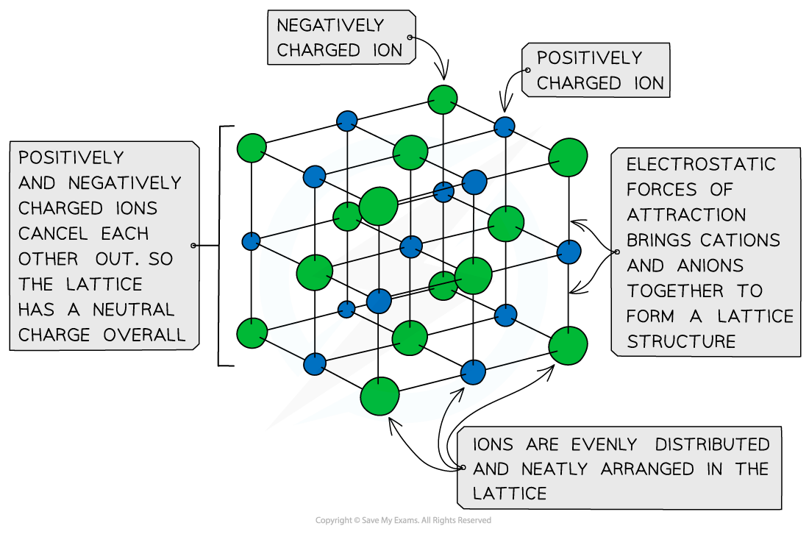
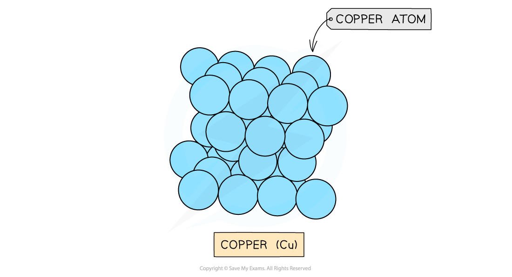
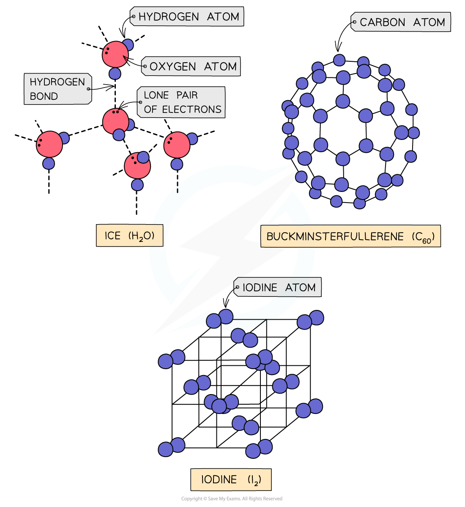
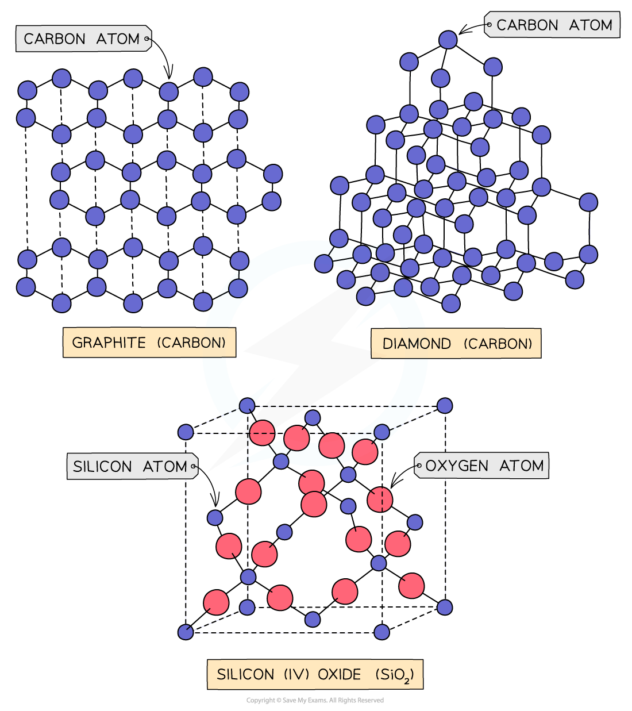

Giant Lattices
--------------

#### Ionic Lattices

* The ions form a <b>lattice</b> <b>structure</b> which is an evenly distributed <b>crystalline</b> structure
* Ions in a lattice are arranged in a <b>regular</b> <b>repeating</b> <b>pattern</b> so that positive charges cancel out negative charges
* The attraction between the cations and anions is occurring in all directions

  + Each ion is attracted to all of the oppositely charged ions around it
* Therefore the final lattice is overall electrically <b>neutral</b>

<i><b>Ionic solids are arranged in lattice structures</b></i>

#### Metallic Lattices

* Metals form <b>giant metallic lattices </b>in which the metal ions are surrounded by a ‘sea’ of <b>delocalised </b>electrons
* The metal ions are often packed in <b>hexagonal layers </b>or in a <b>cubic arrangement</b>
* This layered structure with the delocalised electrons gives a metal its key properties

<i><b>Layers of copper ions (the delocalised electrons are not shown in the diagram)</b></i>

#### Covalent lattices

* <b>Covalent bonds </b>are bonds between nonmetals in which electrons are <b>shared </b>between the atoms
* Covalent compounds can be arranged in <b>simple molecular </b>or <b>giant molecular</b> <b>lattices</b>

  + Simple molecular lattices: iodine, buckminsterfullerene (C60) and ice
  + Giant molecular: silicon(IV) oxide, graphite and diamond

<i><b>Simple molecular lattices</b></i>

<i><b>Giant molecular lattices</b></i>

#### Examiner Tips and Tricks

Graphite, diamond and buckminsterfullerene are all <b>allotropes </b>of carbon; they are different <b>structural forms </b>of the same element (which is carbon).