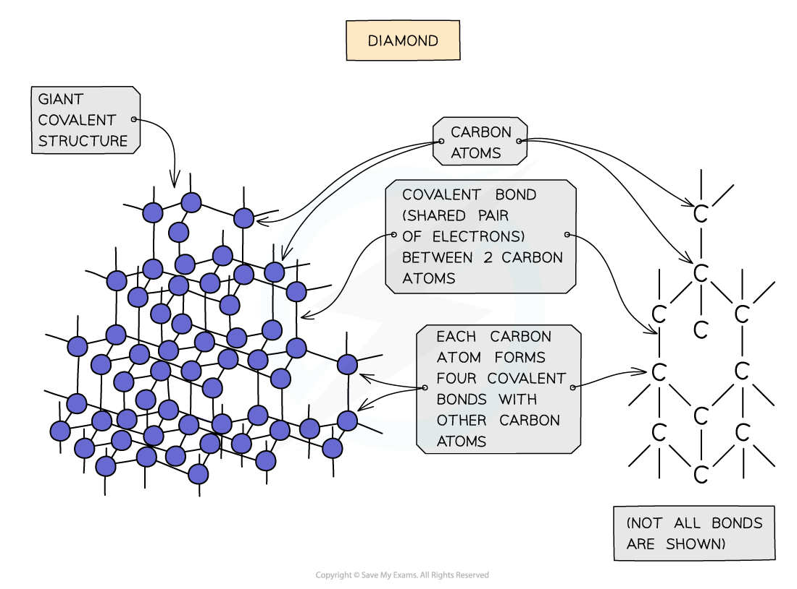

Simple Molecular Compounds
--------------------------

#### Simple Molecular Compounds

* Covalent substances tend to have small molecular structures, such as Cl2, H2O or CO2
* These small molecules are known as <b>simple molecules</b>
* Hydrogen (H2), chlorine (Cl2), oxygen (O2), nitrogen (N2), hydrogen chloride (HCl), water (H2O), ammonia (NH3) and methane (CH4) are also examples of simple molecules
* Iodine is a simple molecule and can be represented but it exists as a crystalline structure involving a regular structure held together by weak London dispersion forces

<i><b>Dot cross diagram of an iodine molecule</b></i>

Carbon Allotropes
-----------------

#### Covalent bonding & giant covalent lattice structures

* <b>Giant covalent lattices </b>have <b>very high</b> <b>melting </b>and <b>boiling points</b>

  + These compounds have a large number of <b>covalent bonds </b>linking the whole structure
  + A lot of energy is required to break the lattice
* The compounds can be <b>hard </b>or <b>soft</b>

  + Graphite is <b>soft</b> as the forces between the carbon layers are weak
  + Diamond and silicon(IV) oxide are <b>hard</b> as it is difficult to break their 3D network of strong covalent bonds
* Most compounds are insoluble with water
* Most compounds do not <b>conduct electricity </b>however some do

  + Graphite has <b>delocalised </b>electrons between the carbon layers which can move along the layers when a voltage is applied
  + Diamond and silicon(IV) oxide do not conduct electricity as all four outer electrons on every carbon atom are involved in a <b>covalent bond</b> so there are no freely moving electrons available

#### Graphite

* Each carbon atom in graphite is bonded to <b>three</b> others forming <b>layers</b> of <b>hexagons</b>, leaving one free electron per carbon atom
* These free electrons migrate along the layers and are free to move and carry charge, hence graphite can <b>conduct electricity</b>
* The covalent bonds within the layers are very strong, but the layers are attracted to each other by weak<b> intermolecular forces</b>, so the layers can <b>slide</b> over each other making graphite <b>soft</b> and<b> slippery</b>

<i><b>Diagram showing the structure and bonding arrangement in graphite</b></i>

#### Diamond

* In diamond, each carbon atom bonds with four other carbons, forming a <b>tetrahedron</b>
* All the covalent bonds are identical, very strong and there are no<b> intermolecular forces</b>

<i><b>Diagram showing the structure and bonding arrangement in diamond</b></i>

#### Graphene

* Graphene consists of a single layer of graphite which is a sheet of carbon atoms covalently bonded forming a continuous hexagonal layer
* It is essentially a 2D molecule since it is only one atom thick
* It has very unusual properties make it useful in fabricating<b> composite</b> materials and in <b>electronics</b>

<i><b>Graphene is a truly remarkable material that has some unexpected properties</b></i>