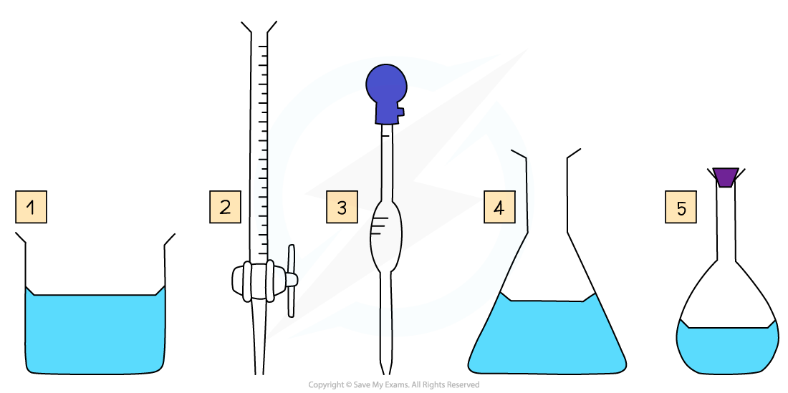

Titration Calculations
----------------------

#### Volumetric Analysis

* Volumetric analysis is a process that uses the volume and concentration of one chemical reactant (<b>standard solution</b>) to determine the concentration of another unknown solution
* The technique most commonly used is a <b>titration</b>
* The volumes are measured using two precise pieces of equipment, a <b>volumetric </b>or<b> graduated pipette </b>and a <b>burette</b>
* Before the titration can be done, the standard solution must be prepared
* Specific apparatus must be used both when preparing the standard solution and when completing the titration, to ensure that volumes are measured precisely

<i><b>Some key pieces of apparatus used to prepare a volumetric solution and perform a simple titration</b></i>

1. Beaker
2. Burette
3. Volumetric Pipette
4. Conical Flask
5. Volumetric Flask

#### Making a Standard Solution

* Chemists routinely prepare solutions needed for analysis, whose concentrations are known precisely
* These solutions are termed <b>volumetric solutions</b> or <b>standard solutions</b>
* They are made as accurately and precisely as possible using three decimal place balances and volumetric flasks to reduce the impact of measurement uncertainties
* The steps are:

#### Performing the Titration

* The key piece of equipment used in the titration is the burette
* <b>Burettes</b> are usually marked to a precision of 0.10 cm3

  + Since they are analogue instruments, the uncertainty is recorded to <b>half</b> the smallest marking, in other words to ±0.05 cm3
* The <b>end point</b> or <b>equivalence point</b> occurs when the two solutions have reacted completely and is shown with the use of an <b>indicator</b>

<i><b>The steps in a titration</b></i>

* A white tile is placed under the conical flask while the titration is performed, to make it easier to see the colour change

<i><b>                           The steps in a titration</b></i>

* The steps in a titration are:

  + Measuring a known volume (usually 20 or 25 cm3) of one of the solutions with a volumetric pipette and placing it into a conical flask
  + The other solution is placed in the burette

    - To start with, the burette will usually be filled to 0.00 cm3
  + A few drops of the indicator are added to the solution in the conical flask
  + The tap on the burette is carefully opened and the solution added, portion by portion, to the conical flask until the indicator starts to change colour
  + As you start getting near to the end point, the flow of the burette should be slowed right down so that the solution is added dropwise

    - You should be able to close the tap on the burette after one drop has caused the colour change
  + Multiple runs are carried out until <b>concordant</b> results are obtained

    - Concordant results are within 0.1 cm3 of each other

#### Recording and processing titration results

* Both the initial and final burette readings should be recorded and shown to a precision of  ±0.05 cm3, the same as the uncertainty

<i><b>A typical layout and set of titration results</b></i>

* The volume delivered (titre) is calculated and recorded to an uncertainty of ±0.10 cm3

  + The uncertainty is doubled, because two burette readings are made to obtain the titre (V final – V initial), following the rules for propagation of uncertainties
* <b>Concordant </b>results are then averaged, and non-concordant results are discarded
* The appropriate calculations are then done

#### Volumes & concentrations of solutions

* The <b>concentration </b>of a solution is the amount of <b>solute </b>dissolved in a <b>solvent</b> to make 1 dm3 of  <b>solution</b>

  + The solute is the substance that dissolves in a solvent to form a solution
  + The solvent is often water

Concentration (mol dm-3) = <math><semantics><mfrac><mrow><mi>number</mi><mo> </mo><mi>of</mi><mo> </mo><mi>moles</mi><mo> </mo><mi>of</mi><mo> </mo><mi>solute</mi><mo> </mo><mo>(</mo><mi>mol</mi><mo>)</mo></mrow><mrow><mi>volume</mi><mo> </mo><mi>of</mi><mo> </mo><mi>solution</mi><mo> </mo><mo>(</mo><msup><mi>dm</mi><mn>3</mn></msup><mo>)</mo></mrow></mfrac><annotation>{"language":"en","fontFamily":"Times New Roman","fontSize":"18"}</annotation></semantics></math>

* A <b>concentrated </b>solution is a solution that has a <b>high </b>concentration of solute
* A <b>dilute </b>solution is a solution with a <b>low </b>concentration of solute
* When carrying out calculations involve concentrations in mol dm-3 the following points need to be considered:

  + Change mass in grams to <b>moles</b>
  + Change cm3 to dm3 
* To calculate the <b>mass </b>of a substance present in solution of known <b>concentration and volume</b>:

  + Rearrange the concentration equation

<b>number of moles (mol) = concentration (mol dm</b><b>-3</b><b>) x volume (dm</b><b>3</b><b>)</b>

* Multiply the moles of solute by its molar mass

<b>mass of solute (g) = number of moles (mol) x molar mass (g mol</b><b>-1</b><b>)</b>

#### Worked Example

<b>Neutralisation calculation  </b>25.0 cm3 of 0.050 mol dm-3 sodium carbonate was completely neutralised by 20.00 cm3  of dilute hydrochloric acid. Calculate the concentration in mol dm-3 of hydrochloric acid.  

<b>Answer</b>

<b>Step 1:</b> Write the balanced symbol equation

<b>Na</b><b>2</b><b>CO</b><b>3</b><b>  +  2HCl  →  2NaCl  +  H</b><b>2</b><b>O  +  CO</b><b>2</b>

<b>Step 2:</b> Calculate the amount, in moles, of sodium carbonate reacted by rearranging the equation for amount of substance (mol) and dividing the volume by 1000 to convert cm3 to dm3

* Amount (Na2CO3) = 0.025 dm3 x 0.050 mol dm-3 = 0.00125 mol

<b>Step 3:</b> Calculate the moles of hydrochloric acid required using the reaction’s stoichiometry

* 1 mol of Na2CO3 reacts with 2 mol of HCl, so the molar ratio is 1 : 2

  + Therefore 0.00125 moles of Na2CO3 react with 0.00250 moles of HCl

<b>Step 4:</b> Calculate the concentration, in mol dm-3, of hydrochloric acid

* [HCl] <math><semantics><mrow><mo>=</mo><mfrac><mrow><mi>amount</mi><mo> </mo><mo>(</mo><mi>mol</mi><mo>)</mo></mrow><mrow><mi>volume</mi><mo> </mo><mo>(</mo><msup><mi>dm</mi><mn>3</mn></msup><mo>)</mo></mrow></mfrac><mo>=</mo><mfrac><mrow><mn>0</mn><mo>.</mo><mn>00250</mn></mrow><mrow><mn>0</mn><mo>.</mo><mn>0200</mn></mrow></mfrac><mo>=</mo><mn>0</mn><mo>.</mo><mn>125</mn><mo> </mo><mi>mol</mi><mo> </mo><msup><mi>dm</mi><mrow><mo>-</mo><mn>3</mn></mrow></msup></mrow><annotation>{"language":"en","fontFamily":"Times New Roman","fontSize":"18"}</annotation></semantics></math>