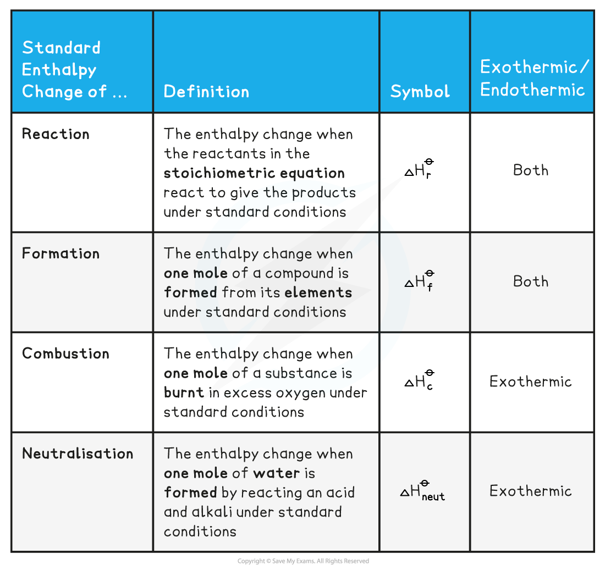

Enthalpy Change Definitions
---------------------------

* To be able to compare the changes in enthalpy between reactions, all thermodynamic measurements are carried out under standard conditions
* These standard conditions are:

  + A <b>pressure</b> of 100 kPa (you may see some older exam questions that use a figure of 101 kPa; the exact figure is 101 325 Pa, but it has been simplified in the current syllabus for problem-solving purposes)
  + A <b>temperature</b> of 298 K (25 oC)
  + Each substance involved in the reaction is in its <b>standard physical state</b> (solid, liquid or gas)
* To show that a reaction has been carried out under standard conditions, the symbol Ꝋ is used

  + Δ<i>H</i>Ꝋ = the standard enthalpy change
* There are a number of key definitions relating to enthalpy changes that you need to know

<b>Enthalpy Definitions Table</b>

#### Examiner Tips and Tricks

You will see various enthalpy change symbols used with subtle changes, e.g.

Δ<i>H</i>cꝊ or Δc<i>H</i>Ꝋ for enthalpy of combustion

Whichever symbol you use must have the following basic points:

* Δ to represent change
* <i>H</i> to represent enthlalpy
* Ꝋ to respresent standard conditions
* A symbol to represent the type of enthalpy change occurring, e.g.

  + c for combustion
  + f for formation
  + neut for neutralisation
  + r for reaction

#### Worked Example

<b>Calculating the enthalpy change of reaction</b>

One mole water is formed from hydrogen and oxygen, releasing 286 kJ of energy

H2 (g) + ½O2 (g) <b>→ </b>H2O (I)      Δ<i>H</i><i>r</i>Ꝋ = -286 kJ mol-1

Calculate Δ<i>H</i><i>r</i>Ꝋ for the reaction below:

2H2 (g) + O2 (g) <b>→ </b>2H2O (I)

<b>Answer</b>

* Since two moles of water molecules are formed in the question above, the energy released is simply:

* Δ<i>H</i><i>r</i>Ꝋ = 2 mol x (-286 kJ mol-1) = -572 kJ mol-1

#### Worked Example

<b>Calculating the enthalpy change</b>

Calculate ΔHfꝋ for the reaction below, given that ΔHfꝋ [Fe2O3(s)] = -824.2 kJ mol-1

4Fe(s) + 3 O2(g) → 2 Fe2O3(s)

<b>Answer</b>

* Since two moles of Fe2O3 (s) are formed the total change in enthalpy for the reaction above is:

  + Δ<i>H</i><i>f</i>Ꝋ =  2 x ( -824.2 kJ mol-1) = - 1648 kJ

#### Worked Example

<b>Calculating enthalpy changes</b>

Identify each of the following as Δ<i>H</i><i>r</i>Ꝋ, Δ<i>H</i><i>f</i>Ꝋ, ΔHcꝊ or ΔHneutꝊ

1. MgCO3 (s) <b>→ </b>MgO (s) + CO2 (g)
2. C (graphite) + O2 (g) <b>→ </b>CO2 (g)
3. HCl (aq) + NaOH (aq) <b>→ </b>NaCl (aq) + H2O (I)

<b>Answer</b>

<b>Answer 1: </b>Δ<i>H</i><i>r</i>Ꝋ

<b>Answer 2: </b>Δ<i>H</i><i>f</i>Ꝋ as one mole of CO2 is formed from its elements in standard state <i>and</i> Δ<i>H</i><i>c</i>Ꝋ as one mole of carbon is burnt in oxygen

<b>Answer 3: </b>Δ<i>H</i><i>neut</i>Ꝋ as one mole of water is formed from the reaction between an acid and an alkali

#### Examiner Tips and Tricks

The Δ<i>H</i><i>f</i>Ꝋ of an <b>element</b> in its standard state is zero.

For example, Δ<i>H</i><i>f</i>Ꝋ of O2(g) is 0 kJ mol-1