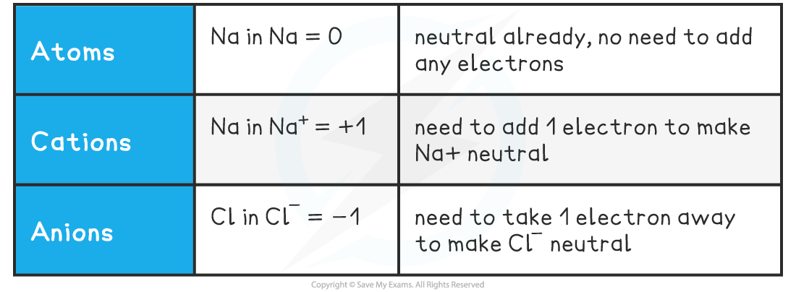
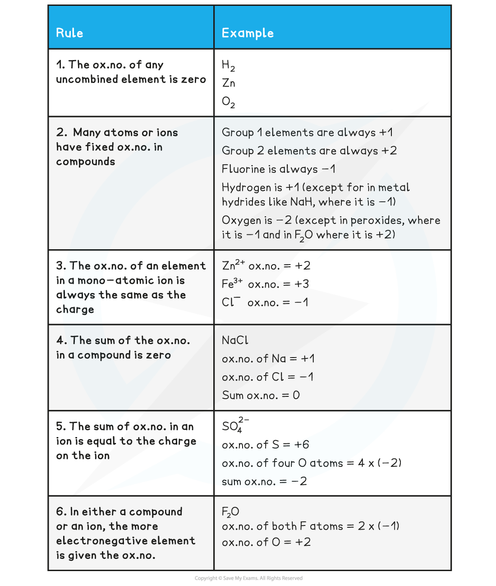
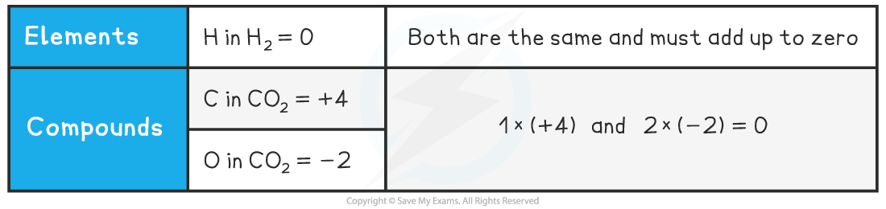
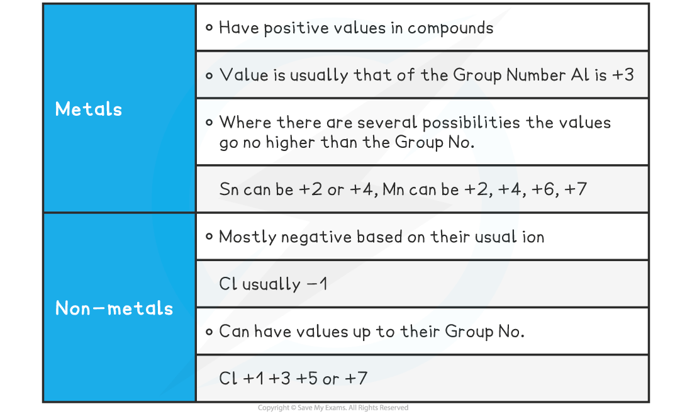

Defining Oxidation Number
-------------------------

* There are three definitions of <b>oxidation</b> and <b>reduction</b>  used in different branches of chemistry
* <b>Oxidation</b> and <b>reduction</b> can be used to describe any of the following processes

<b>Definitions and Examples of Oxidation & Reduction</b>

<i><b>Use the acronym "Oil Rig" to help you remember the definitions of oxidation and reduction</b></i>

#### Oxidation Number

* The<b> </b>oxidation number of an atom is the charge that would exist on an individual atom if the bonding were completely ionic
* It is like the electronic ‘status’ of an element
* Oxidation numbers are used to

  + Tell if oxidation or reduction has taken place
  + Work out what has been oxidised and/or reduced
  + Construct half equations and balance redox equations

<b>Oxidation Numbers of Simple Ions</b>

#### Worked Example

What are the oxidation numbers of the elements in the following species?

a) C                b)  Fe3+                       c)  Fe2+

d) O2-             e)  He                          f)  Al3+

<b>Answers:</b>

a) 0     b) +3    c) +2

d) -2    e) 0      f) +3

* So, in simple ions, the oxidation numbers of the atom is the charge on the ion:

  + Na+, K+, H+ all have an oxidation number of +1
  + Mg2+, Ca2+, Pb2+ all have an oxidation number of +2
  + Cl–, Br–, I– all have an oxidation number of -1
  + O2-, S2- all have an oxidation number of -2

* Roman numerals are also used to indicate the oxidation state of ions

  + Iron(II) sulfate implies that the iron is in a +2 oxidation state, i.e. Fe2+
  + Iron(III) sulfate implies that the iron is in a +3 oxidation state, i.e. Fe3+
* More complicated examples include other atoms / ions as part of the formula

  + Potassium manganate(VII) implies that the manganese is in a +7 oxidation
  + Potassium manganate(VII) contains the potassium ion K+ and the manganate ion MnO4–

    - Since the oxygen in the manganate ion is in the -2 oxidation state, there is a total of -8 from the oxygen
    - The manganate ion has an overall -1 charge, which means that the manganese ion must be in the +7 oxidation state

Calculating Oxidation Numbers
-----------------------------

#### Oxidation Number Rules

* A few simple rules help guide you through the process of determining the oxidation number of any element
* Remember, you are determining the oxidation number of a <i>single</i> atom
* The oxidation number (ox.no.) refers to a <i>single</i> atom in a compound

<b>Oxidation Number Rules Table</b>

Molecules or Compounds In molecules or compounds, the sum of the oxidation numbers on the atoms is zero

<b>Oxidation Number in Molecules or Compounds</b>

* Because CO2 is a neutral molecule, the sum of the oxidation numbers must be zero
* For this, one element must have a positive oxidation number and the other must be negative

<b>How do you determine which is the positive one?</b>

* The more electronegative species will have the negative value
* Electronegativity increases across a period and decreases down a group
* O is further to the right than C in the periodic table so it has the negative value

<b>How do you determine the value of an element’s oxidation number?</b>

* From its position in the periodic table and / or
* The other element(s) present in the formula
* The oxidation numbers of all other atoms in their compounds can vary
* By following the oxidation number rules, the oxidation number of any atom in a compound or ion can be deduced
* The position of an element in the periodic table can act as a guide to the oxidation number

<b>Oxidation Numbers & the Periodic Table</b>

