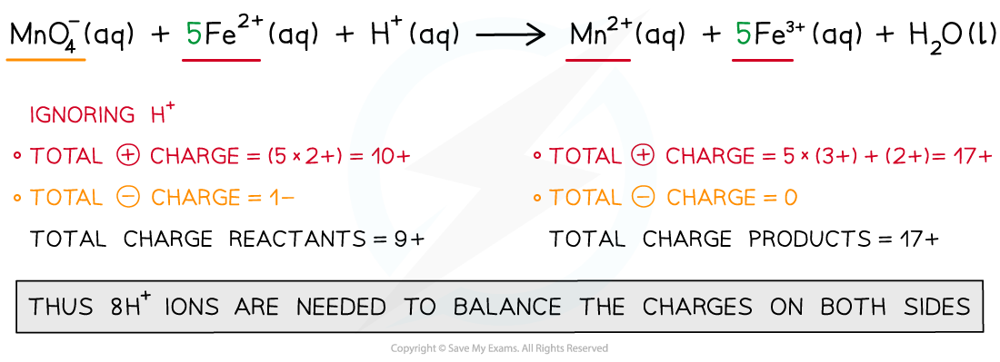

Writing Chemical Formulae
-------------------------

* Oxidation numbers are a useful tool for naming compounds as some elements can exist with more than one oxidation number
* For compound with two elements it is straight forward to name the compound
* For example

  + PCl3 is phosphorus(III) chloride or phosphorus trichloride
  + PCl5 is phosphorus(V) chloride or phosphorus pentachloride
  + OF2 is oxygen difluoride
  + O2F2 is dioxygen difluoride
* In order to name a more complete compound we use Roman numerals for the element that has a variable oxidation number

  + K2CrO4 potassium chromate(VI)

#### Worked Example

Can you name these metal compounds?

1. Cu2O
2. MnSO4
3. Na2CrO4
4. KMnO4
5. Na2Cr2O7

<b>Answer:</b>

<b>Answer 1: copper(I) oxide</b>:

The ox. no. of 1 O atom is -2 and Cu2O has overall no charge so the ox. no. of Cu is +1

<b>Answer 2:</b> <b>manganese(II) sulfate</b>:

The charge on the sulfate ion is -2, so the charge on Mn and ox. no. is +2

<b>Answer 3: sodium chromate(VI)</b>:

The ox. no. of 2 Na atoms is +2 so CrO4 has an overall -2 charge, so the ox. no. of Cr is +6

<b>Answer 4:</b> <b>potassium manganate(VII)</b>:

The ox. no. of a K atom is +1 so MnO4 has overall -1 charge, so the ox. no. of Mn is +7

<b>Answer 5: sodium dichromate(VI)</b>:

The ox. no. of 2 Na atoms is +2 so Cr2O7 has an overall -2 charge, so the ox. no. of Cr is +6. To distinguish it from CrO4 we use the prefix di in front of the anion

Ionic Half-Equations
--------------------

#### Balancing full ionic equations

* Balancing equations using redox principles is a useful skill and is best illustrated by following an example
* It is important to follow a methodical step-by-step approach so that you don't get lost:

#### Worked Example

<b>Writing overall redox reactions</b>

Manganate(VII) ions (MnO4- ) react with Fe2+ ions in the presence of acid (H+) to form Mn2+ ions, Fe3+ ions and water

Write the overall redox equation for this reaction

<b>Answer</b>

<b>Step 1:</b> Write the unbalanced equation and identify the atoms which change in oxidation number

<b>Step 2: </b>Deduce the oxidation number changes

<b>Step 3: </b>Balance the oxidation number changes

<b>Step 4: </b>Balance the charges

<b>Step 5:</b> Finally, balance the atoms

Metals & Non-metals
-------------------

#### Metals

* Metals, in general, will form positive ions by losing electrons
* Therefore, they are <b>oxidised</b> and the oxidation number <b>increases</b>
* Example 1:

  + When sodium reacts with water, sodium hydroxide and hydrogen gas is formed

<b>2Na (s) + H</b><b>2</b><b>O (l) → 2NaOH (aq) + H</b><b>2</b><b> (g) </b>

* The oxidation number of sodium changes from 0 to +1
* Example 2:

  + When magnesium reacts with hydrochloric acid, magnesium chloride and hydrogen gas is formed

<b>Mg (s) + 2HCl (l) → MgCl</b><b>2</b><b> (aq) + H</b><b>2</b><b> (g)</b>

* The oxidation number of magnesium changed from 0 to +2

#### Non-metals

* Non-metals, in general, will form negative ions by gaining electrons
* Therefore, they are <b>reduced</b> and the oxidation number <b>decreases</b>
* Example:

  + When sodium reacts with oxygen, sodium oxide is formed

<b>4Na (s) + O</b><b>2</b><b> (g) → Na</b><b>2</b><b>O (s) </b>

* The oxidation number of oxygen changes from 0 to -2