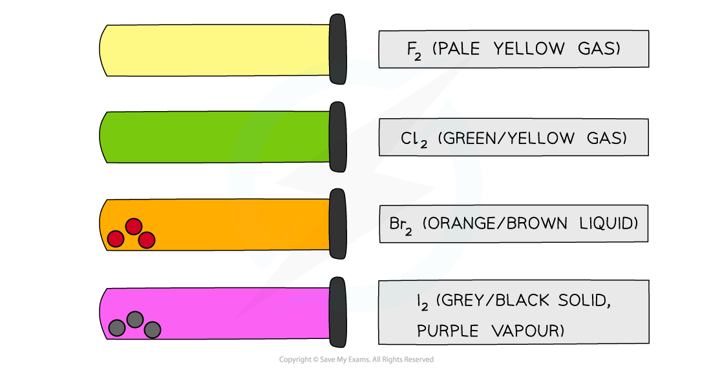
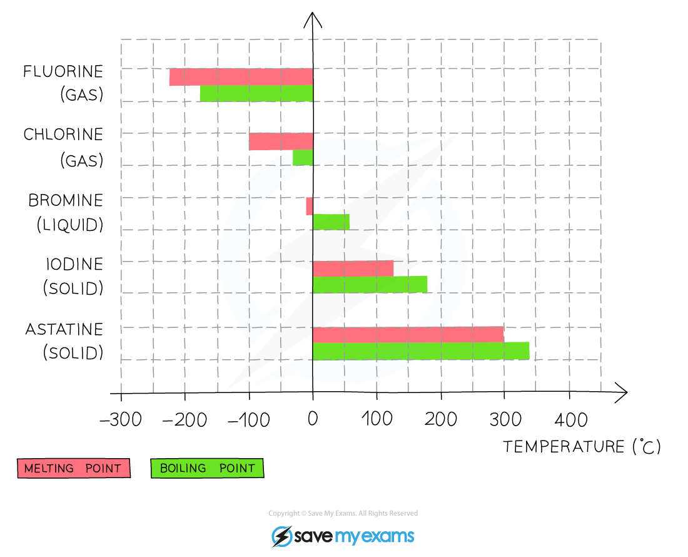
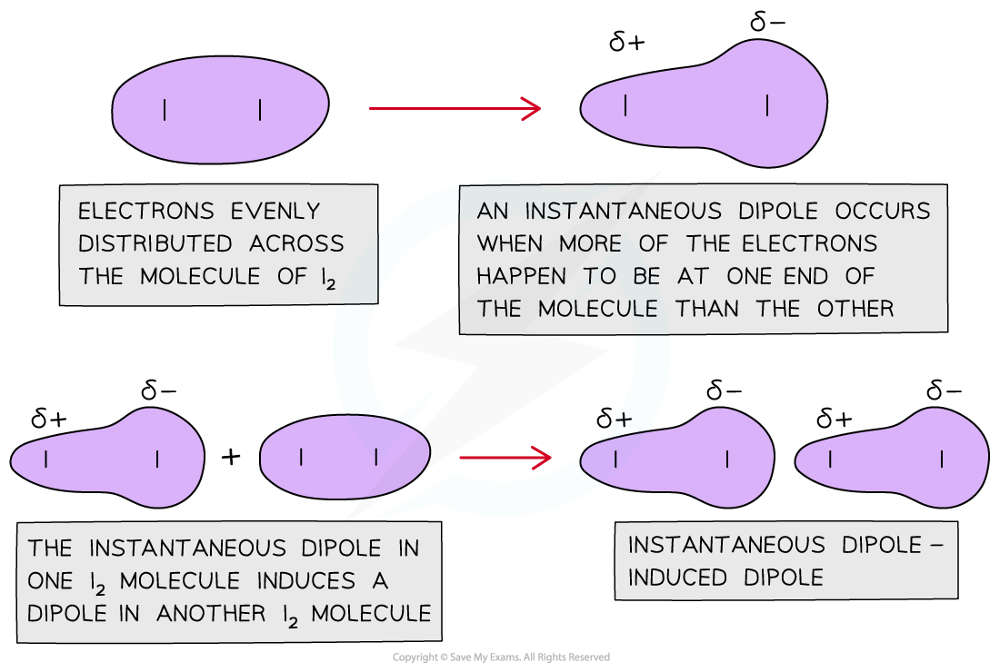
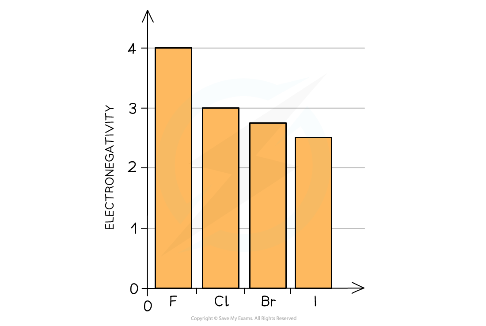
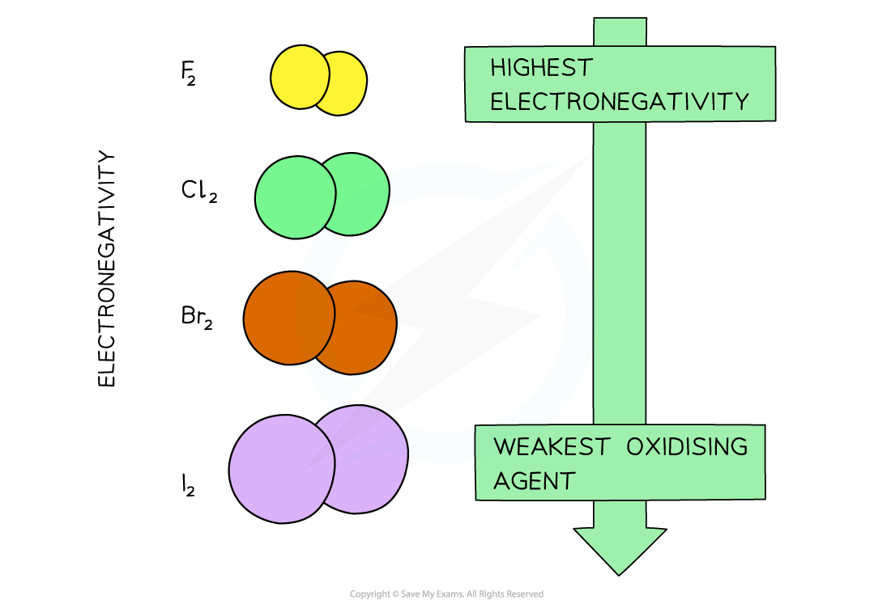
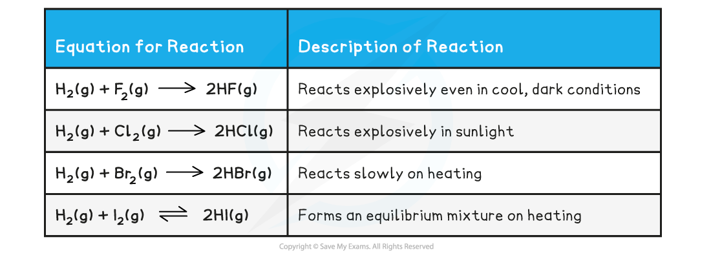
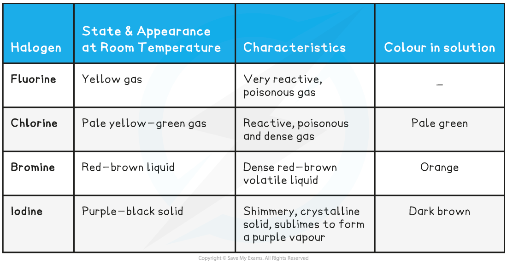

Physical Properties
-------------------

* The Group 7 elements are called <b>halogens</b>
* The halogens have uses in water purification and as bleaching agents (chlorine), as flame-retardants and fire extinguishers (bromine) and as antiseptic and disinfectant agents (iodine)

#### Colours

* All halogens have distinct <b>colours </b>which get <b>darker </b>going down the group

<i><b>The colours of the Group 7 elements get darker going down the group</b></i>

#### Volatility

* <b>Volatility </b>refers to how easily a substance can evaporate

  + A volatile substance will have a low boiling point

<i><b>The melting and boiling points of the Group 7 elements increase going down the group which indicates that the elements become less volatile</b></i>

* Going down the group, the <b>boiling point </b>of the elements increases which means that the <b>volatility </b>of the halogens decreases

  + This means that fluorine is the most volatile and iodine the least volatile

#### Trend in melting and boiling points

* Halogens are non-metals and are <b>diatomic molecules </b>at room temperature

  + This means that they exist as molecules which are made up of two similar atoms, such as F2
* The halogens are <b>simple molecular structures </b>with <b>weak </b>London dispersion forces between the diatomic molecules caused by instantaneous dipole-induced dipole forces

<i><b>The diagram shows that a sudden imbalance of electrons in a nonpolar molecule can cause an instantaneous dipole. When this molecule gets close to another non-polar molecule it can induce a dipole as the cloud of electrons repel the electrons in the neighbouring molecule to the other side</b></i>

* The more <b>electrons </b>there are in a molecule, the greater the instantaneous dipole-induced dipole forces
* Therefore, the <b>larger </b>the molecule the <b>stronger </b>the London dispersion forces between molecules
* This is why as you go down the group, it gets more difficult to separate the molecules and the <b>melting </b>and <b>boiling points </b>increase
* As it gets more difficult to separate the molecules, the <b>volatility </b>of the halogens <b>decreases </b>going down the group

#### Trend in electronegativity

* The electronegativity of the halogens decreases down the group

  

<i><b>The electronegativity of the halogens decreases going down the group</b></i>

* The <b>electronegativity</b> of an atom refers to how strongly it attracts electrons towards itself in a covalent bond
* The decrease in electronegativity is linked to the size of the halogens
* Going down the group, the atomic radii of the elements increase which means that the outer shells get further away from the nucleus
* An ‘incoming’ electron will therefore experience more <b>shielding</b> from the attraction of the positive nuclear charge
* The halogens’ ability to accept an electron (their <b>oxidising power</b>) therefore decreases going down the group

<i><b>With increasing atomic size of the halogens (going down the group) their electronegativity, and therefore oxidising power, decreases</b></i>

Group 7 Reactivity
------------------

#### Reactivity

* When a halogen atom reacts it will usually gain an electron, to form a <b>1-</b> ion (X + e- → X-)
* The oxidation number has decreased from 0 to -1, therefore reduction has occurred
* Therefore, halogens will act as oxidising agents
* Down Group 7 we have seen that the atoms become larger so the outer electrons are further away and are therefore more shielded from the positive nucleus
* Larger halogen atoms such as iodine will find it more difficult to attract incoming electrons needed to form the 1- ion
* Therefore the reactivity decreases down Group 7

<b>Reaction with hydrogen</b>

* To demonstrate the decrease in the reactivity we can look a the reaction with hydrogen gas
* The table outlines the trend in the reactivity of the halogens with hydrogen gas
* As we can see the reaction becomes less vigorous down the group

<b>Reaction between Halogen & Hydrogen Gas</b>

Making Predictions
------------------

#### Making Predictions

* <b>Boiling and melting point</b>

  + Increases down the group
* <b>Colour</b>

  + Appear darker in colour down the group

<b>The Appearance, Characteristics and Colour in Solution of the Halogens</b>

