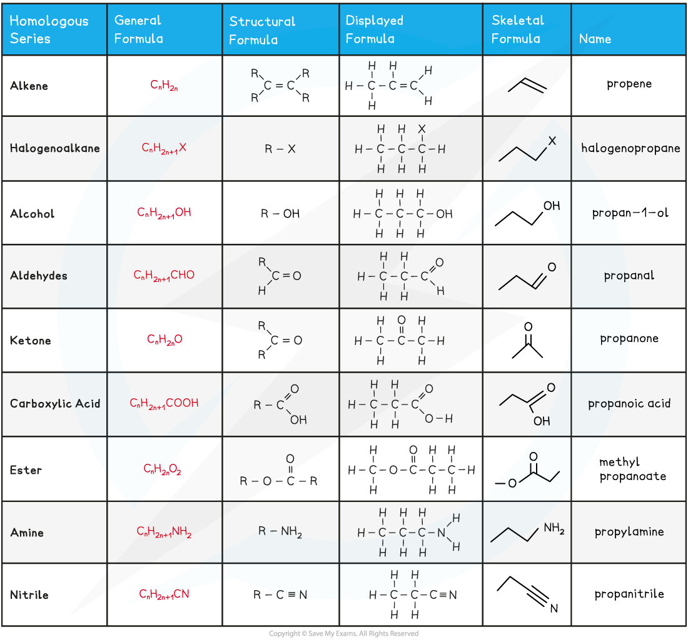

Formulae of Organic Compounds
-----------------------------

* <b>Organic chemistry</b> is the chemistry of carbon compounds
* Carbon forms a vast number of compounds because it can form strong covalent bonds with itself
* This enables it to form long chains of carbon atoms, and hence an almost infinite variety of carbon compounds are known
* Hydrocarbons are compounds that are made up of carbon and hydrogen atoms <b>ONLY</b>

<i><b>The diagram shows examples of hydrocarbons</b></i>

<i><b>Ethanol is NOT a hydrocarbon as the molecule also contains an oxygen atom and is not solely made up of carbon and hydrogen</b></i>

* Hydrocarbons can be placed into two categories

  + Saturated molecules containing single carbon-carbon bonds only
  + Unsaturated molecules containing double or triple carbon-carbon bonds
* The <b>general formula </b>is a formula that represents a <b>homologous series</b> of compounds using letters and numbers

  + Eg. the general formula of alkanes is CnH2n+2
  + A homologous series is a group of organic compounds that have the same functional group, the same general formula and the same chemical properties
* The <b>structural formula </b>is a formula that shows how the atoms are bonded to each carbon atom in a molecule
* The <b>displayed formula </b>is a 2D representation of an organic molecule showing <b>all</b> its atoms (by their <b>symbols</b>) and their bonds (by single, double or triple bonds)
* The <b>skeletal formula</b> is a simplified displayed formula with all the carbon and hydrogen (C-H) bonds removed

<b>Overview of the Formulae of Organic Compounds Table</b>

#### Worked Example

<b>Drawing skeletal formulae of molecules</b>

Draw the skeletal formula of the following molecules:

1. CH3(CH2)3OH
2. (CH3)2CHCH2OH
3. CH3CH2OCH2CH3

<b>Answer:</b>

#### Worked Example

<b>Drawing displayed formulae of molecules </b>Draw the displayed formula of the following molecules:

<b>Answer:</b>

* The <b>molecular formula </b>shows the number and type of each atom in a molecule

  + Eg. the molecular formula of ethanoic acid is C2H4O2

* The <b>empirical formula</b> shows the simplest whole number ratio of the elements present in one molecule of the compound

  + Eg. the empirical formula of ethanoic acid is CH2O

#### Worked Example

<b>Deducing molecular & empirical formulae</b>

Deduce the molecular and empirical formula of the following compounds:

<b>Answer:</b>

