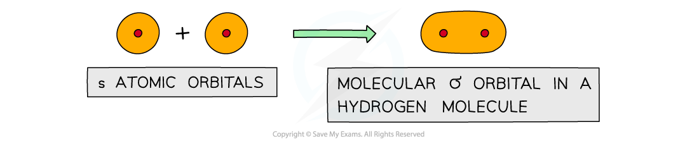
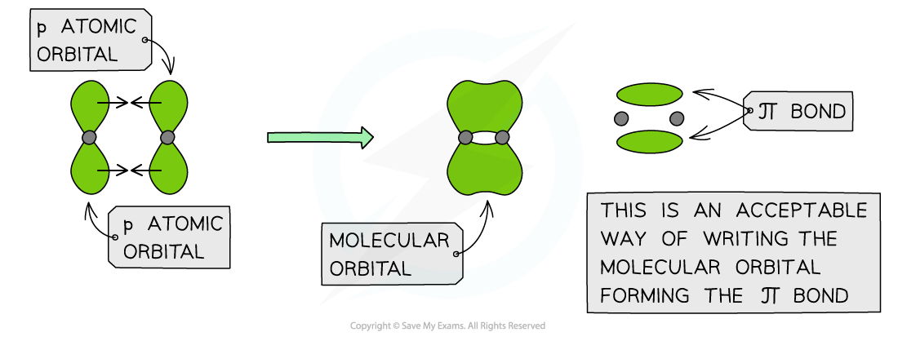
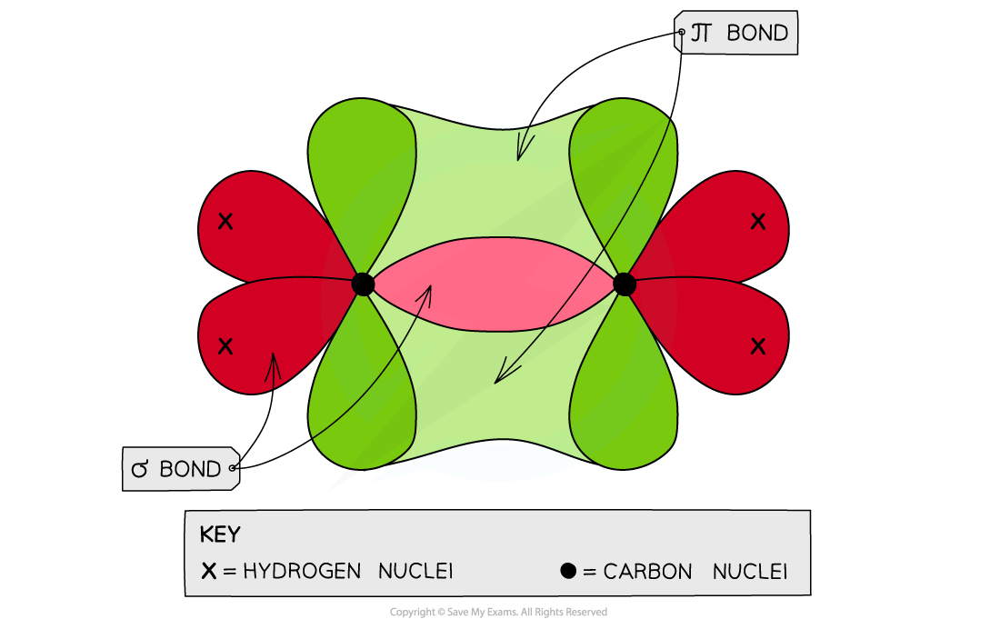

Bonding in Alkenes
------------------

* Each carbon atom has four electrons in its outer shell (<b>electronic configuration</b>: 1s22s22p2)
* Carbon atoms share these four electrons in four covalent bonds with other atoms to achieve a <b>full outer shell configuration</b>
* These electrons are found in orbitals within the respective atoms
* When forming a covalent bond, the orbitals overlap in such a way to form two types of bonds

  + Sigma bonds (σ)
  + Pi bonds (π)

* When carbon atoms use only three of their electron pairs to form a σ bond, each carbon atom will have a p orbital which contains <b>one</b> spare electron
* When the p orbitals of two carbon atoms overlap with each other, a π bond is formed (the π bond contains two electrons)
* The two orbitals that form the π bond lie above and below the plane of the two carbon atoms to maximise bond overlap

#### σ bonds

* <b>Sigma</b> (σ) bonds are formed from the <b>end to end</b> <b>overlap</b> of atomic orbitals
* s orbitals overlap this way as well as p orbitals

<i><b>Sigma orbitals can be formed from the end to end overlap of s orbitals </b></i>

* The electron density in a σ bond is symmetrical about a line joining the nuclei of the atoms forming the bond
* The pair of electrons is found between the nuclei of the two atoms
* The electrostatic attraction between the electrons and nuclei bonds the atoms to each other

#### Hydrogen

* The hydrogen atom has only one s orbital
* The s orbitals of the two hydrogen atoms will overlap to form a σ bond

#### π bonds

* <b>Pi</b> (π) bonds are formed from the <b>sideways</b> <b>overlap</b> of <b>adjacent </b>p orbitals
* The two lobes that make up the π bond lie <b>above</b> <b>and</b> <b>below</b> <b>the</b> <b>plane</b> of the σ bond
* This maximises overlap of the p orbitals
* A single π bond is drawn as <b>two electron clouds,</b> one arising from each lobe of the p orbitals
* The two clouds of electrons in a π bond represent <b>one </b>bond containing <b>two electrons</b>

<i><b>π orbitals can be formed from the sideways overlap of p orbitals</b></i>

#### Ethene

* Each carbon atom uses <b>three </b>of its <b>four </b>electrons to form σ bonds
* Two σ bonds are formed with the hydrogen atoms
* One σ bond is formed with the other carbon atom
* The fourth electron from each carbon atom occupies a p orbital which overlaps <b>sideways </b>with another p orbital on the other carbon atom to form a π bond
* This means that the C-C is a <b>double bond</b>: one σ and one π bond

<i><b>Each carbon atom in ethene forms two sigma bonds with hydrogen atoms and one σ bond with another carbon atom. The fourth electron is used to form a π bond between the two carbon atoms</b></i>