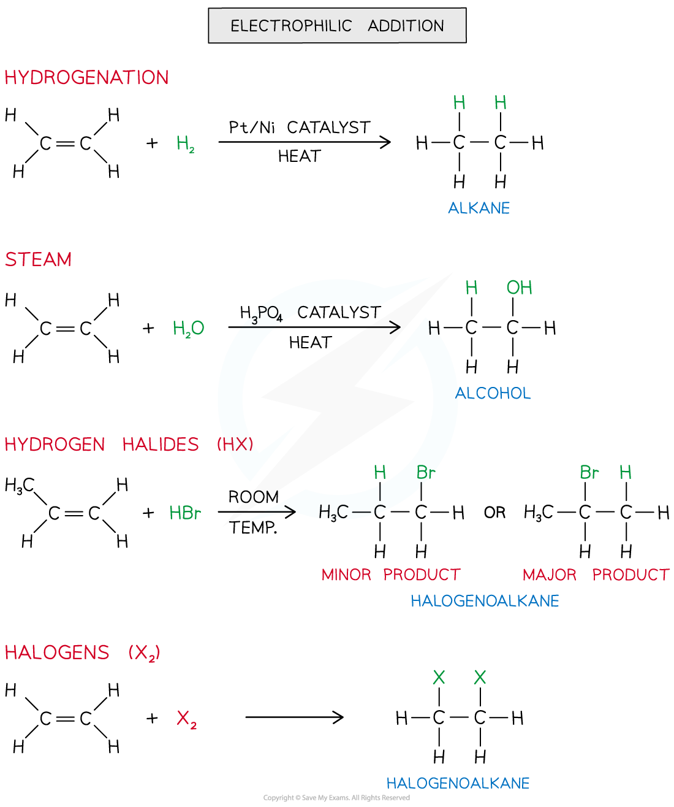
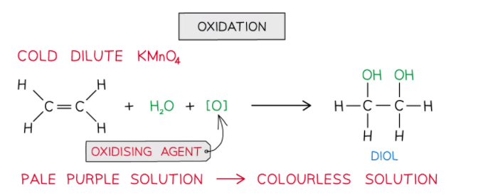

Electrophilic Addition
----------------------

* The double bond in alkenes is an area of high electron density (there are four electrons found in this double bond)
* This makes the double bond susceptible to attack by electrophiles (electron-loving species)
* An <b>electrophilic addition </b>is the addition of an <b>electrophile</b> to a double bond
* The C-C double bond is broken, and a new single bond is formed from each of the two carbon atoms
* Electrophilic addition reactions include the addition of:

  + Hydrogen (also known as <b>hydrogenation</b> <b>reaction</b>)
  + Steam (H2O (g))
  + Hydrogen halide (HX)
  + Halogen

<i><b>The diagram shows an overview of the different electrophilic addition reactions alkenes can undergo</b></i>

#### Manufacture of margarine

* Hydrogenation is extensively used in industry to manufacture margarine
* Naturally occurring vegetable oils are unsaturated and contain C=C double bonds
* When these bonds react with hydrogen, some of the C=C double bonds become C-C single bonds
* This process changes the properties of vegetable oil and converts it into a solid: margarine

#### Oxidation

* Alkenes can also be <b>oxidised </b>by <b>acidified potassium manganate(VII) </b>(KMnO4) which is a very powerful <b>oxidising agent</b>
* When shaken with cold dilute<b> KMnO</b><b>4</b> the <b>pale purple </b>solution turns <b>colourless </b>and the product is a <b>diol</b>

  + This colour change means this reaction can be used, like bromine, to distinguish alkanes from alkenes ( alkanes do not have double bonds and so are not oxidised in this way)

* Although you do not need to know the full details of the working of this reaction you can think of it as an oxidation followed by an addition

  + The potassium manganate provides an oxygen atom (oxidation)
  + Then water in the solution provides another oxygen atom and two hydrogen atoms, so there is addition of two OH groups across the double bond

Heterolytic Fission
-------------------

* <b>Heterolytic fission </b>is breaking a covalent bond in such a way that the more electronegative atom takes both the electrons from the bond to form a negative ion and leaving behind a positive ion

  

<i><b>The diagram shows heterolytic fission in which the most electronegative atom takes both electrons in the covalent bond</b></i>