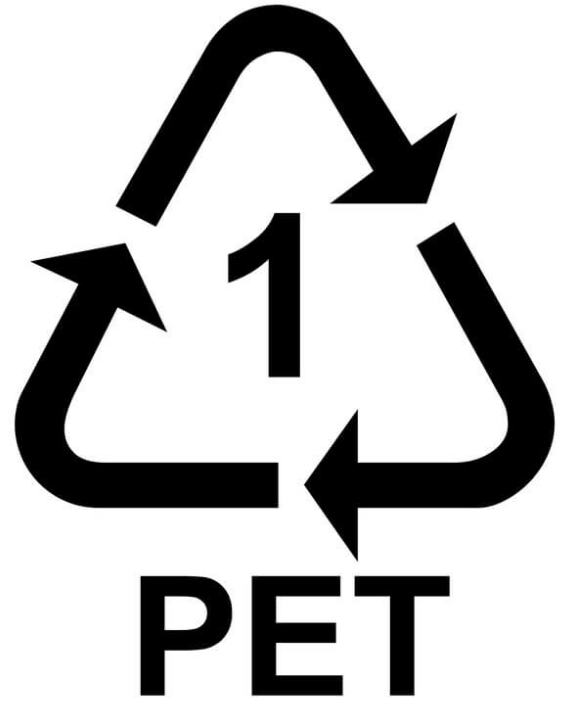
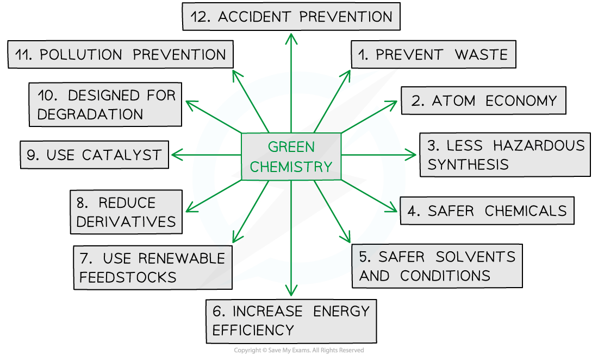

Disposal of Polymers
--------------------

* Polymers provide a readily available, cheap alternative to many metal, glass, paper and cardboard materials in everyday use
* The <b>low reactivity</b> of many polymers makes them ideal for certain uses, e.g. food packaging, but at the same time creates problems with their disposal as a lot of polymers are <b>non-biodegradable</b>

  + There are many published articles about the <b>environmental problems</b> of waste plastic killing marine animals
* One method of polymer disposal continues to be the use of landfill sites

  + This is not ideal and various initiatives are being introduced aiming to reduce this method of waste disposal in general as well as with specific regard to polymers

#### Recycling

* Polymer <b>recycling </b>reduces the amount of waste that it going to <b>landfill </b>sites

  + Newer landfill sites can have a recycling point where the new waste is brought before going to into the actual landfill - this is in an effort to reduce the amount of polymers (and other recyclable materials) unnecessarily going into the waste site
* The recycling of polymers can also reduce the use of <b>finite resources</b>

  + Lots of polymers are made from the products of cracking crude oil and it's fractions

* Recycling polymers is a <b>time-consuming</b> process as they have to be sorted into the different categories

  + These categories are usually shown somewhere on the plastic / polymer product with the recycling symbol and numbers or abbreviations for the different polymers, e.g.:

<b>The recycling symbol for the polyethylene terephthalate polymer</b>

* After sorting, the polymers are chopped, washed, dried, melted and then cast into pellets ready for use

  + However, mixed polymers can mean that this process is wasted as its produces an unusable mix of polymers
* Certain polymers can cause problems when recycling due to their chemical composition, e.g. PVC contains a large amount of toxic chlorine which can be released

  + Modern techniques are overcoming this PVC problem by dissolving the polymer and precipitating out the recycled material

#### Incineration

* Some petroleum / natural gas derived polymers are still difficult to recycle
* Since they have a large amount of energy stored within the polymer chains, these polymers can be incinerated

  + This process can then be used to boil water and use the water vapour to turn turbines inside a power station, in a  similar fashion to coal-fired power stations
* This process still causes environmental pollution as the carbon within the polymer can be released as carbon dioxide contributing to global warming

  + Other toxic waste products include hydrogen chloride and other chlorinated molecules from the combustion of PVC

#### Feedstock recycling

* <b>Feedstock recycling</b> is where waste polymers are broken down, by chemical and thermal processes, into monomers, gases and oils
* These products are then used as the raw materials in the production of new polymers and other organic chemicals
* The major benefit of feedstock recycling, compared to other methods of polymer disposal, is that it works with unsorted and unwashed polymers

Sustainability
--------------

* Chemists will often use the principles of green chemistry when designing a <b>sustainable </b>polymer manufacturing process

<i><b>The twelve principles of green chemistry</b></i>

* They will aim to:

  + Use chemicals (reactants, solvents and catalysts) that are as <b>safe </b>and <b>environmentally friendly</b> as possible

    - They also aim to <b>reduce the amount of chemicals used,</b> in terms of physical quantities as well as actual number of chemicals
  + Use <b>renewable feedstock</b> chemicals where possible
  + <b>Reduce the energy requirements</b> for the reaction as well as increase the energy efficiency, which has both an environmental and financial bonus
  + Improve atom economy / reduce the amount of waste byproducts
  + Consider the lifespan of the polymer, which will incorporate the idea of the polymer being suitable for its use

Limiting Problems of Polymer Disposal
-------------------------------------

* Chemists have designed ways to remove toxic waste products like HCl before they are emitted into the atmosphere
* The waste gase from the incinerator are scrubbed/reacted with a base or carbonate
* The base reacts with the acidic HCl gas, neutralising it

  + eg. CaO (s) + 2HCl (aq)→ CaCl2 (aq) + H2O (l)
* Chemists have also developed biodegradable and compostable polymers

#### Biodegradable polymers

* Biodegradable polymers can be broken down over time by microorganisms

  + Common products from this process include carbon dioxide, water and other organic compounds
* The <b>polyester </b>and <b>polyamide </b>condensation polymers are considered to be biodegradable as they can be broken down using <b>hydrolysis </b>reactions

  + This is a major advantage over the polymers produced using alkene monomers (polyalkenes)
  + When polyesters and polyamides are taken to landfill sites, they can be broken down easily and their products used for other applications

#### Compostable polymers

* Compostable polymers are commonly plant based

  + Plant starch is being used in the production of biodegradable bin liners
  + Sugar cane fibres are replacing polystyrene in the production of disposable plates and cups
* Compostable polymers degrade naturally leaving no harmful residues