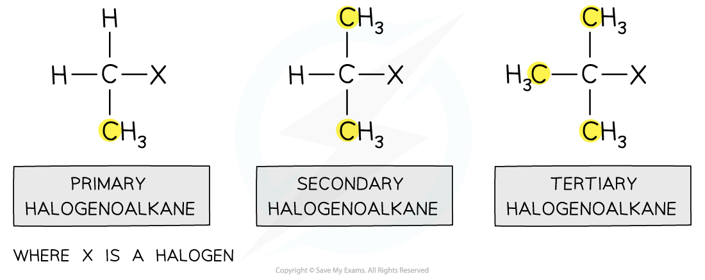

Classifying Halogenoalkanes
---------------------------

#### Naming halogenoalkanes

* We use the prefixes

  + <b>Fluoro</b> for fluorine
  + <b>Chloro</b> for chlroine
  + <b>Bromo</b> for bromine
  + <b>Iodo</b> for iodine
* The name of the halogenoalkane is based on the orignal alkane

  + So CH3CH2CH2Br would be 1-bromopropane
* The position of the halogen atom must be taken into account

  + So CH3CH(Br)CH3 would be 2-bromopropane
* Finally the substituents are listed alphabetically

  + So  CH3CH(Cl)CH2Br would be 1-bromo-2-chloropropane

#### Classifying halogenoalkanes

* Halogenoalkanes can be classified as <b>primary</b>, <b>secondary</b> or <b>tertiary</b> depending on the number of carbon atoms attached to the C-X functional group

  + A <b>primary halogenoalkane </b>is when a halogen is attached to a carbon that itself is attached to one other alkyl group
  + A <b>secondary halogenoalkane </b>is when a halogen is attached to a carbon that itself is attached to two other alkyl groups
  + A <b>tertiary halogenoalkane </b>is when a halogen is attached to a carbon that itself is attached to three other alkyl groups

<i><b>Primary, secondary and tertiary halogenoalkanes</b></i>