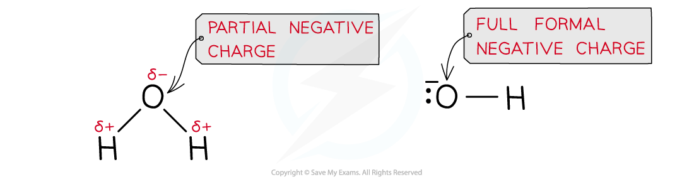

Nucleophilic Substitution: Reactions
------------------------------------

* A <b>nucleophile</b> is an electron-rich species that can <b>donate</b> a pair of electrons

  + ‘Nucleophile’ means ‘nucleus / positive charge loving’ as nucleophiles are attracted to positively charged species
  + <b>Nucleophilic </b>refers to reactions that involve a nucleophile

#### Formation of alcohols

* The nucleophile in this reaction is the <b>hydroxide ion</b>, <b>OH</b><b>-</b><b> </b>
* An <b>aqueous</b> solution of sodium hydroxide (NaOH) or potassium hydroxide (KOH) with <b>ethanol</b> is used to form an alcohol
* This reaction is very slow at room temperature, so the reaction mixture is warmed
* This is an example of a <b>hydrolysis reaction</b> and the product is an alcohol

  + The rate of this reaction depends on the type of halogen in the halogenoalkane
  + The stronger the C-X bond, the slower the rate of the reaction
  + In terms of bond enthalpy, C-F > C-Cl > C-Br > C-I
  + Fluoroalkanes do not react at all, but iodoalkanes have a very fast rate of reaction

<i><b>The halogen is replaced by the nucleophile, OH</b></i><i><b>-</b></i><i><b> </b></i>

* This reaction could also be done with water as the nucleophile, but it is very slow

  + The hydroxide ion is a better nucleophile than water as it carries a full negative charge
  + In water, the oxygen atom only carries a partial charge

<i><b>A hydroxide ion is a better nucleophile as it has a full formal negative charge whereas the oxygen atom in water only carries a partial negative charge; this causes the nucleophilic substitution reaction with water to be much slower than the aqueous alkali</b></i>

#### Reaction with water

* The water molecule is a weak nucleophile, but it will eventually substitute for the halogen
* This occurs much more slowly compared to when warm aqueous sodium hydroxide is used
* An alcohol is produced

  + <b>RX + H</b><b>2</b><b>O → ROH + H</b><b>+</b><b> + X</b><b>-</b>
  + <b>CH</b><b>3</b><b>CH</b><b>2</b><b>Br + H</b><b>2</b><b>O → CH</b><b>3</b><b>CH</b><b>2</b><b>OH + H</b><b>+</b><b> + Br</b><b>-</b>
* If silver nitrate solution in ethanol is added to the solution, the silver ions will react with the halide ions as soon as they form, giving a silver halide precipitate

  + <b>Ag</b><b>+ </b><b>(aq) + X</b><b>-</b><b> (aq) → AgX (s) </b>

#### Formation of nitriles

* The nucleophile in this reaction is the <b>cyanide ion, CN</b><b>-</b><b> </b>
* An <b>ethanolic solution</b> of <b>potassium</b> <b>cyanide</b> (KCN in ethanol) is <b>heated</b> <b>under</b> <b>reflux</b> with the halogenoalkane
* The product is a <b>nitrile</b>

  + E.g. bromoethane is heated under reflux with ethanolic potassium cyanide to form propanenitrile

<i><b>The halogen is replaced by a cyanide group, CN </b></i><i><b>-</b></i>

* The nucleophilic substitution of halogenoalkanes with KCN <b>extends the carbon chain</b> by adding an extra carbon atom
* This reaction can therefore be used by chemists to make a compound with one more carbon atom than the best available organic starting material

#### Formation of primary amines by reaction with ammonia

* The nucleophile in this reaction is the ammonia molecule, NH3
* An<b> ethanolic</b> <b>solution</b> of <b>excess </b>ammonia (NH3 in ethanol) is <b>heated</b> <b>under pressure </b>with a <b>primary </b>halogenoalkane

  + An excess of ammonia is used because the product is more reactive than ammonia so further substitution reactions could occur
* The product is a <b>primary amine</b>

  + E.g. bromoethane reacts with excess ethanolic ammonia when heated under pressure to form ethylamine

<i><b>The halogen is replaced by an amine group, NH</b></i><i><b>2</b></i>

#### Formation of alkenes

* The halogenoalkanes are <b>heated under reflux </b>with <b>ethanolic sodium hydroxide </b>causing the C-X bond to break <b>heterolytically, </b>forming an X- ion and leaving an alkene as an organic product

  + E.g. bromoethane is heated under reflux with ethanolic sodium hydroxide to form ethene

<i><b>Production of an alkene from a halogenoalkane by reacting it with ethanolic sodium hydroxide and heating it</b></i>

<i><b>Hydrogen bromide is eliminated to form ethene</b></i>