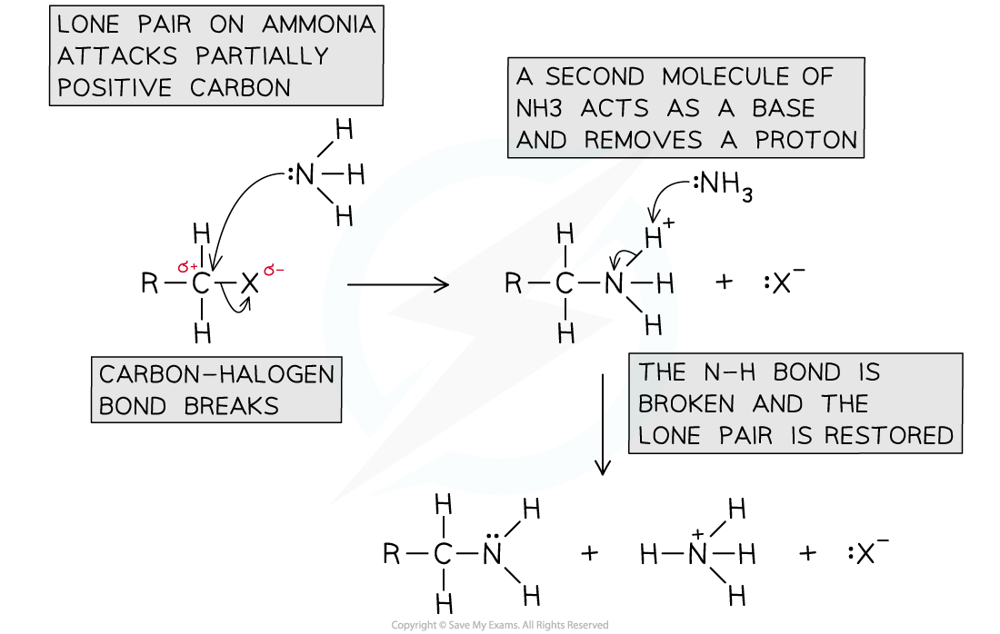

Nucleophilic Substitution: Mechanisms
-------------------------------------

* A <b>nucleophilic substitution </b>reaction is one in which a <b>nucleophile </b>attacks a carbon atom which carries a <b>partial</b> <b>positive</b> <b>charge</b>
* An atom that has a <b>partial</b> <b>negative</b> <b>charge</b> is replaced by the nucleophile
* Halogenoalkanes will undergo nucleophilic substitution reactions due to the polar C-X bond (where X is a halogen)

<i><b>Due to large differences in electronegativity between the carbon and halogen atom, the C-X bond is polar</b></i>

#### Mechanism with aqueous potassium hydroxide

* In the following reaction a halogenoalkane reacts with aqueous alkali to form an alcohol

<i><b>The halogen is replaced by a nucleophile, OH</b></i><i><b>–</b></i>

* The mechanism for the reaction is as follows

<i><b>Nucleophilic substitution reaction of bromoethane and aqueous alkali (e.g. NaOH)</b></i>

#### Mechanism with ammonia

* When ammonia reacts with a haloalkane a nucleophilic substitution reaction takes place forming a primary amine

  + For example chloromethane reacts with ammonia in two steps to make methylamine and ammonium chloride

<b>CH</b><b>3</b><b>Cl + NH</b><b>3</b><b> → [CH</b><b>3</b><b>NH</b><b>3</b><b>]</b><b>+</b><b>Cl</b><b>-</b>

<b>[CH</b><b>3</b><b>NH</b><b>3</b><b>]</b><b>+</b><b>Cl</b><b>-</b><b> + NH</b><b>3</b><b> → CH</b><b>3</b><b>NH</b><b>2</b><b> + NH</b><b>4</b><b>+</b><b>Cl</b><b>-</b>

* <b>Excess</b> ammonia is used to prevent further substitution and favour the formation of a primary amine

<i><b>The mechanism of nucleophilic substitution between ammonia and a halogenoalkane</b></i>