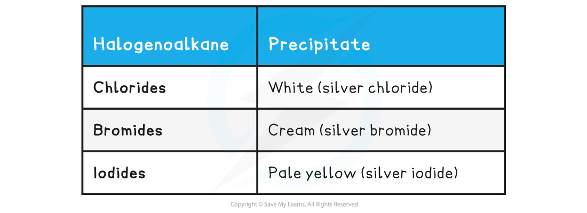

Relative Rates of Hydrolysis
----------------------------

#### Measuring the rate of hydrolysis

* Acidified aqueous silver nitrate can be used to measure the rate of hydrolysis of halogenoalkanes
* The following method is used:

  + Set up three test tubes in a 50 oC water bath, with a mixture of ethanol and acidified silver nitrate
  + Add a few drops of a chloroalkane, bromoalkane and an iodoalkane to each test tube and start a stop watch
  + Time how long it takes for the precipitates to form

* Reacting halogenoalkanes with <b>aqueous silver nitrate solution</b> will result in the formation of a <b>precipitate</b>
* The <b>rate of formation</b> of these precipitates can also be used to determine the reactivity of the haloalkane

#### Haloalkane Precipitates Table

* The precipitates will form as the reaction progresses and the halide ions are formed

  + The yellow silver iodide precipitate is the fastest <b>nucleophilic substitution </b>reaction

    - This is because the C-I bond has the lowest bond enthalpy, so it is the easiest to break and will cause the I- ions to form the fastest
  + The white chloride precipitate is the slowest nucleophilic substitution reaction

    - This is because the C-Cl bond has the highest bond enthalpy, so it is the hardest to break and will cause the Cl- ions to form the slowest

* Silver fluoride is soluble, so a precipitate will not be formed in this reaction
* This confirms that fluoroalkanes are the least reactive and iodoalkanes are the most reactive halogenoalkanes

  + It can be predicted that the formation of silver astatide would be even quicker than silver iodide

<i><b>The trend in reactivity of haloalkanes</b></i>

* A similar experiment can be set up to compare the rate of hydrolysis in primary, secondary and tertiary halogenoalkanes

  + The halogen involved and the overall molecular formula of the halogenoalkane must remain the same
  + E.g. 1-chlorobutane (primary), 2-chlorobutane (secondary) and 2-chloro-2-methylpropane (tertiary)
* Results would show that:

  + The tertiary halogenoalkane / 2-chloro-2-methylpropane reacts the quickest
  + The primary halogenoalkane / 1-chlorobutane reacts the slowest
  + Therefore, the secondary halogenoalkane / 2-chlorobutane is in the middle

    - Although, the explanation for this is not required at AS level, it is required at A-level
    - The rate of hydrolysis is determined by the use of either an SN1 or an SN2 reaction mechanism