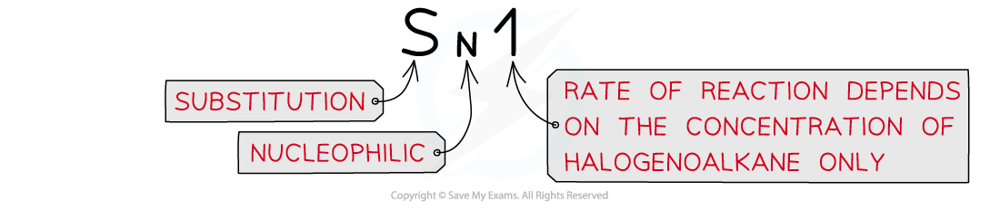
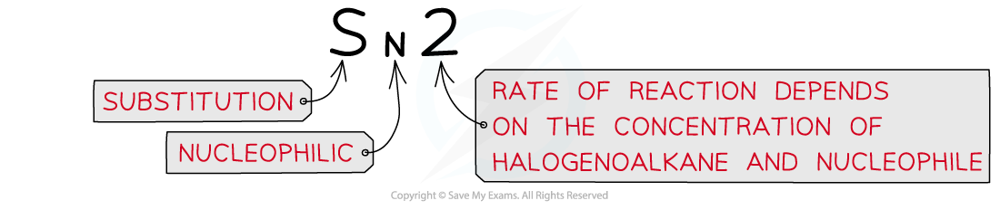

Reactivity of Halogenoalkanes
-----------------------------

* Nucleophilic substitution reactions can occur in two different ways (known as <b>S</b><b>N</b><b>2</b> and <b>S</b><b>N</b><b>1 </b>reactions) depending on the structure of the halogenoalkane involved

  + <b>Tertiary</b> halogenoalkanes favour SN1 reactions
  + <b>Primary</b> halogenoalkanes favour SN2 reactions

#### SN1 reactions

* In<b> tertiary </b>halogenoalkanes, the carbon that is attached to the halogen is also bonded to three alkyl groups
* These halogenoalkanes undergo nucleophilic substitution by an <b>S</b><b>N</b><b>1</b> mechanism

  + ‘S’ stands for ‘substitution’
  + ‘N’ stands for ‘nucleophilic’
  + ‘1’ means that the rate of the reaction (which is determined by the slowest step of the reaction) depends on the concentration of only one reagent, the halogenoalkane

* The SN1 mechanism is a <b>two-step</b> reaction
* In the first step, the C-X bond breaks heterolytically and the halogen leaves the halogenoalkane as an X- ion (this is the <b>slow</b> and <b>rate-determining step</b>)

  + This forms a tertiary carbocation <b>(which is a tertiary carbon atom with a positive charge)</b>
  + In the second step, the tertiary carbocation is attacked by the nucleophile

* For example, the nucleophilic substitution of 2-bromo-2-methylpropane by hydroxide ions to form 2-methyl-2-propanol

<i><b>The mechanism of nucleophilic substitution in 2-bromo-2-methylpropane which is a tertiary halogenoalkane</b></i>

#### SN2 reactions

* In<b> primary </b>halogenoalkanes<b>, </b>the carbon that is attached to the halogen is bonded to one alkyl group
* These halogenoalkanes undergo nucleophilic substitution by an <b>S</b><b>N</b><b>2</b> mechanism

  + ‘S’ stands for ‘substitution’
  + ‘N’ stands for ‘nucleophilic’
  + ‘2’ means that the rate of the reaction (which is determined by the slowest step of the reaction) depends on the concentration of both the halogenoalkane and the nucleophile ions

* The SN2 mechanism is a <b>one-step</b> reaction

  + The nucleophile donates a pair of electrons to the δ+ carbon atom of the halogenoalkane to form a new bond

    At the same time, the C-X bond is breaking and the halogen (X) takes both electrons in the bond
  + The halogen leaves the halogenoalkane as an X- ion
* For example, the nucleophilic substitution of bromoethane by hydroxide ions to form ethanol

<i><b>The </b></i><b>S</b><b>N</b><b>2 </b><i><b>mechanism of bromoethane with hydroxide causing an inversion of configuration</b></i>

Bond Enthalpy & Halogenoalkane Reactivity
-----------------------------------------

#### Bond Enthalpy

* The halogenoalkanes have different <b>rates</b> of <b>substitution</b> <b>reactions</b>
* Since substitution reactions involve <b>breaking</b> the <b>carbon-halogen</b> bond the <b>bond</b> <b>energies </b>can be used to explain their different reactivities

#### Halogenoalkane Bond Energy

* The table above shows that the C-I bond requires the least energy to break, and is therefore the <b>weakest</b> carbon-halogen bond
* During substitution reactions, the C-I bond will, therefore, <b>heterolytically</b> break as follows:

<b>R</b><b>3</b><b>C-I + OH</b><b>-</b><b>     →    R</b><b>3</b><b>C-OH + I</b><b>-</b>

                 halogenoalkane          alcohol

* The C-F bond, on the other hand, requires the most energy to break and is, therefore, the <b>strongest </b>carbon-halogen bond
* Fluoroalkanes will, therefore, be less likely to undergo substitution reactions