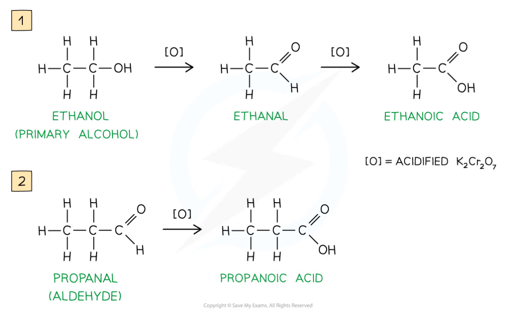
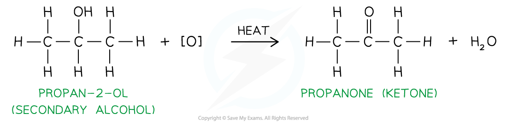
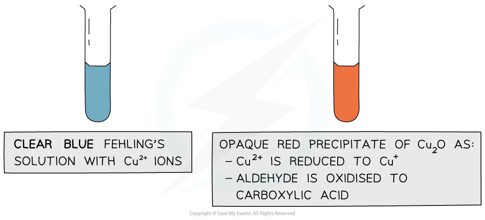
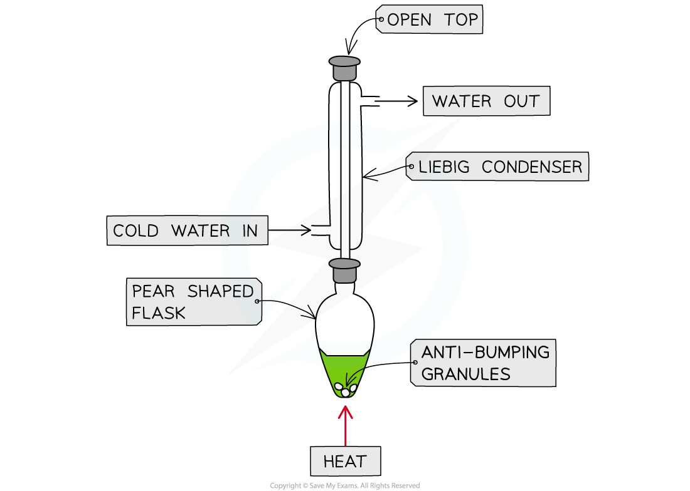
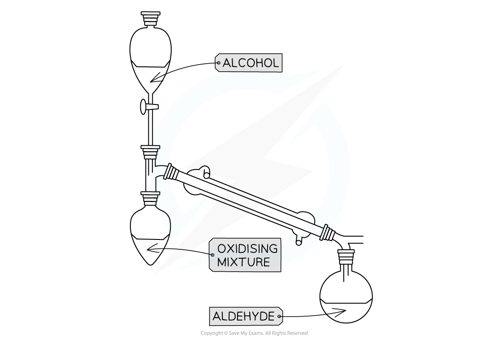

Reactions of Alcohols
---------------------

#### Combustion of alcohols

* Alcohols react with oxygen in the air when ignited and undergo <b>complete combustion </b>to form carbon dioxide and water

<b>alcohol + oxygen → carbon dioxide + water</b>

<i><b>Complete combustion of alcohols to produce carbon dioxide and water</b></i>

#### Conversions to halogenoalkanes

* These reactions involve replacing the hydroxyl group in an alcohol molecule with a halogen atom(known as halogenation)
* Different methods are required for each halogen

#### Chlorination

* Phosphorus(V) chloride is added to the alcohol resulting in a vigorous reaction at room temperature

  + This means the mixture doesn't need heating
* This reaction is used as a qualitative test for the presence of the -OH group

  + If you add PCl5 to an unknown liquid the evolution of steamy fumes (HCl gas) is evidence for the presence of the -OH group
* Two inorganic products are formed: phosphoryl chloride and hydrogen chloride

<b>CH</b><b>3</b><b>CH</b><b>2</b><b>CH</b><b>2</b><b>OH + PCl</b><b>5</b><b> → CH</b><b>3</b><b>CH</b><b>2</b><b>CH</b><b>2</b><b>Cl + POCl</b><b>3</b><b> + HCl</b>

* Chlorination of tertiary alcohols can be carried out in a different way by mixing (shaking) with hydrochloric acid at room temperature

* An example equation for the reaction of 2-methyl propan-2-ol is:

<b>(CH</b><b>3</b><b>)</b><b>3</b><b>COH + HCl → (CH</b><b>3</b><b>)</b><b>3</b><b>CCl + H</b><b>2</b><b>O</b>

* This reaction will not occur with primary or secondary alcohols

#### Bromination

* This reaction is carried out using a warmed mixture of potassium bromide and 50% concentrated sulfuric acid with the reacting alcohol
* More concentrated sulfuric acid would oxidise bromide ions to bromine resulting in different products
* The reaction can be written as two equations as the inorganic reactants first react together to form hydrogen bromide and potassium sulfate

<b>2KBr + H</b><b>2</b><b>SO</b><b>4</b><b>  → K</b><b>2</b><b>SO</b><b>4</b><b> +2HBr</b>

* The resulting hydrogen bromide then reacts with the alcohol, for example the reaction with butan-1-ol would be as follows:

<b>CH</b><b>3</b><b>CH</b><b>2</b><b>CH</b><b>2</b><b>CH</b><b>2</b><b>OH + HBr → CH</b><b>3</b><b>CH</b><b>2</b><b>CH</b><b>2</b><b>CH</b><b>2</b><b>Br + H</b><b>2</b><b>O</b>

#### Iodination

* This reaction is carried out using a mixture of red phosphorus and iodine with the alcohol whilst heating under reflux
* Similar to bromination, the reaction can be written as two equations as the inorganic reactants first react to form phosphorus(III) iodide

<b>2P + 3I</b><b>2</b><b> → 2PI</b><b>3</b>

* The reaction for the iodination of ethanol would be:

<b>3C</b><b>2</b><b>H</b><b>5</b><b>OH + PI</b><b>3</b><b> → 3C</b><b>2</b><b>H</b><b>5</b><b>I + H</b><b>3</b><b>PO</b><b>3</b>

* This reaction results in the formation of phosphoric acid as shown above

#### Dehydration to Alkenes

* Dehydration is done by heating the alcohol with concentrated phosphoric acid
* The reaction is similar to the elimination reaction of a halogenoalkene

  + The OH group and hydrogen of adjacent carbons are removed forming a C=C bond
* The equation for the dehydration of ethanol would be

<b>CH</b><b>3</b><b>CH</b><b>2</b><b>OH → CH</b><b>2</b><b>=CH</b><b>2 </b><b>+ H</b><b>2</b><b>O</b>

* Phosphoric acid does not appear in the equation as the water formed dilutes the concentrated phosphoric acid

#### Oxidation of alcohols

* Primary alcohols can be oxidised to form <b>aldehydes</b> which can undergo further oxidation to form <b>carboxylic</b> <b>acids</b>
* Secondary alcohols can be oxidised to form <b>ketones </b>only
* Tertiary alcohols do not undergo oxidation
* The oxidising agents of alcohols include <b>acidified K</b><b>2</b><b>Cr</b><b>2</b><b>O</b><b>7</b>
* <b>Acidified potassium dichromate(VI)</b>, K2Cr2O7, is an orange oxidising agent

  + Acidified means that that the potassium dichromate(VI) is in a solution of <b>dilute</b> <b>acid</b> (such as dilute sulfuric acid)
  + For potassium dichromate(VI) to act as an oxidising agent, it itself needs to be reduced
  + This reduction requires hydrogen (H+) ions which are provided by the acidic medium

    - When alcohols are <b>oxidised </b>the orange dichromate ions (Cr2O72-) are reduced to green Cr3+ ions
* The primary alcohol is added to the oxidising agent and warmed
* The aldehyde product has a lower boiling point than the alcohol reactant so it can be <b>distilled off </b>as soon as it forms
* If the aldehyde is not distilled off, further <b>refluxing</b> with excess oxidising agent will oxidise it to a carboxylic acid
* Since ketones cannot be further oxidised, the ketone product does not need to be <b>distilled off </b>straight away after it has been formed

<i><b>Oxidation Stages of Primary Alcohols</b></i>

<i><b>Oxidation of propan-2-ol by acidified K</b></i><i><b>2</b></i><i><b>Cr</b></i><i><b>2</b></i><i><b>O</b></i><i><b>7</b></i><i><b> to form a ketone</b></i>

* The presence of an aldehyde group (-CHO) in an <b>unknown compound </b>can be determined by the <b>oxidising agents</b> Fehling’s and Tollens’ reagents

#### Fehling’s solution

* <b>Fehling’s solution</b> is an alkaline solution containing copper(II) ions which act as the oxidising agent
* When <b>warmed</b> with an aldehyde, the aldehyde is oxidised to a carboxylic acid and the Cu2+ ions are reduced to Cu+ ions

  + In the alkaline conditions, the carboxylic acid formed will be neutralised to a carboxylate ion (the -COOH will lose a proton to become -COO- )
  + The carboxylate ion (-COO-) will form a salt with a positively charged metal ion such as sodium (-COO-Na+)

* The <b>clear blue</b> solution turns <b>opaque </b>due to the formation of a <b>red precipitate</b>, <b>copper(I) oxide</b>
* <b>Ketones </b>cannot be oxidised and therefore give a <b>negative test</b> when warmed with Fehling’s solution

<i><b>The copper(II) ions in Fehling’s solution are oxidising agents, oxidising the aldehyde to a carboxylic acid and getting reduced themselves to copper(I) ions in the Cu</b></i><i><b>2</b></i><i><b>O precipitate</b></i>

#### Tollens’ reagent

* <b>Tollens' reagent </b>is an aqueous alkaline solution of silver nitrate in excess ammonia solution

  + Tollen’s reagent is also called <b>ammoniacal silver nitrate solution</b>
* When <b>warmed</b> with an aldehyde, the aldehyde is oxidised to a carboxylic acid and the Ag+ ions are reduced to Ag atoms

  + In the alkaline conditions, the carboxylic acid will become a carboxylate ion and form a salt

* The Ag atoms form a silver ‘mirror’ on the inside of the tube
* <b>Ketones </b>cannot be oxidised and therefore give a <b>negative test</b> when warmed with Tollens’ reagent

<i><b>The Ag</b></i><i><b>+ </b></i><i><b>ions in Tollens’ reagent are oxidising agents, oxidising the aldehyde to a carboxylic acid and getting reduced themselves to silver atoms</b></i>

#### Different practical techniques

* Because of the easier oxidation of aldehydes compared to alcohols, two different techniques are used

  + Heating under reflux
  + Distillation with addition

#### Heating under reflux

* This technique is used when we want full oxidation

  + Producing a carboxylic acid for a primary alcohol
  + Producing a ketone for a secondary alcohol

<i><b>Apparatus set up for heating under reflux</b></i>

* This set up means any products of oxidation remain in the reaction mixture
* Products which boil off condense in the vertical condenser then return to the heating flask

#### Distillation with addition

* This technique is used when we do not want to complete oxidation

  + To obtain an aldehyde rather than carboxylic acid for primary alcohol

    

<i><b>Apparatus set up for distillation with addition</b></i>

* Only the oxidising agent is heated whilst the alcohol is slowly added
* When the aldehyde is formed it immediately distils off as it has a much lower boiling point than the alcohol used to make it
* The aldehyde is then collected in the reciever

#### Examiner Tips and Tricks

* Tri-iodoethane is used in the iodoform test which will give a yellow precipitate with methyl ketones as covered at A Level in 7.2.2 Testing for Carbonyls
* It can also give a positive result for alcohols containing the CH3CHOH group (this also will include ethanol)