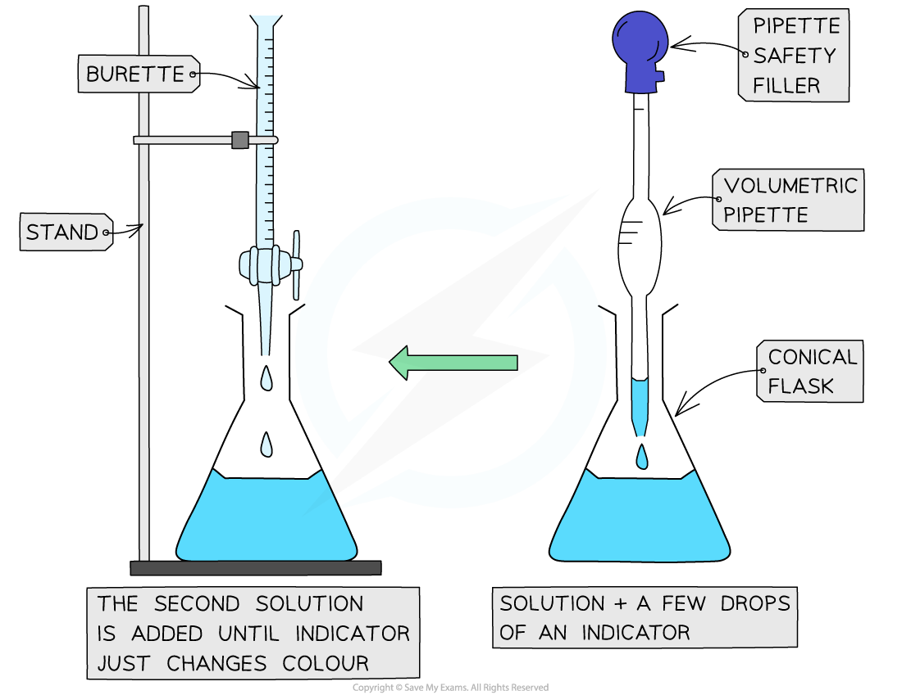
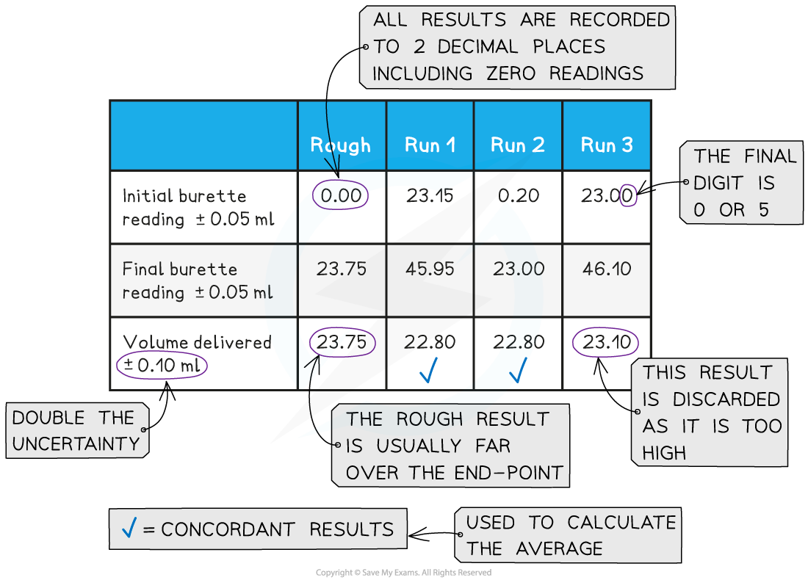

Core Practical 3: Hydrochloric Acid Concentration
-------------------------------------------------

#### Performing the Titration

* The key piece of equipment used in the titration is the burette
* <b>Burettes</b> are usually marked to a precision of 0.10 cm3

  + Since they are analogue instruments, the uncertainty is recorded to <b>half</b> the smallest marking, in other words to ±0.05 cm3
* The <b>end point</b> or <b>equivalence point</b> occurs when the two solutions have reacted completely and is shown with the use of an <b>indicator</b>

<i><b>The steps in a titration</b></i>

* A white tile is placed under the conical flask while the titration is performed, to make it easier to see the colour change

<i><b>Titrating</b></i>

* The steps in a titration are:

  + Measuring a known volume (usually 20 or 25 cm3) of one of the solutions with a<b> volumetric</b> <b>pipette</b> and placing it into a <b>conical flask</b>
  + The other solution is placed in the <b>burette</b>

    - To start with, the burette will usually be filled to 0.00 cm3
  + A few drops of the <b>indicator</b> are added to the solution in the conical flask
  + The tap on the <b>burette</b> is carefully opened and the solution added, portion by portion, to the <b>conical flask</b> until the <b>indicator</b> starts to change colour
  + As you start getting near to the end point, the flow of the burette should be slowed right down so that the solution is added dropwise

    - You should be able to close the tap on the burette after one drop has caused the colour change
  + Multiple runs are carried out until <b>concordant</b> results are obtained

    - Concordant results are within 0.1 cm3 of each other

#### Recording and processing titration results

* Both the initial and final <b>burette</b> readings should be recorded and shown to a <b>precision</b> of  ±0.05 cm3, the same as the <b>uncertainty</b>

<i><b>A typical layout and set of titration results</b></i>

* The volume delivered (<b>titre</b>) is calculated and recorded to an <b>uncertainty</b> of ±0.10 cm3

  + The <b>uncertainty</b> is doubled, because two <b>burette</b> readings are made to obtain the <b>titre</b> (V final – V initial), following the rules for <b>propagation of uncertainties</b>
* <b>Concordant </b>results are then averaged, and non-concordant results are discarded
* The appropriate calculations are then done

#### Worked Example

25.0 cm3 of hydrochloric acid was titrated with a 0.200 mol dm-3 solution of sodium hydrogencarbonate, NaHCO3.

<b>NaHCO</b><b>3</b><b> + HCl → NaCl + H</b><b>2</b><b>O + CO</b><b>2</b><b> </b>

Use the following results to calculate the concentration of the acid, to 3 significant figures.

<b>Answer</b>

<b>Step 1:</b> Calculate the average titre

* Average titre<math><semantics><mrow><mo>=</mo><mo> </mo><mfrac><mrow><mn>22</mn><mo>.</mo><mn>80</mn><mo> </mo><mo>+</mo><mo> </mo><mn>22</mn><mo>.</mo><mn>80</mn></mrow><mn>2</mn></mfrac><mo> </mo><mo>=</mo></mrow><annotation>{"language":"en","fontFamily":"Times New Roman","fontSize":"18"}</annotation></semantics></math>22.80 cm3

<b>Step 2:</b> Calculate the number of moles of sodium hydrogencarbonate

* Moles = <math><semantics><mfrac><mrow><mn>22</mn><mo>.</mo><mn>80</mn></mrow><mn>1000</mn></mfrac><annotation>{"language":"en","fontFamily":"Times New Roman","fontSize":"18"}</annotation></semantics></math> x 0.200 = 4.56 x 10-3 moles

<b>Step 3:</b> Calculate (or deduce) the number of moles of hydrochloric acid

* The stoichiometry of NaHCO3 : HCl is 1 : 1

  + Therefore, the number of moles of sodium hydrogencarbonate is also 4.56 x 10-3 moles

<b>Step 4: </b>Calculate the concentration of hydrochloric acid

* Concentration = <math><semantics><mrow><mo>=</mo><mo> </mo><mfrac><mrow><mi>m</mi><mi>o</mi><mi>l</mi><mi>e</mi><mi>s</mi></mrow><mrow><mi>v</mi><mi>o</mi><mi>l</mi><mi>u</mi><mi>m</mi><mi>e</mi></mrow></mfrac><mo> </mo><mo>=</mo><mfrac><mrow><mn>4</mn><mo>.</mo><mn>56</mn><mo> </mo><mo>×</mo><mo> </mo><msup><mn>10</mn><mrow><mo>-</mo><mn>3</mn></mrow></msup></mrow><mrow><mo>(</mo><mn>25</mn><mo>.</mo><mn>0</mn><mo> </mo><mo>/</mo><mo> </mo><mn>1000</mn><mo>)</mo></mrow></mfrac><mo> </mo><mo>=</mo><mo> </mo></mrow><annotation>{"language":"en","fontFamily":"Times New Roman","fontSize":"18"}</annotation></semantics></math><b>0.182 mol dm</b><b>-3</b><b> </b>