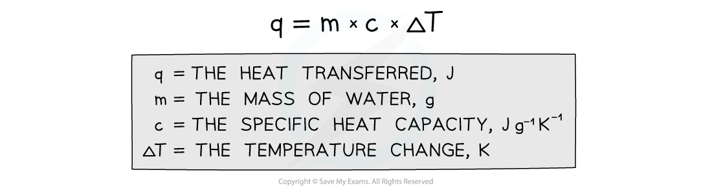

Core Practical 8: Determining Enthalpy Change of Reaction
---------------------------------------------------------

#### Measuring enthalpy changes

* <b>Calorimetry </b>is a technique used to measure changes in enthalpy of chemical reactions
* A <b>calorimeter</b> can be made up of a <b>polystyrene drinking cup</b>, a <b>vacuum flask</b> or <b>metal can</b>

<i><b>A polystyrene cup can act as a calorimeter to find enthalpy changes in a chemical reaction</b></i>

The energy needed to raise the temperature of 1 g of a substance by 1 K is called the <b>specific heat capacity </b>(<i>c</i>) of the liquid The <b>specific heat capacity</b> of water is 4.18 J g-1 K-1 The energy transferred as heat can be calculated by:

<i><b>Equation for calculating energy transferred in a calorimeter</b></i>

#### Enthalpy changes for reactions in solution

* The principle of these calorimetry experiments is to carry out the reaction with an excess of one reagent and measure the temperature change over the course of a few minutes
* The apparatus needed to carry out an enthalpy of reaction in solution calorimetry experiment is shown above

<b>     Sample method for a displacement reaction</b>

1. Using a measuring cylinder place 25 cm3 of the 1.0 mol dm-3 copper(II) sulphate solution into the polystyrene cup
2. Weigh about 6 g of zinc powder - as this is an excess there is no need to be very accurate
3. Draw a table to record the initial temperature and then the temperature and time every half minute up to 9.5 minutes
4. Put a thermometer or temperature probe in the cup, stir, and record the temperature every half minute for 2.5 minutes
5. At precisely 3 minutes, add the zinc powder to the cup (DO NOT RECORD THE TEMPERATURE AT 3 MINUTES)
6. Continue stirring and record the temperature for an additional 6 minutes

* For the purposes of the calculations, some assumptions are made about the experiment:

  + That the specific heat capacity of the solution is the same as pure water, i.e. <b>4.18 J g</b><b>-1 </b><b>K</b><b>-1</b>
  + That the density of the solution is the same as pure water, i.e. <b>1 g cm</b><b>-3</b>
  + The specific heat capacity of the container is ignored
  + The reaction is complete
  + There are negligible heat losses

#### Temperature correction graphs

* For reactions which are not instantaneous there may be a delay before the maximum temperature is reached
* During that delay the substances themselves may be losing heat to the surroundings, so that the true maximum temperature is never actually reached
* To overcome this problem we can use graphical analysis to determine the maximum enthalpy change

<i><b>A temperature correction graph for a metal displacement reaction between zinc and copper sulfate solution. The zinc is added after 4 minutes</b></i>

<b>The steps to make a temperature correction graph are:</b>

1. Take a temperature reading before adding the reactants for a few minutes to get a steady value
2. Add the second reactant and continue recording the temperature and time
3. Plot the graph and <b>extrapolate </b>the cooling part of the graph until you intersect the time at which the second reactant was added

#### Analysis

* Use both extrapolated lines to calculate Δ<i>T</i> as shown on the graph
* Use the equation <i>q </i> = <i>mc</i>Δ<i>T</i> to calculate the energy transferred

  + <i>q</i> = energy transferred
  + <i>m</i> = mass - this will be the mass of the 25 cm3 solution which will be 25 g (assuming a density of 1 g cm-3)
  + <i>c</i> = specific heat capacity - this will be assumed to be 4.18 J g-1 K-1, which is the specific heat capacity of water
  + Δ<i>T</i> = the temperature change from the graph
* Convert your value for energy transferred from J into kJ
* Then use the equation Δ<i>H</i> = <math><semantics><mfrac><mi>q</mi><mi>n</mi></mfrac><annotation>{"language":"en","fontFamily":"Times New Roman","fontSize":"18"}</annotation></semantics></math> to calculate the enthalpy change for the reaction

  + <i>q</i> = energy transferred
  + <i>n </i>= number of moles - this would be the number of moles of the <b>limiting reagent</b>, which means that you will have an extra calculation to do to determine whether this is the zinc or the copper sulfate
* Remember that in the example above, the temperature of the reaction mixture increased which means that the reaction is exothermic and should, therefore, have a negative value