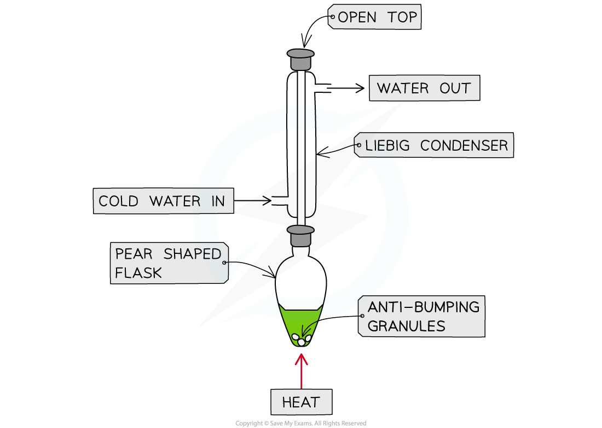
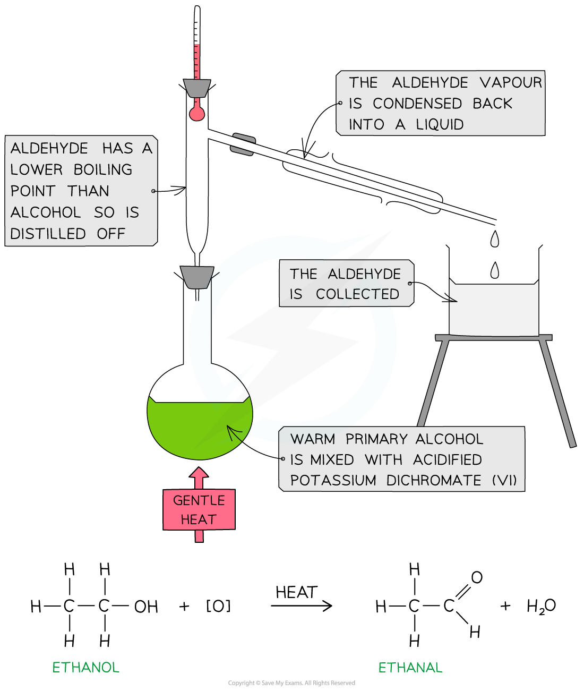

Core Practical 5: Oxidation of Ethanol
--------------------------------------

#### Oxidation of ethanol

* Primary alcohols can be oxidised to form <b>aldehydes</b> which can undergo further oxidation to form <b>carboxylic</b> <b>acids</b>

  + When ethanol is oxidised, ethanal is produced and when oxidised further ethanoic acid will be formed

#### Synthesis and purification of ethanal and ethanoic acid

* Carefully add 20 cm3 of acidified potassium dichromate(VI) solution, K2Cr2O7 (aq), to a 50 cm3 pear-shaped flask and cool the flask in an iced water bath
* Set up the reflux apparatus keeping pear shaped flask cool
* Place <b>anti-bumping granules</b> into the pear shaped flask
* Measure out 1 cm3 of ethanol
* Using a pipette, slowly add the ethanol drop wise into the reflux condenser
* When the ethanol has been added remove the ice bath and allow to warm up to room temperature
* Position the flask over an electric heater or in a water bath and heat for 20 minutes

  + Ethanol is flammable, therefore. naked flames should not be used when heating which is why the use of an electric heater or water bath is an important safety precaution
* Purify the product using distillation apparatus

<i><b>Reflux apparatus for the oxidation of ethanol to ethanoic acid</b></i>

<i><b>Oxidation of ethanol by acidified K</b></i><i><b>2</b></i><i><b>Cr</b></i><i><b>2</b></i><i><b>O</b></i><i><b>7</b></i><i><b> to form an aldehyde by distillation</b></i>