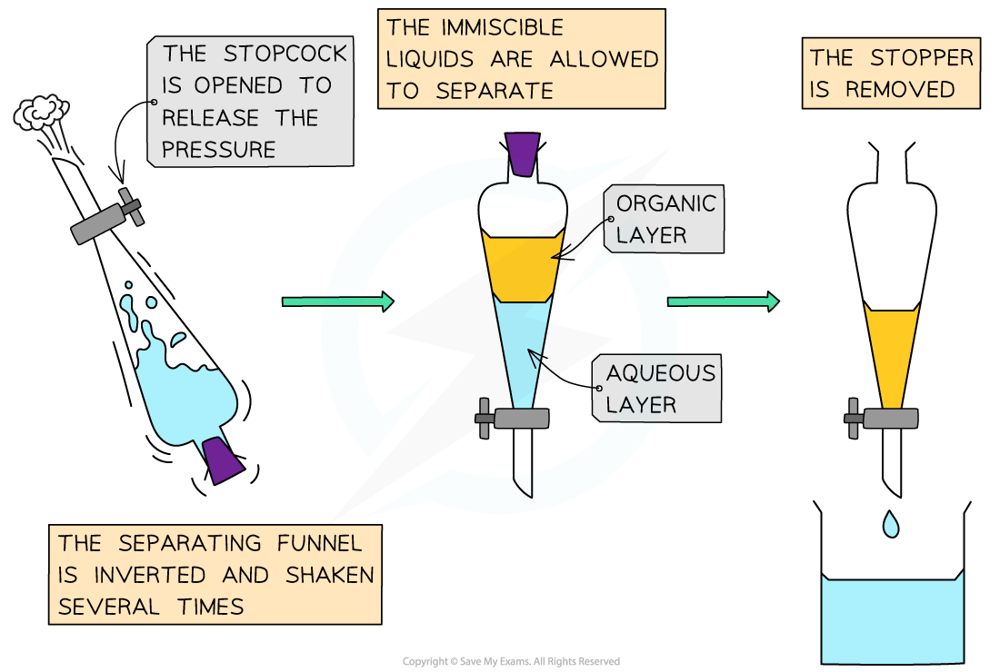

Core Practical 6: Chlorination of 2-Methylpropan-2-ol
-----------------------------------------------------

#### Synthesis of a haloalkane from an alcohol

* Measure 8 cm3 of 2-methylpropan-2-ol in a measuring cylinder
* Pour the 2-methylpropan-2-ol into a separating funnel
* Using a fume hood, add 20 cm3 of concentrated hydrochloric acid to the separating funnel in small portions of 2 - 3 cm3 making sure to release the pressure by opening the stopper after each addition
* Leave the separating funnel to stand in the fume hood for 20 minutes and gently shake the separating funnel at 2 minute intervals
* Allow the layers to separate and dispose of the lower aqueous layer by opening the tap
* Add add sodium hydrogen carbonate solution in small portions to the funnel and gently shake the funnel, again, release the pressure at regular intervals

  + This removes acidic impurities
* Once these layers have separated, open the tap once more and dispose of the aqueous layer
* Pour the organic layer into a clean dry conical flask and add two spatulas of magnesium sulfate

  + This will remove water
* Once clear, decant the liquid into distillation apparatus
* Distill the liquid and collect the distillate in the range of 47 - 53oC

<i><b>A separating funnel allows the product to be cleaned and isolated</b></i>

#### Examiner Tips and Tricks

This practical requires a fume hood as concentrated hydrochloric acid is very volatile at room temperature and hydrogen chloride gas is released from the solution quickly when the cover to a container or bottle is removed.

When using a fume hood you must make sure the window is not open above the safety line, otherwise, the exhaust system will not be strong enough to draw in the fumes. Therefore toxic, poisonous, harmful or irritant fumes will escape into the laboratory

If heating is involved in the experiment taking place in the fume hood, having the window open above the safety line will mean that carbon monoxide or soot could also escape.