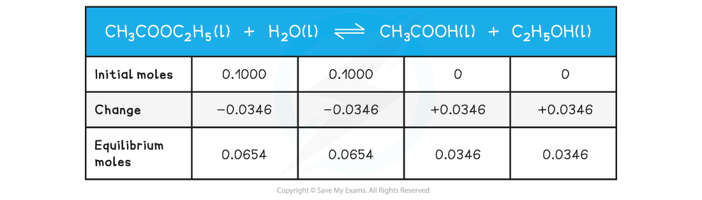
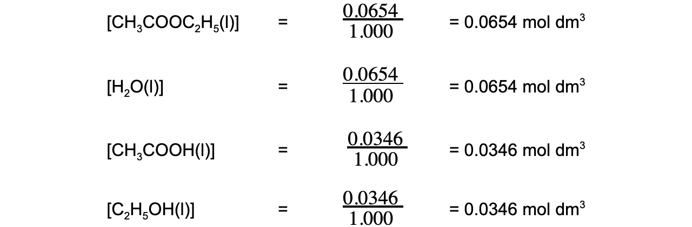

Equilibrium Constant Calculations
---------------------------------

#### Calculations involving Kc

* In the equilibrium expression each figure within a square bracket represents the concentration in <b>mol dm</b><b>-3</b>
* The <b>units </b>of <i>K</i><i>c</i> therefore depend on the form of the equilibrium expression
* Some questions give the <b>number of moles </b>of each of the reactants and products at equilibrium together with the volume of the reaction mixture
* The concentrations of the reactants and products can then be calculated from the number of moles and total volume

<i><b>Equation to calculate concentration from number of moles and volume</b></i>

#### Worked Example

#### Calculating Kc of ethanoic acid

Ethanoic acid and ethanol react according to the following equation:

<b>CH</b><b>3</b><b>COOH (I) + C</b><b>2</b><b>H</b><b>5</b><b>OH (I) ⇌ CH</b><b>3</b><b>COOC</b><b>2</b><b>H</b><b>5</b><b> (I) + H</b><b>2</b><b>O (I)</b>

At equilibrium, 500 cm3 of the reaction mixture contained 0.235 mol of ethanoic acid and 0.035 mol of ethanol together with 0.182 mol of ethyl ethanoate and 0.182 mol of water.

Calculate a value of <i>K</i><i>c</i><i> </i>for this reaction

<b>Answer</b>

* <b>Step 1: </b>Calculate the concentrations of the reactants and products

  + [CH3COOH] <math><semantics><mrow><mo>=</mo><mo> </mo><mfrac><mrow><mn>0</mn><mo>.</mo><mn>235</mn></mrow><mrow><mn>0</mn><mo>.</mo><mn>500</mn></mrow></mfrac><mo> </mo><mo>=</mo><mo> </mo></mrow><annotation>{"language":"en","fontFamily":"Times New Roman","fontSize":"18"}</annotation></semantics></math>0.470 mol dm-3
  + [C2H5OH] <math><semantics><mrow><mo>=</mo><mo> </mo><mfrac><mrow><mn>0</mn><mo>.</mo><mn>035</mn></mrow><mrow><mn>0</mn><mo>.</mo><mn>500</mn></mrow></mfrac><mo> </mo><mo>=</mo><mo> </mo></mrow><annotation>{"language":"en","fontFamily":"Times New Roman","fontSize":"18"}</annotation></semantics></math>0.070 mol dm-3
  + [CH3COOC2H5] <math><semantics><mrow><mo>=</mo><mo> </mo><mfrac><mrow><mn>0</mn><mo>.</mo><mn>182</mn></mrow><mrow><mn>0</mn><mo>.</mo><mn>500</mn></mrow></mfrac><mo> </mo><mo>=</mo><mo> </mo></mrow><annotation>{"language":"en","fontFamily":"Times New Roman","fontSize":"18"}</annotation></semantics></math>0.364 mol dm-3
  + [H2O] <math><semantics><mrow><mo>=</mo><mo> </mo><mfrac><mrow><mn>0</mn><mo>.</mo><mn>182</mn></mrow><mrow><mn>0</mn><mo>.</mo><mn>500</mn></mrow></mfrac><mo> </mo><mo>=</mo><mo> </mo></mrow><annotation>{"language":"en","fontFamily":"Times New Roman","fontSize":"18"}</annotation></semantics></math>0.364 mol dm-3

* <b>Step 2: </b>Write out the balanced chemical equation with the concentrations of beneath each substance

* <b>Step 3: </b>Write the equilibrium constant for this reaction in terms of concentration

<i>K</i>c = <math><semantics><mfrac><mrow><mo>[</mo><msub><mi>H</mi><mn>2</mn></msub><mi>O</mi><mo>]</mo><mo> </mo><mo>[</mo><msub><mi>CH</mi><mn>3</mn></msub><msub><mi>COOC</mi><mn>2</mn></msub><msub><mi>H</mi><mn>5</mn></msub><mo>]</mo></mrow><mrow><mo>[</mo><msub><mi>C</mi><mn>2</mn></msub><msub><mi>H</mi><mn>5</mn></msub><mi>OH</mi><mo>]</mo><mo> </mo><mo>[</mo><msub><mi>CH</mi><mn>3</mn></msub><mi>COOH</mi><mo>]</mo></mrow></mfrac><annotation>{"language":"en","fontFamily":"Times New Roman","fontSize":"18"}</annotation></semantics></math>

* <b>Step 4: </b>Substitute the equilibrium concentrations into the expression

<i>K</i>c = <math><semantics><mrow><mo>=</mo><mfrac><mrow><mo>[</mo><mn>0</mn><mo>.</mo><mn>364</mn><mo>]</mo><mo>×</mo><mo>[</mo><mn>0</mn><mo>.</mo><mn>364</mn><mo>]</mo></mrow><mrow><mo>[</mo><mn>0</mn><mo>.</mo><mn>070</mn><mo>]</mo><mo>×</mo><mo>[</mo><mn>0</mn><mo>.</mo><mn>0470</mn><mo>]</mo></mrow></mfrac><mo>=</mo></mrow><annotation>{"language":"en","fontFamily":"Times New Roman","fontSize":"18"}</annotation></semantics></math>4.03

* <b>Step 5: </b>Deduce the correct units for <i>K</i><i>c</i><i> </i>

<i>K</i><i>c</i><i> = </i><math><semantics><mfrac><mrow><mo>[</mo><mi>mol</mi><mo> </mo><msup><mi>dm</mi><mrow><mo>-</mo><mn>3</mn></mrow></msup><mo>]</mo><mo>×</mo><mo>[</mo><mi>mol</mi><mo> </mo><msup><mi>dm</mi><mrow><mo>-</mo><mn>3</mn></mrow></msup><mo>]</mo></mrow><mrow><mo>[</mo><mi>mol</mi><mo> </mo><msup><mi>dm</mi><mrow><mo>-</mo><mn>3</mn></mrow></msup><mo>]</mo><mo>×</mo><mo>[</mo><mi>mol</mi><mo> </mo><msup><mi>dm</mi><mrow><mo>-</mo><mn>3</mn></mrow></msup><mo>]</mo></mrow></mfrac><annotation>{"language":"en","fontFamily":"Times New Roman","fontSize":"18"}</annotation></semantics></math>

All units cancel out

Therefore, <i>K</i><i>c</i><i> </i>= 4.03

* Note that the smallest number of significant figures used in the question is 3, so the final answer should also be given to 3 significant figures

* Some questions give the <b>initial and equilibrium concentrations </b>of the reactants but products
* An initial, change and equilibrium table should be used to determine the equilibrium concentration of the products <b>using the molar ratio of reactants and products in the stoichiometric equation</b>

#### Worked Example

<b>Calculating K</b><b>c</b><b> of ethyl ethanoate</b>

Ethyl ethanoate is hydrolysed by water:

CH3COOC2H5(I) + H2O(I) ⇌ CH3COOH(I) + C2H5OH(I)

0.1000 mol of ethyl ethanoate are added to 0.1000 mol of water. A little acid catalyst is added and the mixture made up to 1dm3. At equilibrium 0.0654 mol of water are present. Use this data to calculate a value of Kc for this reaction.

<b>Answer</b>

* <b>Step 1: </b>Write out the balanced chemical equation with the concentrations of beneath each substance using an initial, change and equilibrium table

* <b>Step 2: </b>Calculate the concentrations of the reactants and products

* <b>Step 3: </b>Write the equilibrium constant for this reaction in terms of concentration

* <b>Step 4: </b>Substitute the equilibrium concentrations into the expression

<math><semantics><mrow><msub><mi>K</mi><mi>c</mi></msub><mo> </mo><mo>=</mo><mo> </mo><mfrac><mrow><mo>(</mo><mn>0</mn><mo>.</mo><mn>0346</mn><mo>)</mo><mo> </mo><mo>×</mo><mo> </mo><mo>(</mo><mn>0</mn><mo>.</mo><mn>0346</mn><mo>)</mo></mrow><mrow><mo>(</mo><mn>0</mn><mo>.</mo><mn>0654</mn><mo>)</mo><mo> </mo><mo>×</mo><mo> </mo><mo>(</mo><mn>0</mn><mo>.</mo><mn>0654</mn><mo>)</mo></mrow></mfrac></mrow><annotation>{"language":"en","fontFamily":"Times New Roman","fontSize":"18"}</annotation></semantics></math>

<i><b>K</b></i><b>c </b><b>= 0.28</b>

* <b>Step 5: </b>Deduce the correct units for <i>K</i><i>c</i>

<math><semantics><mrow><msub><mi>K</mi><mi>c</mi></msub><mo> </mo><mo>=</mo><mo> </mo><mfrac><mrow><mo>(</mo><mi>mol</mi><mo> </mo><msup><mi>dm</mi><mrow><mo>-</mo><mn>3</mn></mrow></msup><mo>)</mo><mo>×</mo><mo>(</mo><mi>mol</mi><mo> </mo><msup><mi>dm</mi><mrow><mo>-</mo><mn>3</mn></mrow></msup><mo>)</mo></mrow><mrow><mo>(</mo><mi>mol</mi><mo> </mo><msup><mi>dm</mi><mrow><mo>-</mo><mn>3</mn></mrow></msup><mo>)</mo><mo>×</mo><mo>(</mo><mi>mol</mi><mo> </mo><msup><mi>dm</mi><mrow><mo>-</mo><mn>3</mn></mrow></msup><mo>)</mo></mrow></mfrac></mrow><annotation>{"language":"en","fontFamily":"Times New Roman","fontSize":"18"}</annotation></semantics></math>

All units cancel out

Therefore, <i>K</i><i>c</i><i> </i>= 0.288

#### Calculations involving Kp

* In the equilibrium expression the <i>p</i> represent the partial pressure of the reactants and products in <b>Pa</b>
* The <b>units</b> of <i>K</i><i>p</i><i> </i>therefore depend on the form of the equilibrium expression

#### Worked Example

<b>Calculating K</b><b>p </b><b>of a gaseous reaction:</b>

In the reaction:

<b>2SO</b><b>2</b><b> (g) + O</b><b>2</b><b> (g) ⇌ 2SO</b><b>3</b><b> (g)</b>

the equilibrium partial pressures at constant temperature are

SO2 = 1.0 × 106 Pa, O2 = 7.0 × 106 Pa, SO3 = 8.0 × 106 Pa

Calculate the value for Kp for this reaction.

<b>Answer</b>

* <b>Step 1: </b>Write the equilibrium constant for the reaction in terms of partial pressures

<math><semantics><mrow><msub><mi>K</mi><mi>p</mi></msub><mo> </mo><mo>=</mo><mo> </mo><mfrac><mrow><msup><mi>p</mi><mn>2</mn></msup><mo> </mo><msub><mi>SO</mi><mn>3</mn></msub></mrow><mrow><msup><mi>p</mi><mn>2</mn></msup><mo> </mo><msub><mi>SO</mi><mn>2</mn></msub><mo> </mo><mo>×</mo><mi>p</mi><msub><mi>O</mi><mn>2</mn></msub></mrow></mfrac></mrow><annotation>{"language":"en","fontFamily":"Times New Roman","fontSize":"18"}</annotation></semantics></math>

* <b>Step 2: </b>Substitute the equilibrium concentrations into the expression

<math><semantics><mrow><msub><mi>K</mi><mi>p</mi></msub><mo> </mo><mo>=</mo><mo> </mo><mfrac><msup><mrow><mo>(</mo><mn>8</mn><mo>.</mo><mn>0</mn><mo> </mo><mo>×</mo><msup><mn>10</mn><mn>6</mn></msup><mo>)</mo></mrow><mn>2</mn></msup><mrow><msup><mrow><mo>(</mo><mn>1</mn><mo>.</mo><mn>0</mn><mo> </mo><mo>×</mo><msup><mn>10</mn><mn>6</mn></msup><mo>)</mo></mrow><mn>2</mn></msup><mo> </mo><mo>×</mo><mo>(</mo><mn>7</mn><mo>.</mo><mn>0</mn><mo> </mo><mo>×</mo><msup><mn>10</mn><mn>6</mn></msup><mo>)</mo></mrow></mfrac></mrow><annotation>{"language":"en","fontFamily":"Times New Roman","fontSize":"18"}</annotation></semantics></math>

<i><b>K</b></i><i><b>p</b></i><b> </b><b>= 9.1 x 10</b><b>-6</b>

* <b>Step 3: </b>Deduce the correct units of <i>K</i><i>p</i>

<math><semantics><mrow><msub><mi>K</mi><mi>p</mi></msub><mo> </mo><mo>=</mo><mo> </mo><mfrac><mrow><mi>P</mi><msup><mi>a</mi><mn>2</mn></msup></mrow><mrow><mi>P</mi><msup><mi>a</mi><mn>2</mn></msup><mo> </mo><mo>×</mo><mi>P</mi><mi>a</mi></mrow></mfrac></mrow><annotation>{"language":"en","fontFamily":"Times New Roman","fontSize":"18"}</annotation></semantics></math>

The units of <i>K</i><i>p</i><i> </i>are Pa-1

Therefore, <i>K</i><i>p</i><i> </i>= 9.1 x 10-6 Pa-1

* Some questions only give the <b>number of moles</b> of gases present and the total pressure
* The number of moles of each gas should be used to first calculate the <b>mole fractions</b>
* The mole fractions are then used to calculate the <b>partial pressures</b>
* The values of the partial pressures are then substituted in the <b>equilibrium expression</b>

#### Worked Example

<b>Calculating K</b><b>p </b><b>of a hydrogen iodide equilibrium reaction:</b>

The equilibrium between hydrogen, iodine and hydrogen iodide at 600 K is as follows:

<b>H</b><b>2</b><b> (g) + I</b><b>2</b><b> (g) ⇌ 2HI (g)</b>

At equilibrium the number of moles present are:

H2 = 1.71 × 10-3

I2 = 2.91 × 10-3

HI = 1.65 × 10-2 

The total pressure is 100 kPa.

Calculate the value of Kp for this reaction.

<b>Answer</b>

* <b>Step 1: </b>Calculate the total number of moles

<b>Total number of moles = 1.71 x 10</b><b>-3 </b><b>+ 2.91 x 10</b><b>-3 </b><b>+ 1.65 x 10</b><b>-2</b>

<b>= 2.112 x 10</b><b>-2</b>

* <b>Step 2: </b>Calculate the mole fraction of each gas

<math><semantics><mrow><msub><mi>H</mi><mn>2</mn></msub><mo>=</mo><mfrac><mrow><mn>1</mn><mo>.</mo><mn>71</mn><mo>×</mo><msup><mn>10</mn><mrow><mo>-</mo><mn>3</mn></mrow></msup></mrow><mrow><mn>2</mn><mo>.</mo><mn>112</mn><mo>×</mo><msup><mn>10</mn><mrow><mo>-</mo><mn>2</mn></mrow></msup></mrow></mfrac><mo>=</mo><mn>0</mn><mo>.</mo><mn>0810</mn><mspace></mspace><msub><mi>I</mi><mn>2</mn></msub><mo> </mo><mo>=</mo><mo> </mo><mfrac><mrow><mn>2</mn><mo>.</mo><mn>91</mn><mo> </mo><mo>×</mo><msup><mn>10</mn><mrow><mo>-</mo><mn>3</mn></mrow></msup></mrow><mrow><mn>2</mn><mo>.</mo><mn>112</mn><mo> </mo><mo>×</mo><msup><mn>10</mn><mrow><mo>-</mo><mn>2</mn></mrow></msup></mrow></mfrac><mo>=</mo><mo> </mo><mn>0</mn><mo>.</mo><mn>1378</mn><mspace></mspace><mi>HI</mi><mo> </mo><mo>=</mo><mo> </mo><mfrac><mrow><mn>1</mn><mo>.</mo><mn>65</mn><mo> </mo><mo>×</mo><msup><mn>10</mn><mrow><mo>-</mo><mn>2</mn></mrow></msup></mrow><mrow><mn>2</mn><mo>.</mo><mn>112</mn><mo> </mo><mo>×</mo><msup><mn>10</mn><mrow><mo>-</mo><mn>2</mn></mrow></msup></mrow></mfrac><mo>=</mo><mo> </mo><mn>0</mn><mo>.</mo><mn>7813</mn></mrow><annotation>{"language":"en","fontFamily":"Times New Roman","fontSize":"18"}</annotation></semantics></math>

* <b>Step 3: </b>Calculate the partial pressure of each gas

<b>H</b><b>2</b><b> = 0.0810 x 100 = 8.10 kPa</b>

<b>I</b><b>2</b><b> = 0.1378 x 100 = 13.78 kPa</b>

<b>HI = 0.7813 x 100 = 78.13 kPa</b>

* <b>Step 4: </b>Write the equilibrium constant in terms of partial pressure

<math><semantics><mrow><msub><mi>K</mi><mi>p</mi></msub><mo> </mo><mo>=</mo><mfrac><mrow><msup><mi>p</mi><mn>2</mn></msup><mi>HI</mi></mrow><mrow><mi>p</mi><msub><mi>H</mi><mn>2</mn></msub><mo> </mo><mo>×</mo><mi>p</mi><msub><mi>I</mi><mn>2</mn></msub></mrow></mfrac></mrow><annotation>{"language":"en","fontFamily":"Times New Roman","fontSize":"18"}</annotation></semantics></math>

* <b>Step 5: </b>Substitute the values into the equilibrium expression

<math><semantics><mrow><msub><mi>K</mi><mi>p</mi></msub><mo> </mo><mo>=</mo><mo> </mo><mfrac><mrow><mn>78</mn><mo>.</mo><msup><mn>13</mn><mn>2</mn></msup></mrow><mrow><mn>8</mn><mo>.</mo><mn>10</mn><mo> </mo><mo>×</mo><mn>13</mn><mo>.</mo><mn>78</mn></mrow></mfrac></mrow><annotation>{"language":"en","fontFamily":"Times New Roman","fontSize":"18"}</annotation></semantics></math>

<i><b>K</b></i><i><b>p</b></i><b> </b><b>= 54.7</b>

* <b>Step 6: </b>Deduce the correct units for <i>K</i><i>p</i>

<math><semantics><mrow><msub><mi>K</mi><mi>p</mi></msub><mo> </mo><mo>=</mo><mo> </mo><mfrac><mrow><mi>P</mi><msup><mi>a</mi><mn>2</mn></msup></mrow><mrow><mi>P</mi><mi>a</mi><mo> </mo><mo>×</mo><mi>P</mi><mi>a</mi></mrow></mfrac></mrow><annotation>{"language":"en","fontFamily":"Times New Roman","fontSize":"18"}</annotation></semantics></math>

All units cancel out

Therefore, <i>K</i><i>p</i><i> </i>= 54.7

* Other questions related to equilibrium expressions may involve calculating quantities present at equilibrium given appropriate data

#### Examiner Tips and Tricks

* If a reaction has reached equilibrium:

  + The moles of reactants and products will remain unchanged
  + This means that the concentrations / mole fractions / partial pressures of each chemical will remain unchanged
  + Consequently, the value of the equilibrium constant (<i>K</i>c<i> </i>or <i>K</i>p) will also remain unchanged