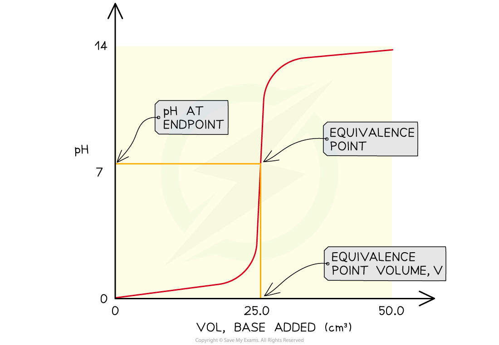
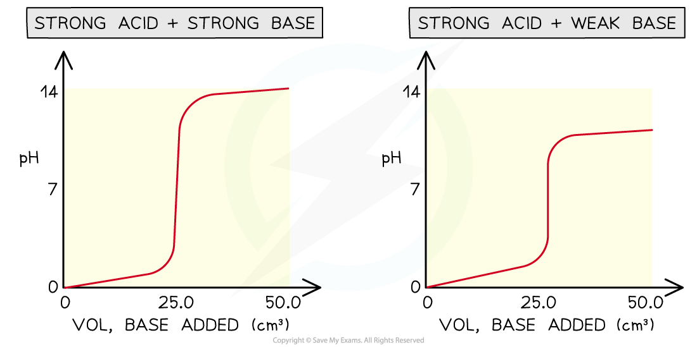
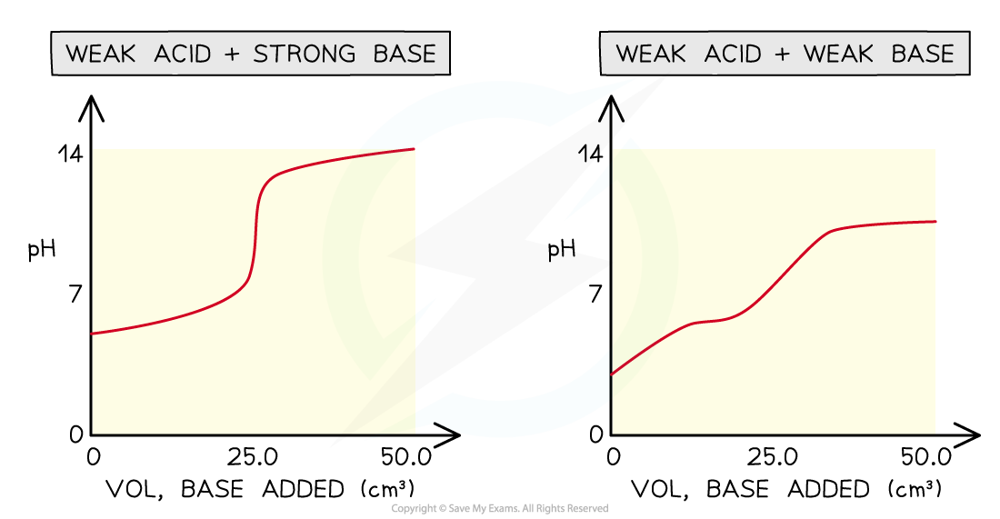
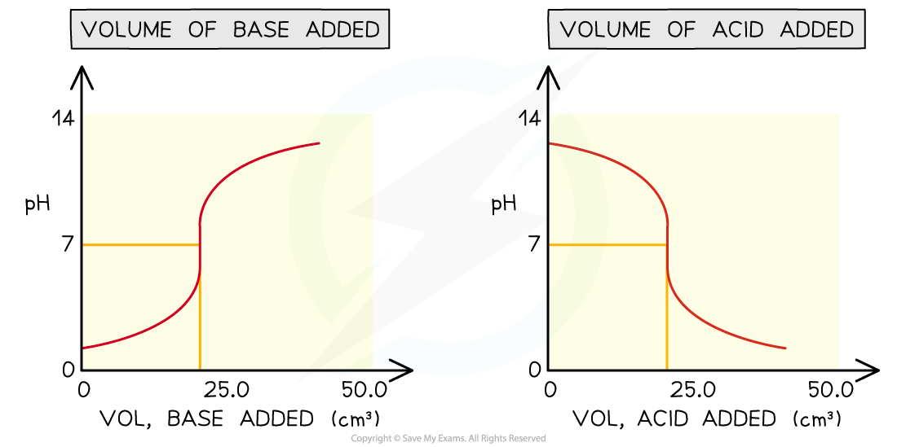
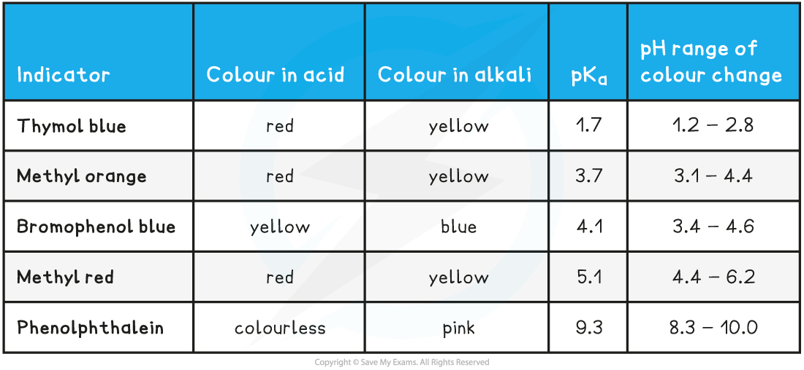
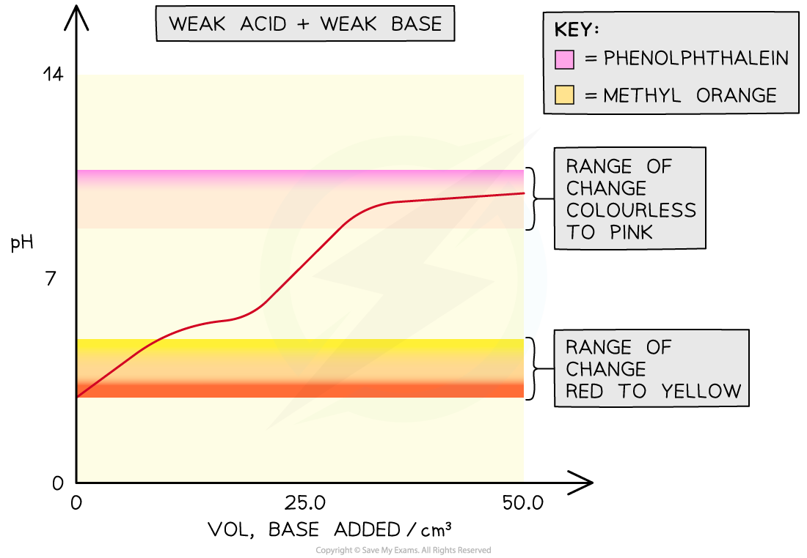

Drawing & Interpreting Titration Curves
---------------------------------------

* During a titration a pH meter can be used and a pH curve plotted
* A pH curve is a graph showing how the pH of a solution changes as the acid (or base) is added
* The result is characteristically shaped graph which can yield useful information about how the particular acid and alkali react together with stoichiometric information

<i><b>The features of a pH curve</b></i>

* All pH curves show an s-shape curve and the midpoint of the inflection is called the <b>equivalence</b> or<b> stochiometric point</b>
* From the curves you can

  + Determine the pH of the acid by looking where the curve starts on the y-axis
  + Find the pH at the equivalence point
  + Find volume of base at the equivalence point
  + Obtain the range of pH at the vertical section of the curve

<b>Four types of acid-base titrations</b>

* There are four combinations of acids and alkalis that you should know about:

  + strong acid + strong base
  + weak acid + strong base
  + strong acid + weak base
  + weak acid + weak base

<i><b>pH curves for the four types of acid-base titrations</b></i>

* Without titles for the graph you can easily recognise which combination is shown by looking at the starting and ending pH and deducing whether the acid and alkali are strong or weak
* Sometimes you may see pH titration curves which show pH plotted against volume of acid added
* This produces the mirror image graph from which you can get all the same information

<i><b>Comparing different versions of pH titration curves</b></i>

#### Examiner Tips and Tricks

The word base and alkali are being used interchangeably here, but you should know an alkali is a soluble base.Since we are dealing with titrations here, the bases are always in solution so they are also alkalis.

Selecting Indicators
--------------------

* An <b>acid-base indicator</b> is a weak acid which dissociates to give an anion of a different colour
* Consider a weak acid HIn:

<b>HIn (aq)  + H</b><b>2</b><b>O (l)  ⇌ H</b><b>3</b><b>O</b><b>+</b><b> (aq) + In</b><b>- </b><b>(aq)</b>

<b>colour 1                                          colour 2</b>

* HIn and its <b>conjugate base</b> In- are different colours
* The colour of the solution depends on the relative concentrations of the two species
* If the solution is <b>acidic</b>, the above equilibrium will be shifted to the left and more HIn will be present

  + <b>Colour 1</b> will thus dominate
* If the solution is <b>alkaline</b>, the above equilibrium will shift to the right and more In- will be present

  + <b>Colour 2</b> will thus dominate
* The colour of the indicator thus depends on the pH of the solution
* The colour will not change suddenly at a certain pH, but will change gradually over a pH range
* The colour of the indicator depends on the ratio of [HIn] to [In-]
* The pH at which these transitions will occur depends on the <i>K</i><i>a  </i>of the indicator

  
* The endpoint of the reaction is where there is a balance between [HIn] and [In-]. At this point these two concentrations are equal

  
* Taking negative logs of both sides:

<b>p</b><i><b>K</b></i><i><b>a  </b></i><b>= pH</b>

* This means the p<i>K</i><i>a </i>of an indicator is the same as the pH of its endpoint

<b>Common Indicators and their colours table</b>

#### Choosing a suitable indicator

* Around the equivalence point of a titration, the pH changes very rapidly
* <b>Indicators</b> change colour over a narrow pH range approximately centred around the p<i>K</i><i>a</i> of the indicator
* An indicator will be appropriate for a titration if the pH range of the indicator falls within the rapid pH change for that titration

<b>Strong acid-strong base</b>

* In strong acid - strong base titrations, the pH changes from 4 to 10 at the end-point so a suitable indicator must change colour within this range

  + <b>Methyl red</b> and <b>phenolphthalein</b> are suitable indicators for these titrations
  + <b>Methyl orange</b> is not ideal but it shows a significant enough colour change at the end point so is widely used

<b>Weak acid-strong base</b>

* In weak acid - strong base titrations, the pH changes from 7 to 10 at the end-point so a suitable indicator must change colour within this range

  + <b>Phenolphthalein</b> is the only suitable indicator for weak acid - strong base titrations that is widely available

<b>Strong acid-weak base</b>

* In strong acid - weak base titrations, the pH changes from 4 to 7 at the end-point so a suitable indicator must change colour within this range

  + <b>Methyl red</b> is the most suitable indicator for these titrations
  + However <b>methyl orange</b> is often used since it shows a significant enough colour change at the end-point and is more widely available than methyl red

<b>Weak acid-weak base</b>

* In weak acid -weak alkali titrations, there is <b>no sudden pH change</b> at the end-point and thus there are <b>no suitable indicators</b> for these titrations
* The end-points of these titrations cannot be easily determined

<i><b>The overlay on the graph shows that both phenolphthalein and methyl orange would change colour outside the point of inflection in a weak acid-weak base titration so they would not be able to show the equivalence point of the titration</b></i>

#### Examiner Tips and Tricks

Although many people often use the term end point and equivalence point for the end of a titration, they are not in fact the same thing. The end point refers to the change in colour of the indicator whereas the equivalence point is the volume of base required to exactly neutralise the acid (or acid if starting with the base).