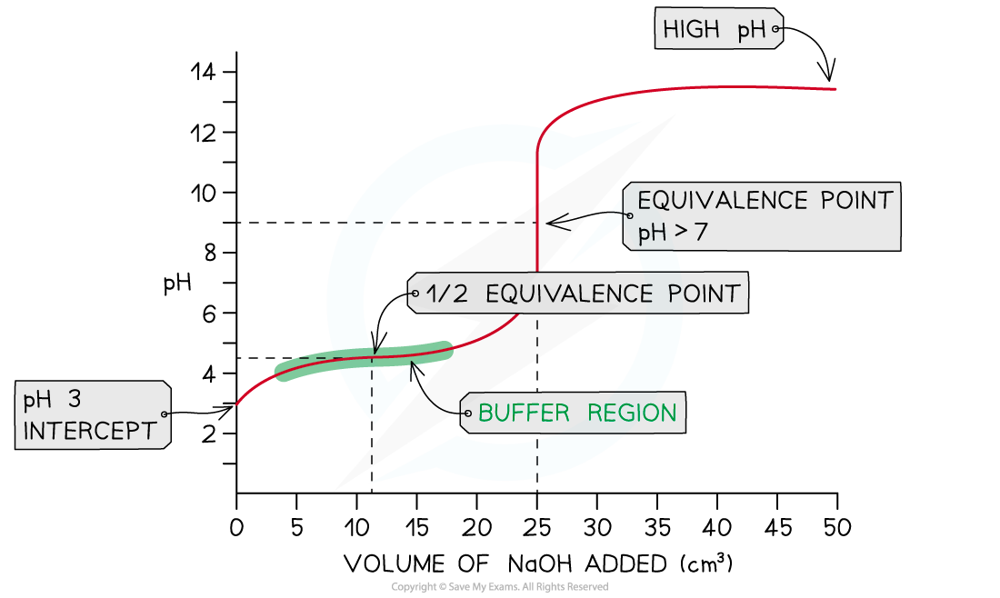

Weak Acid - Strong Base Titration
---------------------------------

* In this example, strong sodium hydroxide, NaOH (aq), is being added to weak ethanoic acid, CH3COOH (aq)

<b>NaOH (aq) + CH</b><b>3</b><b>COOH (aq) → CH</b><b>3</b><b>COONa (aq) + H</b><b>2</b><b>O (l)</b>

* The pH on the intercept on the y axis starts at roughly 3 due to the relative strength of the ethanoic acid
* The initial rise in pH is steep as the neutralisation of the weak acid by the strong base is rapid
* Ethanoate ions (conjugate base to ethanoic acid) are formed which then creates a buffer

  + A buffer consists of a weak acid and its conjugate base or a weak base and its conjugate acid
* At this point, the buffer formed will resist changes in pH so the pH rises gradually as shown in the <b>buffer region</b>
* The <b>half equivalence point</b> is the stage of the titration at which exactly half the amount of weak acid has been neutralised

  + <b>[CH</b><b>3</b><b>COOH (aq)] = [CH</b><b>3</b><b>COO</b><b>-</b><b> (aq)]</b>
  + At this point, it is important to note that the p<i>K</i>a of the acid is equal to the pH

    - <b>p</b><i><b>K</b></i><b>a</b><b> = pH </b>at <b>half equivalence </b>
* The equivalence point in a weak acid - strong base titration is <b>above 7</b>

<i><b>Weak acid - strong base pH curve </b></i>