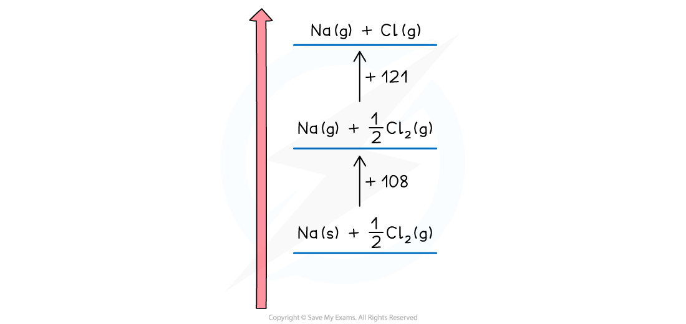

Born-Haber Cycles
-----------------

* A <b>Born-Haber cycle</b> is a specific application of Hess’ Law for ionic compounds and enable us to calculate lattice enthalpy which cannot be found by experiment
* The basic principle of drawing the cycle is to construct a diagram in which energy increases going up the diagram

<i><b>The basic principle of a Born-Haber cycle</b></i>

* The cycle shows all the steps needed to turn atoms into gaseous ions and from gaseous ions into the ionic lattice
* The alternative route to the ionic lattice begins from the enthalpy of formation of the elements in their standard states

#### Drawing the cycle for sodium chloride

* A good starting point is to draw the elements with their state symbols about a third of the way up the diagram
* This is shown as the left hand side of the equation for the process indicated
* The location is marked by drawing a horizontal bar or line which represents the starting energy level

<i><b>Drawing a Born-Haber cycle step 1</b></i>

* Next, we need to create the gaseous ions
* This is a two step process of first creating the gaseous atoms and then turning them into ions
* Creating gaseous atoms is a bond breaking process, so arrows must be drawn upwards
* It doesn't matter whether you start with sodium or chlorine
* The enthalpy of atomisation of sodium is

<b>Na (s) → Na (g)           Δ</b><i><b>H</b></i><i><b>at</b></i><b>ꝋ</b><b> = +108 kJ mol</b><b> -1</b>

* The enthalpy of atomisation of chlorine is

<b>½Cl</b><b>2</b><b> (g) → Cl (g)       Δ</b><i><b>H</b></i><i><b>at</b></i><b>ꝋ </b><b>= +121 kJ mol</b><b> -1</b>

* We can show the products of the process on the horizontal lines and the energy value against a vertical arrow connecting the energy levels

<i><b>Drawing a Born-Haber cycle step 2 - creating the gaseous atoms</b></i>

* Now the ions are created
* The sodium ion loses an electron, so this energy change is the first ionisation energy for sodium

<b>Na (g) → Na</b><b>+</b><b> (g) + e</b><b>–</b><b>          Δ</b><i><b>H</b></i><i><b>ie</b></i><b>ꝋ </b><b>= +500 kJ mol</b><b>-1</b>

* The change is endothermic so the direction continues upwards
* The chlorine atom gains an electron, so this is electron affinity

<b>Cl (g) + e</b><b>–</b><b> → Cl</b><b>-</b><b> (g)           Δ</b><i><b>H</b></i><i><b>ea</b></i><b>ꝋ </b><b>= -364 kJ mol</b><b>-1</b>

* The exothermic change means this is downwards
* The change is displaced to the right to make the diagram easier to read

<i><b>Drawing a Born-Haber cycle step 3 - creating the gaseous ions</b></i>

* The two remaining parts of the cycle can now be completed
* The enthalpy of formation of sodium chloride is added at the bottom of the diagram

<b>Na (s) + ½Cl</b><b>2 </b><b>(g) → NaCl (s)            Δ</b><i><b>H</b></i><i><b>f</b></i><b>ꝋ</b><b> = -411 kJ mol</b><b> -1</b>

* This is an exothermic change for sodium chloride so the arrow points downwards
* Enthalpy of formation can be exothermic or endothermic, so you may need to show it above the elements ( and displaced to the right) for a endothermic change
* The final change is lattice enthalpy, which is usually shown a formation. For sodium chloride the equation is

<b>Na</b><b>+</b><b>(g) + Cl</b><b>-</b><b>(g) → NaCl (s)  Δ</b><i><b>H</b></i><i><b>latt</b></i><b>ꝋ</b> 

<i><b>Drawing a Born-Haber cycle step 4 - completing the cycle</b></i>

* The cycle is now complete
* The cycle is usually used to calculate the lattice enthalpy of an ionic solid, but can be used to find other enthalpy changes if you are given the lattice enthalpy

#### Worked Example

<b>Constructing a Born-Haber cycle for KCl</b>

Construct a Born-Haber Cycle which can be used to calculate the lattice energy of potassium chloride

<b>Answer</b>

#### Worked Example

<b>Constructing a Born-Haber cycle for MgO</b>

Construct a Born-Haber Cycle which can be used to calculate the lattice energy of magnesium oxide

<b>Answer</b>

* Once a Born-Haber cycle has been constructed, it is possible to calculate the lattice energy (Δ<i>H</i><i>latt</i>ꝋ) by applying Hess’s law and rearranging:

<b>Δ</b><i><b>H</b></i><i><b>f</b></i><b>ꝋ </b><b>= Δ</b><i><b>H</b></i><i><b>at</b></i><b>ꝋ </b><b>+ Δ</b><i><b>H</b></i><i><b>at</b></i><b>ꝋ </b><b>+ </b><i><b>IE </b></i><b>+ </b><i><b>EA </b></i><b>+ Δ</b><i><b>H</b></i><i><b>latt</b></i><b>ꝋ</b>

* If we simplify this into three terms, this makes the equation easier to see:

  + Δ<i>H</i><i>latt</i>ꝋ
  + Δ<i>H</i><i>f</i>ꝋ
  + Δ<i>H</i><i>1</i>ꝋ (the sum of all of the various enthalpy changes necessary to convert the elements in their standard states to gaseous ions)
* The simplified equation becomes

<b>Δ</b><i><b>H</b></i><i><b>f</b></i><b>ꝋ </b><b>= Δ</b><i><b>H</b></i><i><b>1</b></i><b>ꝋ</b><b> + Δ</b><i><b>H</b></i><i><b>latt</b></i><b>ꝋ</b>

So, if we rearrange to calculate the lattice energy, the equation becomes

<b>Δ</b><i><b>H</b></i><i><b>latt</b></i><b>ꝋ </b><b>= Δ</b><i><b>H</b></i><i><b>f</b></i><b>ꝋ</b><b> - Δ</b><i><b>H</b></i><i><b>1</b></i><b>ꝋ</b>

* When calculating the Δ<i>H</i><i>latt</i>ꝋ, all other necessary values will be given in the question
* A Born-Haber cycle could be used to calculate any stage in the cycle

  + For example, you could be given the lattice energy and asked to calculate the enthalpy change of formation of the ionic compound
  + The principle would be exactly the same
  + Work out the <b>direct</b> and <b>indirect route</b> of the cycle (the stage that you are being asked to calculate will always be the direct route)
  + Write out the equation in terms of enthalpy changes and rearrange if necessary to calculate the required value
* <b>Remember:</b> sometimes a value may need to be doubled or halved, depending on the ionic solid involved

  + For example, with MgCl2 the value for the first electron affinity of chlorine would need to be doubled in the calculation, because there are two moles of chlorine atoms
  + Therefore, you are adding <b>2 moles</b> of electrons to <b>2 moles</b> of chlorine atoms, to form <b>2 moles</b> of Cl- ions

#### Worked Example

<b>Calculating the lattice energy of KCl</b>

Given the data below, calculate the Δ<i>H</i><i>latt</i>ꝋ of potassium chloride (KCl)<b>  </b>

<b>Answer</b>

<b>Step 1: </b>The corresponding Born-Haber cycle is:

<b>Step 2: </b>Applying Hess’ law, the lattice energy of KC<i>l</i> is:

<b>Δ</b><i><b>H</b></i><i><b>latt</b></i><b>ꝋ</b><b> = Δ</b><i><b>H</b></i><i><b>f</b></i><b>ꝋ</b><b> - Δ</b><i><b>H</b></i><i><b>1</b></i><b>ꝋ</b>

<b>Δ</b><i><b>H</b></i><i><b>latt</b></i><b>ꝋ</b><b> = Δ</b><i><b>H</b></i><i><b>f</b></i><b>ꝋ</b><b> - [(Δ</b><i><b>H</b></i><i><b>at</b></i><b>ꝋ</b><b> K) + (Δ</b><i><b>H</b></i><i><b>at</b></i><b>ꝋ</b><b> Cl) + (</b><i><b>IE</b></i><i><b>1</b></i><b> K) + (</b><i><b>EA</b></i><i><b>1</b></i><b> Cl)]</b>

<b>Step 3: </b>Substitute in the numbers:

<b>Δ</b><i><b>H</b></i><i><b>latt</b></i><b>ꝋ</b><b> = (-437) - [(+90) + (+122) + (+418) + (-349)] = -718 kJ mol</b><b>-1</b>

#### Worked Example

<b>Calculating the lattice energy of MgO</b>

Given the data below, calculate the of Δ<i>H</i><i>latt</i>ꝋ magnesium oxide of magnesium oxide (MgO)

<b>Answer</b>

<b>Step 1: </b>The corresponding Born-Haber cycle is:

<b>Step 2: </b>Applying Hess’ law, the lattice energy of MgO is:

<b>Δ</b><i><b>H</b></i><i><b>latt</b></i><b>ꝋ</b><b> = Δ</b><i><b>H</b></i><i><b>f</b></i><b>ꝋ</b><b> - Δ</b><i><b>H</b></i><i><b>1</b></i><b>ꝋ</b>

<b>Δ</b><i><b>H</b></i><i><b>latt</b></i><b>ꝋ</b><b> = Δ</b><i><b>H</b></i><i><b>f</b></i><b>ꝋ</b><b> - [(Δ</b><i><b>H</b></i><i><b>at</b></i><b>ꝋ</b><b> Mg) + (Δ</b><i><b>H</b></i><i><b>at</b></i><b>ꝋ</b><b> O) + (IE</b><b>1</b><b> Mg) + (</b><i><b>IE</b></i><i><b>2</b></i><b> Mg) + (</b><i><b>EA</b></i><i><b>1</b></i><b> O) + (</b><i><b>EA</b></i><i><b>2</b></i><b> O)]</b>

<b>Step 3: </b>Substitute in the numbers:

<b>Δ</b><i><b>H</b></i><i><b>latt</b></i><b>ꝋ</b><b> = (-602) - [(+148) + (+248) + (+736) + (+1450) + (-142) + (+770)]</b>

<b>= -3812 kJ mol</b><b>-1</b>