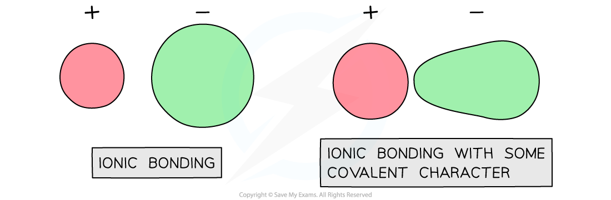

Polarisation of Ions
--------------------

* Theoretical lattice energies assume a perfect ionic model where the ions are 100% spherical and the attractions are purely electrostatic

  + So overall, there has a been a complete and irreversible exchange of outer shell electrons between the two elements in the compound so that one ion is negatively charged and the other ion positively charged and the charges are whole values
* Theoretical lattice energy can differ from measured lattice energy
* This is because covalent character is introduced when there is <b>polarisation</b> of the anions
* When this occurs, the cation attracts electrons from the anion therefore distorting electron density of the anion

<i><b>Polarisation of anion leading to covalent character</b></i>

Anions & Cations
----------------

#### Cations

* A cation with a large charge density will have a larger <b>polarising power</b>
* The charge density can be calculated as the charge of the cation divided by the surface area, for example

  + K+ will have a lower polarising power than Li+ as the ionic radius is greater
  + Na+ will have a lower polarising power than Mg2+ as the charge is smaller
* So a cation that is small and highly charged will have the greatest polarising power

#### Anions

* Anions are polarised
* The polarisability of the anion depends of its ionic radius
* The larger the ionic radius the more easily it will be distorted, for example

  + Br- will be more polarisable than Cl- as the ionic radius is larger